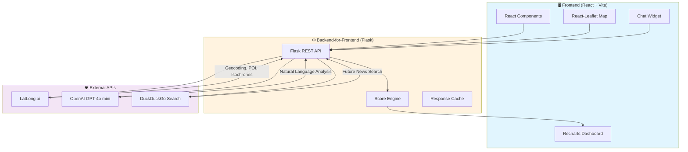

# 🎯 Hotspot IQ

<div align="center">


### **Hyper-Local Location Intelligence for Smarter Business Expansion**

*Stop guessing. Start knowing. Make data-driven decisions for your next store location.*

[Demo](#demo) • [Features](#features) • [Architecture](#architecture) • [Setup](#setup) • [API Docs](#api-documentation)

</div>

---

## 🚨 The Problem: Blind Expansion Kills Businesses

**60% of new retail stores fail within the first 3 years.** The #1 reason? **Poor location selection.**

Business owners today rely on:
- ❌ Gut feeling and "foot traffic looks good"
- ❌ Expensive consultants with outdated data
- ❌ Generic tools not built for Indian contexts (pincodes, local landmarks)
- ❌ No visibility into future infrastructure developments

**The cost of a wrong location decision:** ₹15-50 lakhs in sunk costs, 12-18 months of wasted effort.

---

## 💡 The Solution: Hotspot IQ

Hotspot IQ is an **AI-powered location intelligence platform** that helps entrepreneurs, franchise owners, and retail chains validate potential store locations using:

| Feature | What It Does |
|---------|--------------|
| 🎯 **Opportunity Score** | Proprietary algorithm combining footfall, landmarks, and competition |
| 🗺️ **Hyper-Local Data** | Powered by LatLong.ai for accurate Indian context (pincodes, Digipin) |
| 🤖 **AI Advisor** | Ask natural language questions like "Is this good for a gym?" |
| 🔮 **Growth Radar** | Scans news for upcoming infrastructure that could boost location value |
| 🚛 **Supply Chain Check** | Validates logistics feasibility from your warehouse |

---

## ✨ Features

### Phase 1: Descriptive Analytics (Core)
- **Smart Location Search** — Autocomplete powered by LatLong.ai
- **Competitor Density Mapping** — See how many cafes, ATMs, gyms exist nearby
- **Landmark Intelligence** — Identify proximity to schools, metros, colleges
- **Opportunity Score Dashboard** — One number that tells you if a location is worth it
- **Interactive Heatmaps** — Visual overlay showing business potential

### Phase 2: Interactive Intelligence
- **Isochrone Visualization** — See exactly what's reachable in a 15-min bike/walk radius
- **GenAI Chat ("Ask Hotspot")** — Get AI-powered advice based on real POI data
- **Digipin Integration** — Share exact locations with investors using India's digital address code

### Phase 3: Future Radar & Operations
- **Growth Radar** — AI scans news for "New metro station in Whitefield" type developments
- **Supply Chain Validator** — Enter warehouse location, get logistics feasibility score
- **Location Identifier** - Identify Legally Restricted areas for businesses and areas where there are Prohibited Business Activities/Types

---

## 🚶 How It Works — User Flow

Hotspot IQ follows a **guided 4-step flow** to ensure users provide the right context before analysis:

```
┌─────────────────────────────────────────────────────────────────────────────┐
│                          USER JOURNEY FLOW                                  │
├─────────────────────────────────────────────────────────────────────────────┤
│                                                                             │
│   STEP 1              STEP 2              STEP 3              STEP 4       │
│   ┌──────┐           ┌──────┐           ┌──────┐           ┌──────┐       │
│   │ 🏪   │    →      │ ✅   │    →      │ 📍   │    →      │ 📊   │       │
│   │ Type │           │Filter│           │Search│           │Analyze│       │
│   └──────┘           └──────┘           └──────┘           └──────┘       │
│   "What are          "What do           "Where do          "Show me       │
│    you starting?"     you need           you want           the data!"    │
│                       nearby?"           to open?"                        │
│                                                                             │
└─────────────────────────────────────────────────────────────────────────────┘
```

### Step 1: Select Business Type 🏪

The user **first selects what type of business** they are planning to open. This is critical because:
- It determines which POIs are counted as **competitors** (e.g., selecting "Cafe" → all nearby cafes are competitors)
- It influences the **Opportunity Score algorithm** weights
- It customizes AI recommendations in the chat

**Available Business Types:**
| Category | Icon | Competitor POI Categories |
|----------|------|---------------------------|
| Cafe / Coffee Shop | ☕ | cafe, coffee_shop, bakery |
| Restaurant | 🍽️ | restaurant, fast_food, food_court |
| Retail Store | 🛍️ | retail, supermarket, convenience_store |
| Gym / Fitness Center | 💪 | gym, fitness_center, sports_club |
| Pharmacy / Medical | 💊 | pharmacy, clinic, medical_store |
| Salon / Spa | 💇 | salon, spa, beauty_parlor |
| Electronics Store | 📱 | electronics, mobile_shop, computer_store |
| Clothing / Fashion | 👕 | clothing_store, boutique, fashion |
| Bookstore / Stationery | 📚 | bookstore, stationery, office_supplies |
| Other (Custom) | 🏢 | User specifies custom category |

### Step 2: Select Proximity Preferences ✅

Next, the user selects **what they want nearby** using checkbox filters. These preferences:
- Add **bonus points** to the Opportunity Score when present
- Help identify locations that match the user's ideal criteria
- Filter the map to highlight relevant landmarks

**Available Proximity Filters:**
| Filter | Icon | Why It Matters |
|--------|------|----------------|
| Near Metro Station | 🚇 | High footfall, easy accessibility |
| Near Bus Stop | 🚌 | Public transit increases customer base |
| Near School | 🏫 | Family traffic, afternoon rush |
| Near College/University | 🎓 | Young demographic, evening crowd |
| Near Hospital | 🏥 | Essential services traffic |
| Near Mall/Shopping Complex | 🏬 | Captive audience, high spending power |
| Near Office Complex/IT Park | 🏢 | Weekday lunch & after-work crowd |
| Near Residential Area | 🏠 | Daily needs, repeat customers |
| Near Temple/Religious Place | 🛕 | Weekend/festival traffic |
| Near Park/Recreation | 🌳 | Morning/evening joggers, families |
| Near ATM/Bank | 🏦 | Financial convenience |
| Near Bar/Pub | 🍺 | Nightlife synergy (for restaurants/cafes) |

### Step 3: Search Location 📍

Now the user searches for a specific location using the **autocomplete search bar**:
- Powered by LatLong.ai Autocomplete API
- Supports addresses, landmarks, pincodes, and place names
- Shows suggestions as user types (debounced 300ms)
- Selecting a suggestion centers the map and drops a marker

### Step 4: Analyze & View Results 📊

Once location is selected, clicking **"Analyze Location"** triggers:
1. Backend fetches competitor POIs (based on Step 1 business type)
2. Backend fetches landmark POIs (based on Step 2 filters)
3. Opportunity Score is calculated
4. Dashboard cards animate in with results
5. Map updates with competitor markers and heatmap

---

## 🏗️ Architecture



### Why Backend-for-Frontend (BFF)?
1. **Security** — API keys never exposed to browser
2. **Aggregation** — Combine multiple API calls into one response
3. **Transformation** — Shape data exactly as frontend needs it
4. **Caching** — Reduce API costs by caching frequent queries

---

## 🛠️ Tech Stack

| Layer | Technology | Purpose |
|-------|------------|---------|
| **Frontend** | React 18 + Vite | Fast, modern UI framework |
| **Styling** | Tailwind CSS | Utility-first CSS |
| **Maps** | React-Leaflet | Interactive map rendering |
| **Charts** | Recharts | Analytics visualization |
| **Backend** | Python Flask | REST API server |
| **Data** | Pandas | Data manipulation |
| **AI** | OpenAI GPT-4o mini | Natural language analysis |
| **Geo APIs** | LatLong.ai | Indian geospatial data |
| **Search** | DuckDuckGo | News & web search |

---

## 🚀 Setup Instructions

### Prerequisites
- Node.js 18+ & npm
- Python 3.10+
- API Keys: LatLong.ai, OpenAI

### 1. Clone the Repository
```bash
git clone https://github.com/your-team/hotspot-iq.git
cd hotspot-iq
```

### 2. Backend Setup
```bash
cd backend

# Create virtual environment
python -m venv venv

# Activate (Windows)
.\venv\Scripts\activate

# Activate (Mac/Linux)
source venv/bin/activate

# Install dependencies
pip install -r requirements.txt

# Configure environment
copy .env.example .env
# Edit .env with your API keys
```

### 3. Frontend Setup
```bash
cd frontend

# Install dependencies
npm install

# Configure environment
copy .env.example .env
# Edit .env if needed
```

### 4. Environment Variables

**Backend `.env`:**
```env
FLASK_ENV=development
FLASK_DEBUG=True
LATLONG_API_KEY=your_latlong_api_key
OPENAI_API_KEY=your_openai_api_key
```

**Frontend `.env`:**
```env
VITE_API_BASE_URL=http://localhost:5000/api
```

### 5. Run the Application

**Terminal 1 — Backend:**
```bash
cd backend
python app.py
# Server runs on http://localhost:5000
```

**Terminal 2 — Frontend:**
```bash
cd frontend
npm run dev
# App runs on http://localhost:5173
```

---

## 📡 API Documentation

### Base URL
```
http://localhost:5000/api
```

### Endpoints

#### 🔍 Location Search
```http
GET /api/autocomplete?query={search_term}
```
Returns location suggestions for autocomplete dropdown.

**Response:**
```json
{
  "suggestions": [
    { "place_id": "abc123", "name": "Indiranagar, Bangalore", "lat": 12.97, "lng": 77.64 }
  ]
}
```

---

#### 📍 Location Analysis
```http
POST /api/analyze
Content-Type: application/json

{
  "lat": 12.9716,
  "lng": 77.5946,
  "business_type": "cafe",
  "filters": ["near_metro", "near_college"]
}
```
Returns comprehensive location analysis including opportunity score.

**Response:**
```json
{
  "opportunity_score": 78,
  "competitors": { "count": 12, "nearby": [...] },
  "landmarks": { "metro": 2, "schools": 5, "colleges": 1 },
  "footfall_proxy": "high",
  "recommendation": "Strong potential for cafe"
}
```

---

#### 🗺️ Isochrone (Reachability)
```http
POST /api/isochrone
Content-Type: application/json

{
  "lat": 12.9716,
  "lng": 77.5946,
  "mode": "bike",
  "time_minutes": 15
}
```
Returns GeoJSON polygon for isochrone visualization.

**Response:**
```json
{
  "type": "Feature",
  "geometry": {
    "type": "Polygon",
    "coordinates": [[[77.59, 12.97], ...]]
  }
}
```

---

#### 🤖 AI Chat
```http
POST /api/chat
Content-Type: application/json

{
  "message": "Is this location good for a gym?",
  "context": {
    "lat": 12.9716,
    "lng": 77.5946
  }
}
```
Returns AI-powered location advice.

**Response:**
```json
{
  "response": "Based on the data, this location shows strong potential for a gym. There are 3 corporate offices within 1km, high residential density, and only 1 competing gym. The footfall proxy indicates high morning and evening activity.",
  "data_sources": ["poi", "landmarks", "competitors"]
}
```

---

#### 📮 Digipin Lookup
```http
GET /api/digipin?lat={lat}&lng={lng}
```
Returns the official Digipin (Digital Address Code) for a location.

**Response:**
```json
{
  "digipin": "MH-12-ABC-1234",
  "formatted_address": "123, MG Road, Indiranagar, Bangalore - 560038"
}
```

---

#### 🔮 Growth Radar
```http
POST /api/growth-radar
Content-Type: application/json

{
  "location": "Whitefield, Bangalore"
}
```
Returns news about infrastructure developments.

**Response:**
```json
{
  "developments": [
    {
      "title": "New Metro Line Extension to Whitefield",
      "source": "Economic Times",
      "date": "2025-01-15",
      "impact": "positive",
      "summary": "Expected to increase footfall by 40%"
    }
  ],
  "growth_outlook": "bullish"
}
```

---

#### 🚛 Supply Chain Check
```http
POST /api/supply-chain
Content-Type: application/json

{
  "store_lat": 12.9716,
  "store_lng": 77.5946,
  "warehouse_lat": 13.0827,
  "warehouse_lng": 77.5877
}
```
Returns logistics feasibility analysis.

**Response:**
```json
{
  "distance_km": 18.5,
  "drive_time_minutes": 52,
  "feasibility": "warning",
  "message": "High Logistics Cost - Drive time exceeds 45 minutes",
  "recommendation": "Consider a closer warehouse or factor in higher delivery costs"
}
```

---

## 📊 The Opportunity Score Algorithm

```
Opportunity Score = (Footfall Proxy × Landmark Value) / (Competitor Density + 1)
```

| Factor | Calculation | Weight |
|--------|-------------|--------|
| **Footfall Proxy** | Based on nearby transit, offices, residential density | 0-100 |
| **Landmark Value** | Weighted sum of valuable nearby POIs | 0-50 |
| **Competitor Density** | Count of similar businesses in 1km radius | Divisor |

**Score Interpretation:**
- 🟢 **70-100:** Prime Location — Move fast!
- 🟡 **40-69:** Moderate Potential — Needs differentiation
- 🔴 **0-39:** High Risk — Reconsider or pivot

---

## 🎥 Demo

*Screenshots and demo video coming soon!*

---

## 👥 Team

Built with ❤️ for [Hackathon Name] 2025

| Role | Name |
|------|------|
| **Product & Architecture** **Backend** | Shubhajit Sarkar |
| **Frontend** | Shivam Atulya, Shreeya Nagaraj |
| **AI/ML** | Tanmay Patil |

---

## 📄 License

MIT License — Built for the hackathon, open for the community.

---

<div align="center">

**🎯 Hotspot IQ — Because your next location decision shouldn't be a gamble.**

[⬆ Back to Top](#-hotspot-iq)

</div>
