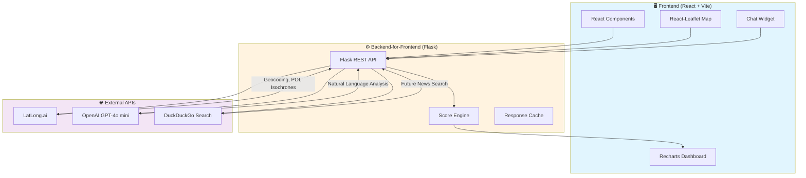

This file is a merged representation of the entire codebase, combined into a single document by Repomix.

<file_summary>
This section contains a summary of this file.

<purpose>
This file contains a packed representation of the entire repository's contents.
It is designed to be easily consumable by AI systems for analysis, code review,
or other automated processes.
</purpose>

<file_format>
The content is organized as follows:
1. This summary section
2. Repository information
3. Directory structure
4. Repository files (if enabled)
5. Multiple file entries, each consisting of:
  - File path as an attribute
  - Full contents of the file
</file_format>

<usage_guidelines>
- This file should be treated as read-only. Any changes should be made to the
  original repository files, not this packed version.
- When processing this file, use the file path to distinguish
  between different files in the repository.
- Be aware that this file may contain sensitive information. Handle it with
  the same level of security as you would the original repository.
</usage_guidelines>

<notes>
- Some files may have been excluded based on .gitignore rules and Repomix's configuration
- Binary files are not included in this packed representation. Please refer to the Repository Structure section for a complete list of file paths, including binary files
- Files matching patterns in .gitignore are excluded
- Files matching default ignore patterns are excluded
- Files are sorted by Git change count (files with more changes are at the bottom)
</notes>

</file_summary>

<directory_structure>
.gitignore
backend/.env.example
backend/.gitignore
backend/app.py
backend/config.py
backend/requirements.txt
backend/routes/__init__.py
backend/routes/analysis_routes.py
backend/routes/chat_routes.py
backend/routes/location_routes.py
backend/services/__init__.py
backend/services/competitor_service.py
backend/services/latlong_service.py
backend/services/places_service.py
backend/utils/__init__.py
backend/utils/score_calculator.py
DESIGN.md
frontend/.env.example
frontend/.gitignore
frontend/index.html
frontend/package.json
frontend/postcss.config.js
frontend/src/App.jsx
frontend/src/components/Dashboard/AnalysisPanel.jsx
frontend/src/components/Dashboard/Charts/CompetitorChart.jsx
frontend/src/components/Dashboard/Charts/index.js
frontend/src/components/Dashboard/Charts/LandmarkRadar.jsx
frontend/src/components/Dashboard/Charts/ScoreGauge.jsx
frontend/src/components/Dashboard/CompetitorCard.jsx
frontend/src/components/Dashboard/index.js
frontend/src/components/Dashboard/LandmarksCard.jsx
frontend/src/components/Dashboard/LoadingProgress.jsx
frontend/src/components/Dashboard/MetricsGrid.jsx
frontend/src/components/Dashboard/RecommendedSpotsCard.jsx
frontend/src/components/Dashboard/ScoreCard.jsx
frontend/src/components/Filters/BusinessTypeSelector.jsx
frontend/src/components/Filters/index.js
frontend/src/components/Filters/ProximityFilters.jsx
frontend/src/components/Layout/Header.jsx
frontend/src/components/Layout/index.js
frontend/src/components/Map/HeatmapOverlay.jsx
frontend/src/components/Map/index.js
frontend/src/components/Map/MapView.jsx
frontend/src/components/Search/index.js
frontend/src/components/Search/SearchBar.jsx
frontend/src/hooks/index.js
frontend/src/hooks/useAnalysis.js
frontend/src/hooks/useFilters.js
frontend/src/hooks/useLocation.js
frontend/src/index.css
frontend/src/main.jsx
frontend/src/services/api.js
frontend/tailwind.config.js
frontend/vite.config.js
README.md
TASKS.md
</directory_structure>

<files>
This section contains the contents of the repository's files.

<file path=".gitignore">
# Dependencies
node_modules/
__pycache__/
*.pyc
venv/
.venv/

# Environment files
.env
.env.local
.env.*.local
*.env

# IDE
.vscode/
.idea/

# Build outputs
dist/
build/

# Logs
*.log
npm-debug.log*

# OS
.DS_Store
Thumbs.db
</file>

<file path="backend/.env.example">
# Hotspot IQ Backend Environment Variables
# Copy this file to .env and fill in your actual API keys

FLASK_ENV=development
FLASK_DEBUG=True
FLASK_PORT=5000

# LatLong.ai API Key (https://latlong.ai)
LATLONG_API_KEY=your_latlong_api_key_here

# OpenAI API Key (https://platform.openai.com)
OPENAI_API_KEY=your_openai_api_key_here

# Frontend URL for CORS
FRONTEND_URL=http://localhost:5173
</file>

<file path="backend/.gitignore">
# Python
__pycache__/
*.py[cod]
*$py.class
*.so
.Python
build/
develop-eggs/
dist/
downloads/
eggs/
.eggs/
lib/
lib64/
parts/
sdist/
var/
wheels/
*.egg-info/
.installed.cfg
*.egg

# Virtual Environment
venv/
ENV/
env/
.venv/

# Environment Variables
.env
.env.local
.env.*.local

# IDE
.idea/
.vscode/
*.swp
*.swo

# Logs
*.log
logs/

# Cache
.cache/
*.cache

# OS
.DS_Store
Thumbs.db
</file>

<file path="backend/config.py">
"""
Hotspot IQ - Configuration Module
Loads environment variables and validates API keys on startup.
"""

import os
from dotenv import load_dotenv

# Load environment variables from .env file
load_dotenv()


class Config:
    """Application configuration class."""
    
    # Flask Settings
    FLASK_ENV = os.getenv('FLASK_ENV', 'development')
    FLASK_DEBUG = os.getenv('FLASK_DEBUG', 'True').lower() == 'true'
    FLASK_PORT = int(os.getenv('FLASK_PORT', 5000))
    
    # API Keys
    LATLONG_API_KEY = os.getenv('LATLONG_API_KEY', '')
    OPENAI_API_KEY = os.getenv('OPENAI_API_KEY', '')
    
    # CORS Settings
    FRONTEND_URL = os.getenv('FRONTEND_URL', 'http://localhost:5173')
    
    # LatLong.ai API Base URL (API Hub)
    LATLONG_BASE_URL = 'https://apihub.latlong.ai'
    
    # Default location (Bangalore)
    DEFAULT_LAT = 12.9716
    DEFAULT_LNG = 77.5946
    DEFAULT_RADIUS = 1000  # meters
    
    @classmethod
    def validate(cls):
        """Validate that required API keys are present."""
        errors = []
        
        if not cls.LATLONG_API_KEY or cls.LATLONG_API_KEY == 'your_latlong_api_key_here':
            errors.append('LATLONG_API_KEY is not configured')
        
        if not cls.OPENAI_API_KEY or cls.OPENAI_API_KEY == 'your_openai_api_key_here':
            errors.append('OPENAI_API_KEY is not configured (optional for Phase 1)')
        
        if errors:
            print("⚠️  Configuration Warnings:")
            for error in errors:
                print(f"   - {error}")
            print("   Some features may not work without valid API keys.\n")
        else:
            print("✅ All API keys configured successfully!\n")
        
        return len(errors) == 0


# Business Type to Competitor POI Category Mapping
COMPETITOR_MAPPING = {
    'cafe': ['cafe', 'coffee_shop', 'bakery', 'tea_house'],
    'restaurant': ['restaurant', 'fast_food', 'food_court', 'dhaba'],
    'retail': ['supermarket', 'convenience_store', 'grocery', 'retail'],
    'gym': ['gym', 'fitness_center', 'yoga_studio', 'sports_club'],
    'pharmacy': ['pharmacy', 'medical_store', 'clinic'],
    'salon': ['salon', 'spa', 'beauty_parlor', 'barbershop'],
    'electronics': ['electronics_store', 'mobile_shop', 'computer_store'],
    'clothing': ['clothing_store', 'boutique', 'fashion_store'],
    'bookstore': ['bookstore', 'stationery_shop', 'library'],
    'other': []
}

# Proximity Filter to POI Category Mapping
FILTER_POI_MAPPING = {
    'near_metro': 'metro_station',
    'near_bus': 'bus_stop',
    'near_school': 'school',
    'near_college': 'college',
    'near_hospital': 'hospital',
    'near_mall': 'mall',
    'near_office': 'office',
    'near_residential': 'residential',
    'near_temple': 'temple',
    'near_park': 'park',
    'near_atm': 'atm',
    'near_bar': 'bar'
}

# Landmark weights for score calculation
LANDMARK_WEIGHTS = {
    'metro_station': 15,
    'bus_stop': 5,
    'school': 10,
    'college': 12,
    'hospital': 8,
    'mall': 15,
    'office': 12,
    'residential': 8,
    'temple': 6,
    'park': 5,
    'atm': 4,
    'bar': 7
}
</file>

<file path="backend/routes/__init__.py">
"""
Hotspot IQ - Routes Package
"""

from .location_routes import location_bp
from .analysis_routes import analysis_bp
from .chat_routes import chat_bp

__all__ = ['location_bp', 'analysis_bp', 'chat_bp']
</file>

<file path="backend/routes/chat_routes.py">
"""
Hotspot IQ - Chat Routes
Handles AI-powered chat endpoints.
"""

from flask import Blueprint, request, jsonify
from services.latlong_service import latlong_service
from utils.score_calculator import analyze_location
from config import Config

chat_bp = Blueprint('chat', __name__)


def generate_context_prompt(location_data: dict, user_question: str) -> str:
    """Generate a context-rich prompt for the AI."""
    
    context = f"""You are Hotspot IQ, an expert location intelligence advisor for businesses in India.
    
LOCATION DATA:
- Coordinates: {location_data.get('lat')}, {location_data.get('lng')}
- Address: {location_data.get('address', {}).get('formatted_address', 'N/A')}
- Business Type: {location_data.get('business_type', 'Not specified')}

ANALYSIS RESULTS:
- Opportunity Score: {location_data.get('opportunity_score', 'N/A')}/100
- Score Category: {location_data.get('interpretation', {}).get('category', 'N/A')}
- Footfall Level: {location_data.get('footfall_proxy', 'N/A')}
- Competitor Count: {location_data.get('competitors', {}).get('count', 0)} nearby

LANDMARKS NEARBY:
{_format_landmarks(location_data.get('landmarks', {}).get('by_category', {}))}

USER QUESTION: {user_question}

Please provide a helpful, actionable response based on this data. Be specific and use the numbers provided.
Keep your response concise (2-3 paragraphs max) and practical for a business owner."""
    
    return context


def _format_landmarks(landmarks: dict) -> str:
    """Format landmarks dict into readable string."""
    if not landmarks:
        return "No landmark data available"
    
    lines = []
    for category, count in landmarks.items():
        readable_name = category.replace('_', ' ').title()
        lines.append(f"- {readable_name}: {count}")
    
    return '\n'.join(lines) if lines else "No landmarks detected"


@chat_bp.route('/chat', methods=['POST'])
def chat():
    """
    POST /api/chat
    
    AI-powered location advice chat.
    
    Request body:
    {
        "message": "Is this location good for a gym?",
        "context": {
            "lat": 12.9716,
            "lng": 77.5946,
            "business_type": "gym",
            "analysis_data": {...}  // Optional, pre-fetched analysis
        }
    }
    """
    data = request.get_json()
    
    if not data:
        return jsonify({'error': 'Request body is required'}), 400
    
    message = data.get('message', '')
    context = data.get('context', {})
    
    if not message:
        return jsonify({'error': 'message is required'}), 400
    
    lat = context.get('lat')
    lng = context.get('lng')
    business_type = context.get('business_type', 'other')
    
    # If we have coordinates but no analysis data, fetch it
    analysis_data = context.get('analysis_data')
    
    if lat and lng and not analysis_data:
        # Fetch fresh analysis data
        competitors = latlong_service.get_competitors(lat, lng, business_type)
        filters = ['near_metro', 'near_bus', 'near_school', 'near_college', 
                   'near_hospital', 'near_mall', 'near_office']
        landmarks = latlong_service.get_landmarks(lat, lng, filters)
        address_info = latlong_service.reverse_geocode(lat, lng)
        
        analysis_result = analyze_location(landmarks, competitors, business_type)
        
        analysis_data = {
            'lat': lat,
            'lng': lng,
            'address': address_info,
            'business_type': business_type,
            'opportunity_score': analysis_result['opportunity_score'],
            'interpretation': analysis_result['interpretation'],
            'footfall_proxy': 'high' if analysis_result['breakdown']['footfall_proxy'] > 60 else 'medium' if analysis_result['breakdown']['footfall_proxy'] > 30 else 'low',
            'competitors': analysis_result['competitors'],
            'landmarks': {
                'by_category': analysis_result['landmarks_summary']
            }
        }
    
    # Check if OpenAI is configured
    if not Config.OPENAI_API_KEY or Config.OPENAI_API_KEY == 'your_openai_api_key_here':
        # Return a template response without AI
        response_text = _generate_template_response(message, analysis_data)
        return jsonify({
            'response': response_text,
            'data_sources': ['poi', 'landmarks', 'competitors'],
            'ai_powered': False
        })
    
    # Generate AI response using OpenAI
    try:
        import openai
        client = openai.OpenAI(api_key=Config.OPENAI_API_KEY)
        
        prompt = generate_context_prompt(analysis_data or {}, message)
        
        completion = client.chat.completions.create(
            model="gpt-4o-mini",
            messages=[
                {"role": "system", "content": "You are Hotspot IQ, a helpful location intelligence advisor."},
                {"role": "user", "content": prompt}
            ],
            max_tokens=500,
            temperature=0.7
        )
        
        response_text = completion.choices[0].message.content
        
        return jsonify({
            'response': response_text,
            'data_sources': ['poi', 'landmarks', 'competitors'],
            'ai_powered': True
        })
        
    except Exception as e:
        print(f"OpenAI API Error: {str(e)}")
        # Fallback to template response
        response_text = _generate_template_response(message, analysis_data)
        return jsonify({
            'response': response_text,
            'data_sources': ['poi', 'landmarks', 'competitors'],
            'ai_powered': False,
            'error': 'AI service temporarily unavailable'
        })


def _generate_template_response(message: str, analysis_data: dict) -> str:
    """Generate a template response when AI is not available."""
    
    if not analysis_data:
        return "Please select a location on the map first so I can analyze it for you."
    
    score = analysis_data.get('opportunity_score', 0)
    category = analysis_data.get('interpretation', {}).get('category', 'Unknown')
    competitors = analysis_data.get('competitors', {}).get('count', 0)
    footfall = analysis_data.get('footfall_proxy', 'unknown')
    business_type = analysis_data.get('business_type', 'business')
    
    message_lower = message.lower()
    
    if 'good' in message_lower or 'suitable' in message_lower:
        if score >= 70:
            return f"Based on the data, this location shows **strong potential** for a {business_type}. With an Opportunity Score of {score}/100, you're looking at a prime location. There are {competitors} competitors nearby, and footfall appears to be {footfall}. I'd recommend moving quickly on this opportunity!"
        elif score >= 40:
            return f"This location has **moderate potential** for a {business_type}, scoring {score}/100. With {competitors} competitors in the area and {footfall} footfall, you'll need a strong differentiation strategy. Consider what unique value you can offer."
        else:
            return f"This location shows some **challenges** for a {business_type}, with a score of {score}/100. High competition ({competitors} nearby) or low footfall ({footfall}) could make success difficult. I'd recommend exploring alternative locations."
    
    elif 'competition' in message_lower or 'competitor' in message_lower:
        return f"There are **{competitors} competitors** (similar {business_type}s) within 1km of this location. {'This is a competitive area - differentiation will be key.' if competitors > 5 else 'Competition is manageable - focus on great service and location visibility.'}"
    
    elif 'landmark' in message_lower or 'nearby' in message_lower:
        landmarks = analysis_data.get('landmarks', {}).get('by_category', {})
        if landmarks:
            landmark_text = ', '.join([f"{count} {cat.replace('_', ' ')}s" for cat, count in landmarks.items() if count > 0])
            return f"Nearby landmarks include: **{landmark_text}**. These contribute to the footfall and accessibility of your location."
        return "I don't have detailed landmark data for this location yet."
    
    else:
        return f"This location has an Opportunity Score of **{score}/100** ({category}). There are {competitors} competitors nearby and {footfall} footfall. What specific aspect would you like me to analyze further?"
</file>

<file path="backend/routes/location_routes.py">
"""
Hotspot IQ - Location Routes
Handles autocomplete, reverse geocoding, and digipin endpoints.
"""

from flask import Blueprint, request, jsonify
from services.latlong_service import latlong_service

location_bp = Blueprint('location', __name__)


@location_bp.route('/autocomplete', methods=['GET'])
def autocomplete():
    """
    GET /api/autocomplete?query={search_term}&lat={lat}&lng={lng}&limit={limit}
    
    Returns location suggestions for autocomplete dropdown.
    
    LatLong API returns:
    {
        "data": [
            { "name": "Delhi, South West Delhi, Delhi", "geoid": 188443 }
        ]
    }
    
    Note: Autocomplete results don't include coordinates.
    For coordinates, use the geocode endpoint with the location name.
    """
    query = request.args.get('query', '')
    limit = request.args.get('limit', 10, type=int)
    lat = request.args.get('lat', type=float)
    lng = request.args.get('lng', type=float)
    
    if len(query) < 2:
        return jsonify({'suggestions': []})
    
    suggestions = latlong_service.autocomplete(query, lat, lng, limit)
    
    return jsonify({'suggestions': suggestions})


@location_bp.route('/geocode', methods=['GET'])
def geocode():
    """
    GET /api/geocode?address={address}
    
    Returns coordinates from an address.
    Use this after autocomplete to get lat/lng for a location.
    """
    address = request.args.get('address', '')
    
    if not address:
        return jsonify({'error': 'address parameter is required'}), 400
    
    result = latlong_service.geocode(address)
    
    if 'error' in result:
        return jsonify({'error': 'Could not geocode address'}), 404
    
    return jsonify(result)


@location_bp.route('/reverse-geocode', methods=['GET'])
def reverse_geocode():
    """
    GET /api/reverse-geocode?lat={lat}&lng={lng}
    
    Returns address details from coordinates.
    """
    lat = request.args.get('lat', type=float)
    lng = request.args.get('lng', type=float)
    
    if lat is None or lng is None:
        return jsonify({'error': 'lat and lng parameters are required'}), 400
    
    result = latlong_service.reverse_geocode(lat, lng)
    
    return jsonify(result)


@location_bp.route('/digipin', methods=['GET'])
def get_digipin():
    """
    GET /api/digipin?lat={lat}&lng={lng}
    
    Returns Digipin (Digital Address Code) for a location.
    """
    lat = request.args.get('lat', type=float)
    lng = request.args.get('lng', type=float)
    
    if lat is None or lng is None:
        return jsonify({'error': 'lat and lng parameters are required'}), 400
    
    result = latlong_service.get_digipin(lat, lng)
    
    return jsonify(result)
</file>

<file path="backend/services/places_service.py">
"""
Hotspot IQ - Places Service
Fetches nearby businesses using OpenStreetMap Overpass API.
Provides clean, reliable competitor data for heatmap generation.
"""

import overpy
import time
from typing import List, Dict, Optional


# Category mapping: user keywords -> OpenStreetMap tags
CATEGORY_MAPPING: Dict[str, Dict[str, str]] = {
    "cafe": {"amenity": "cafe"},
    "restaurant": {"amenity": "restaurant"},
    "hotel": {"tourism": "hotel"},
    "pharmacy": {"amenity": "pharmacy"},
    "hospital": {"amenity": "hospital"},
    "gym": {"leisure": "fitness_centre"},
    # Extended categories for better coverage
    "fast_food": {"amenity": "fast_food"},
    "bar": {"amenity": "bar"},
    "bakery": {"shop": "bakery"},
    "supermarket": {"shop": "supermarket"},
    "bank": {"amenity": "bank"},
    "atm": {"amenity": "atm"},
    "school": {"amenity": "school"},
    "college": {"amenity": "college"},
    "clinic": {"amenity": "clinic"},
    "salon": {"shop": "hairdresser"},
    "beauty": {"shop": "beauty"},
}

# Alternative Overpass API endpoints (in case main one is rate limited)
OVERPASS_ENDPOINTS = [
    "https://overpass-api.de/api/interpreter",
    "https://overpass.kumi.systems/api/interpreter", 
    "https://maps.mail.ru/osm/tools/overpass/api/interpreter",
]


def _build_query(lat: float, lng: float, radius: int, tag_key: str, tag_value: str) -> str:
    """
    Build an Overpass QL query for nodes, ways, and relations.
    
    Args:
        lat: Latitude of center point
        lng: Longitude of center point
        radius: Search radius in meters
        tag_key: OSM tag key (e.g., "amenity")
        tag_value: OSM tag value (e.g., "cafe")
        
    Returns:
        Overpass QL query string
    """
    query = f"""
    [out:json][timeout:10];
    (
        node["{tag_key}"="{tag_value}"](around:{radius},{lat},{lng});
        way["{tag_key}"="{tag_value}"](around:{radius},{lat},{lng});
        relation["{tag_key}"="{tag_value}"](around:{radius},{lat},{lng});
    );
    out center;
    """
    return query


def fetch_nearby_places(
    lat: float, 
    lng: float, 
    radius: int = 1000, 
    category: str = "cafe",
    max_retries: int = 3
) -> List[Dict]:
    """
    Fetch nearby places of a specific category using OpenStreetMap Overpass API.
    Includes retry logic with multiple API endpoints to handle rate limiting.
    
    Args:
        lat: Latitude of the center point
        lng: Longitude of the center point
        radius: Search radius in meters (default: 1000m)
        category: Business category keyword (default: "cafe")
        max_retries: Maximum retry attempts (default: 3)
        
    Returns:
        List of places with name, lat, lng, and type.
        Only returns places that have a name.
        
    Example:
        places = fetch_nearby_places(12.9716, 77.5946, 2500, "cafe")
        # Returns: [{"name": "Starbucks", "lat": 12.97, "lng": 77.59, "type": "cafe"}, ...]
    """
    # Get OSM tag for the category
    tag_info = CATEGORY_MAPPING.get(category.lower())
    
    if not tag_info:
        print(f"⚠️ Unknown category '{category}', defaulting to amenity search")
        tag_key = "amenity"
        tag_value = category.lower()
    else:
        tag_key = list(tag_info.keys())[0]
        tag_value = list(tag_info.values())[0]
    
    # Build the query
    query = _build_query(lat, lng, radius, tag_key, tag_value)
    
    # Try each endpoint with retries
    last_error = None
    for endpoint_idx, endpoint in enumerate(OVERPASS_ENDPOINTS):
        for attempt in range(max_retries):
            try:
                # Create Overpass API instance with specific endpoint
                api = overpy.Overpass(url=endpoint)
                
                # Add delay between retries to avoid rate limiting
                if attempt > 0:
                    delay = 2 ** attempt  # Exponential backoff: 2, 4, 8 seconds
                    print(f"⏳ Waiting {delay}s before retry {attempt + 1}...")
                    time.sleep(delay)
                
                result = api.query(query)
                
                places = []
                
                # Process nodes (points)
                for node in result.nodes:
                    name = node.tags.get("name")
                    if name:  # Only include places with names
                        places.append({
                            "name": name,
                            "lat": float(node.lat),
                            "lng": float(node.lon),
                            "type": category
                        })
                
                # Process ways (buildings/areas) - use center coordinates
                for way in result.ways:
                    name = way.tags.get("name")
                    if name and way.center_lat and way.center_lon:
                        places.append({
                            "name": name,
                            "lat": float(way.center_lat),
                            "lng": float(way.center_lon),
                            "type": category
                        })
                
                # Process relations - use center if available
                for relation in result.relations:
                    name = relation.tags.get("name")
                    if name:
                        rel_lat = getattr(relation, 'center_lat', None)
                        rel_lng = getattr(relation, 'center_lon', None)
                        if rel_lat and rel_lng:
                            places.append({
                                "name": name,
                                "lat": float(rel_lat),
                                "lng": float(rel_lng),
                                "type": category
                            })
                
                print(f"✅ Found {len(places)} {category}(s) within {radius}m radius")
                return places
                
            except overpy.exception.OverpassTooManyRequests:
                last_error = "Rate limited"
                print(f"⚠️ Rate limited on endpoint {endpoint_idx + 1}, attempt {attempt + 1}")
                continue
                
            except overpy.exception.OverpassGatewayTimeout:
                last_error = "Timeout"
                print(f"⚠️ Timeout on endpoint {endpoint_idx + 1}, attempt {attempt + 1}")
                continue
                
            except Exception as e:
                last_error = str(e)
                print(f"⚠️ Error on endpoint {endpoint_idx + 1}: {e}")
                break  # Move to next endpoint on other errors
    
    print(f"❌ All Overpass API attempts failed: {last_error}")
    return []


def fetch_competitors(
    lat: float, 
    lng: float, 
    radius: int, 
    business_type: str
) -> List[Dict]:
    """
    Fetch competitors for a specific business type.
    This is an alias for fetch_nearby_places with business-focused naming.
    
    For cafes, also searches for coffee shops and fast food places.
    For restaurants, also searches for fast food.
    
    Args:
        lat: Latitude
        lng: Longitude
        radius: Search radius in meters
        business_type: Type of business (cafe, restaurant, gym, etc.)
        
    Returns:
        List of competitor places with name, lat, lng, type
    """
    competitors = []
    seen_names = set()  # Avoid duplicates
    
    # Primary category
    primary_places = fetch_nearby_places(lat, lng, radius, business_type)
    for place in primary_places:
        name_key = place["name"].lower()
        if name_key not in seen_names:
            seen_names.add(name_key)
            competitors.append(place)
    
    # Extended search for related categories
    related_categories = {
        "cafe": ["fast_food", "bakery"],
        "restaurant": ["fast_food"],
        "gym": [],
        "pharmacy": ["clinic"],
        "hotel": [],
        "hospital": ["clinic"],
        "salon": ["beauty"],
    }
    
    extra_categories = related_categories.get(business_type.lower(), [])
    for extra_cat in extra_categories:
        extra_places = fetch_nearby_places(lat, lng, radius, extra_cat)
        for place in extra_places:
            name_key = place["name"].lower()
            if name_key not in seen_names:
                seen_names.add(name_key)
                # Mark with original business type for consistency
                place["type"] = business_type
                competitors.append(place)
    
    print(f"📊 Total competitors found: {len(competitors)}")
    return competitors


def fetch_landmarks(lat: float, lng: float, radius: int) -> List[Dict]:
    """
    Fetch various landmark types for area analysis.
    
    Args:
        lat: Latitude
        lng: Longitude
        radius: Search radius in meters
        
    Returns:
        List of landmarks with name, lat, lng, type
    """
    landmark_categories = ["school", "college", "hospital", "bank", "atm"]
    
    landmarks = []
    seen_names = set()
    
    for category in landmark_categories:
        places = fetch_nearby_places(lat, lng, radius, category)
        for place in places:
            name_key = place["name"].lower()
            if name_key not in seen_names:
                seen_names.add(name_key)
                landmarks.append(place)
    
    print(f"🏛️ Total landmarks found: {len(landmarks)}")
    return landmarks


# Convenience functions for common use cases
def get_cafes(lat: float, lng: float, radius: int = 2500) -> List[Dict]:
    """Get all cafes within radius."""
    return fetch_competitors(lat, lng, radius, "cafe")


def get_restaurants(lat: float, lng: float, radius: int = 2500) -> List[Dict]:
    """Get all restaurants within radius."""
    return fetch_competitors(lat, lng, radius, "restaurant")


def get_gyms(lat: float, lng: float, radius: int = 2500) -> List[Dict]:
    """Get all gyms within radius."""
    return fetch_competitors(lat, lng, radius, "gym")


def get_pharmacies(lat: float, lng: float, radius: int = 2500) -> List[Dict]:
    """Get all pharmacies within radius."""
    return fetch_competitors(lat, lng, radius, "pharmacy")
</file>

<file path="backend/utils/__init__.py">
"""
Hotspot IQ - Utils Package
"""

from .score_calculator import (
    calculate_footfall_proxy,
    calculate_landmark_value,
    calculate_competitor_density,
    calculate_opportunity_score,
    get_score_interpretation,
    analyze_location
)

__all__ = [
    'calculate_footfall_proxy',
    'calculate_landmark_value',
    'calculate_competitor_density',
    'calculate_opportunity_score',
    'get_score_interpretation',
    'analyze_location'
]
</file>

<file path="DESIGN.md">
# 🎨 Hotspot IQ — Design Specification Document

> **Version:** 1.0  
> **Last Updated:** November 29, 2025  
> **Status:** Source of Truth for Frontend Development

---

## Table of Contents

1. [Visual Identity & Philosophy](#1-visual-identity--philosophy)
2. [The Color System](#2-the-color-system)
3. [Component Architecture](#3-component-architecture)
4. [Data Visualization Guidelines](#4-data-visualization-guidelines)
5. [Typography & Motion](#5-typography--motion)
6. [Spacing & Grid System](#6-spacing--grid-system)
7. [Responsive Behavior](#7-responsive-behavior)
8. [Accessibility Guidelines](#8-accessibility-guidelines)

---

## 1. Visual Identity & Philosophy

### 1.1 The Aesthetic: "Cyber-Enterprise"

Hotspot IQ embodies a **"Cyber-Enterprise"** aesthetic—the sophisticated credibility of enterprise SaaS fused with the electric energy of cyberpunk interfaces. Think: *What if Mapbox Studio was redesigned by the UI team from Cyberpunk 2077?*

**Visual Anchors:**
| Inspiration | What We Take From It |
|-------------|---------------------|
| **Mapbox Studio** | Map-first layouts, floating control panels, dark canvas |
| **Vercel Dashboard** | Clean typography, subtle gradients, professional spacing |
| **Cyberpunk 2077** | Neon accents, scan-line effects, data-dense HUDs |
| **Bloomberg Terminal** | Information density, real-time updates, serious tone |

### 1.2 The Three Design Pillars

#### 🌑 Pillar 1: "Dark Mode as Default"

The interface is **permanently dark**. There is no light mode toggle—darkness is the product identity.

**Rationale:**
- Maps are the hero. Dark backgrounds make colorful map data pop.
- Reduces eye strain during extended analysis sessions.
- Conveys technical sophistication and premium positioning.
- Neon data points create instant visual hierarchy.

**Implementation:**
- The deepest background (`Canvas`) should feel like looking into space.
- All panels float above this void, creating depth through layering.
- Light elements (text, icons, data points) feel like they're *emitting* light, not reflecting it.

---

#### 🪟 Pillar 2: "Glassmorphism — The Map Never Hides"

All UI panels use **glassmorphism**—translucent surfaces with backdrop blur that allow the map to remain visible at all times.

**Rationale:**
- The map IS the product. Covering it with opaque panels defeats the purpose.
- Users maintain spatial context while reading data.
- Creates a sense of floating, futuristic HUD overlays.
- Reinforces the "intelligence layer on top of geography" metaphor.

**Implementation Rules:**
```
┌─────────────────────────────────────────────────────────────┐
│  GLASSMORPHISM RECIPE                                       │
├─────────────────────────────────────────────────────────────┤
│  Background:    rgba(15, 23, 42, 0.80)  /* Slate-900 @ 80% */
│  Backdrop Blur: blur(12px)                                  │
│  Border:        1px solid rgba(255, 255, 255, 0.08)         │
│  Border Radius: 16px (panels) / 12px (cards) / 8px (inputs)│
│  Shadow:        0 8px 32px rgba(0, 0, 0, 0.4)              │
└─────────────────────────────────────────────────────────────┘
```

**The Opacity Hierarchy:**
| Layer | Opacity | Use Case |
|-------|---------|----------|
| **Primary Panels** | 80% | Sidebar, Main Dashboard |
| **Secondary Cards** | 70% | Score cards, Stat blocks |
| **Tertiary Overlays** | 60% | Tooltips, Dropdowns |
| **Ghost Elements** | 40% | Disabled states, Placeholders |

---

#### ⚡ Pillar 3: "Reactive — The Interface Breathes"

The UI is **reactive**—it responds instantly to user input without waiting for explicit submissions.

**Rationale:**
- Location intelligence is exploratory. Users want to "play" with the map.
- Immediate feedback creates a sense of power and control.
- Reduces friction between thought and action.
- Makes the product feel alive and intelligent.

**Implementation Rules:**

| Interaction | Expected Behavior |
|-------------|-------------------|
| **Typing in Search** | Autocomplete appears after 2 characters, updates on every keystroke (debounced 300ms) |
| **Selecting Location** | Map flies to location, marker appears, analysis begins automatically |
| **Changing Filters** | Dashboard recalculates immediately, cards animate to new values |
| **Hovering Map Pins** | Tooltip fades in (150ms), pin scales up (1.2x) |
| **Adjusting Isochrone** | Polygon redraws in real-time as slider moves |

**The "No Submit Button" Rule:**
Wherever possible, eliminate explicit "Submit" or "Go" buttons. The interface should:
1. Detect user intent from input
2. Begin processing immediately
3. Show loading state inline
4. Resolve with animated result

*Exception: The main "Analyze Location" action retains a button for deliberate, high-stakes actions.*

---

## 2. The Color System

### 2.1 Philosophy: Semantic, Not Decorative

Colors in Hotspot IQ are **functional signals**, not aesthetic choices. Every color communicates meaning.

```
┌─────────────────────────────────────────────────────────────┐
│  "If a color doesn't mean something, it shouldn't exist."  │
└─────────────────────────────────────────────────────────────┘
```

### 2.2 The Semantic Palette

#### 🌌 CANVAS — The Void (Background Layer)

| Token | Hex | Tailwind | RGB |
|-------|-----|----------|-----|
| `--canvas-deep` | `#020617` | `slate-950` | `rgb(2, 6, 23)` |
| `--canvas-base` | `#0f172a` | `slate-900` | `rgb(15, 23, 42)` |

**When to Use:**
- `canvas-deep`: The absolute background. The map container. The void behind everything.
- `canvas-base`: Secondary backgrounds, input fields, code blocks.

**Never Use For:** Text, icons, or anything that needs to be "seen."

---

#### 🪟 SURFACE — The Glass Layers

| Token | Hex + Opacity | Tailwind | Usage |
|-------|---------------|----------|-------|
| `--surface-primary` | `#0f172a` @ 80% | `slate-900/80` | Main panels (Sidebar, Dashboard) |
| `--surface-secondary` | `#1e293b` @ 70% | `slate-800/70` | Cards within panels |
| `--surface-elevated` | `#334155` @ 60% | `slate-700/60` | Hover states, Active items |
| `--surface-border` | `#ffffff` @ 8% | `white/8` | All panel/card borders |

**When to Use:**
- Wrap all floating UI in `surface-primary`.
- Nest cards inside panels using `surface-secondary`.
- Use `surface-elevated` for interactive hover/focus states.

**The Golden Rule:** Surfaces are always semi-transparent. If you're reaching for an opaque color, you're doing it wrong.

---

#### 💚 PRIMARY — The Neon Emerald (Action & Success)

| Token | Hex | Tailwind | RGB |
|-------|-----|----------|-----|
| `--primary-glow` | `#10b981` | `emerald-500` | `rgb(16, 185, 129)` |
| `--primary-bright` | `#34d399` | `emerald-400` | `rgb(52, 211, 153)` |
| `--primary-soft` | `#10b981` @ 20% | `emerald-500/20` | Backgrounds, Fills |
| `--primary-pulse` | `#10b981` @ 50% | `emerald-500/50` | Glows, Shadows |

**When to Use:**
- **Primary CTA buttons:** "Analyze Location", "Get Insights"
- **Positive scores:** Opportunity Score ≥ 70
- **Success states:** "Location Added", "Analysis Complete"
- **Active navigation:** Selected menu items
- **Data highlights:** Important numbers, charts ascending

**Glow Effect Recipe:**
```css
.primary-glow {
  box-shadow: 
    0 0 20px rgba(16, 185, 129, 0.4),
    0 0 40px rgba(16, 185, 129, 0.2),
    0 0 60px rgba(16, 185, 129, 0.1);
}
```

---

#### 💛 WARNING — The Amber Signal (Caution)

| Token | Hex | Tailwind | RGB |
|-------|-----|----------|-----|
| `--warning-glow` | `#f59e0b` | `amber-500` | `rgb(245, 158, 11)` |
| `--warning-soft` | `#f59e0b` @ 20% | `amber-500/20` | Backgrounds |

**When to Use:**
- **Medium scores:** Opportunity Score 40-69
- **Caution alerts:** "Moderate competition detected"
- **Pending states:** "Calculating...", "Loading data"
- **Attention flags:** Items that need review

---

#### ❤️ DESTRUCTIVE — The Neon Rose (Danger & Errors)

| Token | Hex | Tailwind | RGB |
|-------|-----|----------|-----|
| `--destructive-glow` | `#f43f5e` | `rose-500` | `rgb(244, 63, 94)` |
| `--destructive-bright` | `#fb7185` | `rose-400` | `rgb(251, 113, 133)` |
| `--destructive-soft` | `#f43f5e` @ 20% | `rose-500/20` | Backgrounds |

**When to Use:**
- **Low scores:** Opportunity Score < 40
- **Saturation warnings:** "High competitor density!"
- **Error states:** API failures, Invalid inputs
- **Negative trends:** Charts descending, Bad metrics
- **Destructive actions:** "Remove location", "Clear all"

---

#### ⚪ TEXT — The Light Spectrum

| Token | Hex | Tailwind | Opacity | Usage |
|-------|-----|----------|---------|-------|
| `--text-primary` | `#f8fafc` | `slate-50` | 100% | Headlines, Key data, CTAs |
| `--text-secondary` | `#cbd5e1` | `slate-300` | 85% | Body text, Descriptions |
| `--text-tertiary` | `#64748b` | `slate-500` | 60% | Metadata, Timestamps, Labels |
| `--text-disabled` | `#475569` | `slate-600` | 40% | Disabled inputs, Placeholders |

**Hierarchy Rules:**
1. Only ONE piece of information per screen should use `text-primary` (usually the score or key metric).
2. Supporting information uses `text-secondary`.
3. Metadata (dates, IDs, labels) uses `text-tertiary`.
4. Never use pure white (`#ffffff`)—it's too harsh on dark backgrounds.

---

#### 🔵 ACCENT — The Cyan Highlight (Information)

| Token | Hex | Tailwind | Usage |
|-------|-----|----------|-------|
| `--accent-cyan` | `#06b6d4` | `cyan-500` | Links, Info icons, Neutral highlights |
| `--accent-violet` | `#8b5cf6` | `violet-500` | AI/Chat features, Special badges |

**When to Use:**
- `accent-cyan`: Hyperlinks, informational tooltips, neutral data points.
- `accent-violet`: AI-generated content, "Ask Hotspot" chat, premium features.

---

### 2.3 Color Application Matrix

| Element | Background | Border | Text | Icon |
|---------|------------|--------|------|------|
| **Panel** | `surface-primary` | `surface-border` | — | — |
| **Card** | `surface-secondary` | `surface-border` | — | — |
| **Primary Button** | `primary-glow` | `primary-bright` | `canvas-deep` | `canvas-deep` |
| **Ghost Button** | `transparent` | `surface-border` | `text-secondary` | `text-tertiary` |
| **Input Field** | `canvas-base` | `surface-border` | `text-primary` | `text-tertiary` |
| **Input Focused** | `canvas-base` | `primary-glow` | `text-primary` | `primary-glow` |
| **Score High** | `primary-soft` | `primary-glow` | `primary-bright` | — |
| **Score Medium** | `warning-soft` | `warning-glow` | `warning-glow` | — |
| **Score Low** | `destructive-soft` | `destructive-glow` | `destructive-bright` | — |

---

## 3. Component Architecture

### 3.1 The Layered Interface Model

Hotspot IQ uses a **Z-axis layered architecture**. Think of the interface as stacked transparent sheets of glass:

```
┌─────────────────────────────────────────────────────────────┐
│  Z-INDEX STACK (Bottom to Top)                              │
├─────────────────────────────────────────────────────────────┤
│                                                             │
│  z-50  ┌─────────┐  MODAL LAYER (Dialogs, Alerts)          │
│        └─────────┘                                          │
│                                                             │
│  z-40  ┌─────────┐  CHAT WIDGET (Floating FAB)             │
│        └─────────┘                                          │
│                                                             │
│  z-30  ┌─────────────────────────────────┐                 │
│        │      DATA HUD (Score Cards)      │                 │
│        └─────────────────────────────────┘                 │
│                                                             │
│  z-20  ┌───────┐                                           │
│        │CONTROL│  CONTROL DECK (Sidebar)                   │
│        │ DECK  │                                           │
│        └───────┘                                           │
│                                                             │
│  z-10  ┌─────────────────────────────────────────────────┐ │
│        │              MAP OVERLAYS                        │ │
│        │    (Markers, Isochrones, Heatmaps)              │ │
│        └─────────────────────────────────────────────────┘ │
│                                                             │
│  z-0   ╔═════════════════════════════════════════════════╗ │
│        ║                                                 ║ │
│        ║              THE MAP CANVAS                     ║ │
│        ║           (100% width × 100% height)            ║ │
│        ║                                                 ║ │
│        ╚═════════════════════════════════════════════════╝ │
│                                                             │
└─────────────────────────────────────────────────────────────┘
```

---

### 3.2 The Map Canvas (`z-0`)

**Role:** The foundational layer. The reason users come to Hotspot IQ.

**Specifications:**
| Property | Value | Rationale |
|----------|-------|-----------|
| **Position** | `fixed`, `inset-0` | Covers entire viewport |
| **Dimensions** | `100vw × 100vh` | Edge to edge |
| **Tile Style** | Dark/Monochrome | Reduces visual noise |
| **Default Center** | `12.9716, 77.5946` (Bangalore) | Indian market focus |
| **Default Zoom** | `13` | Neighborhood level |
| **Interaction** | Pan, Zoom, Click-to-select | Always interactive |

**Map Style Guidelines:**
- Use a **dark basemap** (Mapbox Dark, CartoDB Dark Matter, or custom).
- Desaturate colors so data overlays pop.
- Road labels should be `text-tertiary` color.
- Water bodies should be `canvas-deep` (near black).
- Parks/green spaces should be a muted dark teal.

**The Map is Never Blocked:**
- No panel should exceed 400px width.
- No panel should exceed 70% viewport height.
- Users must always be able to see at least 50% of the map.

---

### 3.3 The Control Deck (`z-20`) — Left Sidebar

**Role:** The command center. Where users input their intent.

**Position:** Fixed left, vertically centered.

```
┌────────────────────────────────────────┐
│  CONTROL DECK ANATOMY                  │
├────────────────────────────────────────┤
│                                        │
│  ┌──────────────────────────────────┐  │
│  │  🎯 HOTSPOT IQ                   │  │  ← Logo/Brand
│  │     Location Intelligence        │  │
│  └──────────────────────────────────┘  │
│                                        │
│  ┌──────────────────────────────────┐  │
│  │  STEP 1: What are you opening?  │  │  ← Section Label
│  │  ┌────────────────────────────┐  │  │
│  │  │ ☕ Cafe / Coffee Shop    ▼ │  │  │  ← Business Type Dropdown
│  │  └────────────────────────────┘  │  │
│  └──────────────────────────────────┘  │
│                                        │
│  ┌──────────────────────────────────┐  │
│  │  STEP 2: What do you need nearby?│  │  ← Section Label
│  │  ┌──────┐ ┌───────┐ ┌────────┐  │  │
│  │  │🚇 Metro│ │🏫 School│ │🎓 College│  │  │  ← Filter Chips
│  │  └──────┘ └───────┘ └────────┘  │  │    (Multi-select)
│  │  ┌──────┐ ┌───────┐ ┌────────┐  │  │
│  │  │🏥 Hosp│ │🏬 Mall │ │🏢 Office│  │  │
│  │  └──────┘ └───────┘ └────────┘  │  │
│  │  ┌──────┐ ┌───────┐ ┌────────┐  │  │
│  │  │🏦 ATM │ │🍺 Bar  │ │🛕 Temple│  │  │
│  │  └──────┘ └───────┘ └────────┘  │  │
│  └──────────────────────────────────┘  │
│                                        │
│  ┌──────────────────────────────────┐  │
│  │  STEP 3: Where do you want to open?│ │  ← Section Label
│  │  🔍 Search Location...           │  │  ← Autocomplete Input
│  │  ┌────────────────────────────┐  │  │
│  │  │ Indiranagar, Bangalore     │  │  │  ← Suggestion Item
│  │  │ Indira Nagar Metro Station │  │  │
│  │  │ Indirapuram, Ghaziabad     │  │  │
│  │  └────────────────────────────┘  │  │
│  └──────────────────────────────────┘  │
│                                        │
│  ┌──────────────────────────────────┐  │
│  │  ⬢ ANALYZE LOCATION              │  │  ← Primary CTA (Glowing)
│  └──────────────────────────────────┘  │
│                                        │
│  ┌──────────────────────────────────┐  │
│  │  📍 Digipin: J7Q4-M2X9          │  │  ← Location ID (Copyable)
│  └──────────────────────────────────┘  │
│                                        │
└────────────────────────────────────────┘
```

**Specifications:**
| Property | Value |
|----------|-------|
| **Width** | `360px` (desktop), `100%` (mobile drawer) |
| **Height** | Auto, max `calc(100vh - 48px)` |
| **Position** | `fixed`, `left: 24px`, `top: 50%`, `transform: translateY(-50%)` |
| **Background** | `surface-primary` (glassmorphism) |
| **Border Radius** | `16px` |
| **Padding** | `24px` |
| **Gap** | `16px` between sections |

**Interaction States:**
- Panel can be collapsed to icon-only mode (hamburger toggle).
- On mobile, becomes a bottom drawer (swipe up to expand).

---

### 3.3.1 User Input Components (Control Deck Details)

The Control Deck follows a **strict sequential flow**. Users must complete each step before proceeding.

#### Component A: Business Type Selector

**Purpose:** Determines what category of business the user is opening. This selection defines which POIs are treated as **competitors**.

```
┌─────────────────────────────────────────────────────────────┐
│  BUSINESS TYPE DROPDOWN                                     │
├─────────────────────────────────────────────────────────────┤
│                                                             │
│  CLOSED STATE:                                              │
│  ┌─────────────────────────────────────────────────────┐   │
│  │  🏪 What are you opening?                           │   │
│  │  ┌─────────────────────────────────────────────┐   │   │
│  │  │  ☕ Cafe / Coffee Shop                   ▼  │   │   │
│  │  └─────────────────────────────────────────────┘   │   │
│  └─────────────────────────────────────────────────────┘   │
│                                                             │
│  OPEN STATE (Dropdown Expanded):                           │
│  ┌─────────────────────────────────────────────────────┐   │
│  │  │  ☕ Cafe / Coffee Shop              ✓  │ ← Selected │
│  │  │  🍽️ Restaurant / Fast Food             │           │
│  │  │  🛒 Retail Store                       │           │
│  │  │  💪 Gym / Fitness Center               │           │
│  │  │  💊 Pharmacy / Medical                 │           │
│  │  │  💇 Salon / Spa                        │           │
│  │  │  📱 Electronics Store                  │           │
│  │  │  👕 Clothing / Fashion                 │           │
│  │  │  📚 Bookstore / Stationery             │           │
│  │  │  🏢 Other (Custom)...                  │           │
│  └─────────────────────────────────────────────────────┘   │
│                                                             │
└─────────────────────────────────────────────────────────────┘
```

**Specifications:**
| Property | Value |
|----------|-------|
| **Height** | `48px` (closed), auto (open) |
| **Background** | `canvas-base` |
| **Border** | `1px solid surface-border` |
| **Border (Focus)** | `1px solid primary-glow` + glow shadow |
| **Border Radius** | `8px` |
| **Icon Size** | `20px` (emoji/icon) |
| **Font** | `text-body`, `text-primary` |
| **Dropdown Shadow** | `0 8px 24px rgba(0,0,0,0.4)` |

**States:**
| State | Visual Treatment |
|-------|------------------|
| **Empty/Placeholder** | "Select business type..." in `text-tertiary` |
| **Hover** | Background lightens to `surface-secondary` |
| **Open** | Border glows `primary-glow`, dropdown appears |
| **Selected** | Shows icon + business name, checkmark in dropdown |
| **Error** | Red border, "Please select a business type" below |

**Competitor Mapping (Data Logic):**
```
Business Type          → Competitor POI Categories
─────────────────────────────────────────────────────
☕ Cafe / Coffee Shop  → cafe, coffee_shop, bakery, tea_house
🍽️ Restaurant         → restaurant, fast_food, food_court, dhaba
🛒 Retail Store        → supermarket, convenience_store, grocery
💪 Gym / Fitness       → gym, fitness_center, yoga_studio, sports_club
💊 Pharmacy            → pharmacy, medical_store, clinic
💇 Salon / Spa         → salon, spa, beauty_parlor, barbershop
📱 Electronics         → electronics_store, mobile_shop, computer_store
👕 Clothing            → clothing_store, boutique, fashion_store
📚 Bookstore           → bookstore, stationery_shop, library
🏢 Other               → User enters custom POI category
```

---

#### Component B: Proximity Preference Filters

**Purpose:** User selects what landmarks/amenities they want **nearby**. These add bonus points to the Opportunity Score and filter the map display.

```
┌─────────────────────────────────────────────────────────────┐
│  PROXIMITY FILTER CHIPS                                     │
├─────────────────────────────────────────────────────────────┤
│                                                             │
│  Section Label: "What do you want nearby?" (text-secondary) │
│                                                             │
│  CHIP GRID (3 columns, wrapping):                          │
│  ┌─────────────────────────────────────────────────────┐   │
│  │  ┌─────────────┐ ┌─────────────┐ ┌─────────────┐   │   │
│  │  │ 🚇 Metro    │ │ 🏫 School   │ │ 🎓 College  │   │   │
│  │  │   [Active]  │ │  [Inactive] │ │  [Active]   │   │   │
│  │  └─────────────┘ └─────────────┘ └─────────────┘   │   │
│  │                                                     │   │
│  │  ┌─────────────┐ ┌─────────────┐ ┌─────────────┐   │   │
│  │  │ 🏥 Hospital │ │ 🏬 Mall     │ │ 🏢 Office   │   │   │
│  │  │  [Inactive] │ │  [Inactive] │ │  [Active]   │   │   │
│  │  └─────────────┘ └─────────────┘ └─────────────┘   │   │
│  │                                                     │   │
│  │  ┌─────────────┐ ┌─────────────┐ ┌─────────────┐   │   │
│  │  │ 🏠 Resident │ │ 🛕 Temple   │ │ 🌳 Park     │   │   │
│  │  │  [Inactive] │ │  [Inactive] │ │  [Inactive] │   │   │
│  │  └─────────────┘ └─────────────┘ └─────────────┘   │   │
│  │                                                     │   │
│  │  ┌─────────────┐ ┌─────────────┐ ┌─────────────┐   │   │
│  │  │ 🏦 ATM/Bank │ │ 🍺 Bar/Pub  │ │ 🚌 Bus Stop │   │   │
│  │  │  [Inactive] │ │  [Inactive] │ │  [Inactive] │   │   │
│  │  └─────────────┘ └─────────────┘ └─────────────┘   │   │
│  │                                                     │   │
│  │  ┌────────────────────┐ ┌────────────────────┐     │   │
│  │  │ ✨ Select Popular  │ │ ✕ Clear All       │     │   │
│  │  └────────────────────┘ └────────────────────┘     │   │
│  └─────────────────────────────────────────────────────┘   │
│                                                             │
└─────────────────────────────────────────────────────────────┘
```

**Available Filter Options:**
| Filter | Icon | POI Category | Score Bonus |
|--------|------|--------------|-------------|
| Metro Station | 🚇 | `metro_station` | +15 |
| Bus Stop | 🚌 | `bus_stop` | +5 |
| School | 🏫 | `school` | +10 |
| College/University | 🎓 | `college`, `university` | +12 |
| Hospital | 🏥 | `hospital`, `clinic` | +8 |
| Mall/Shopping | 🏬 | `mall`, `shopping_center` | +15 |
| Office/IT Park | 🏢 | `office`, `it_park`, `business_center` | +12 |
| Residential Area | 🏠 | `residential`, `apartment_complex` | +8 |
| Temple/Religious | 🛕 | `temple`, `mosque`, `church`, `gurudwara` | +6 |
| Park/Recreation | 🌳 | `park`, `playground`, `garden` | +5 |
| ATM/Bank | 🏦 | `atm`, `bank` | +4 |
| Bar/Pub | 🍺 | `bar`, `pub`, `nightclub` | +7 |

**Chip Specifications:**
| Property | Inactive State | Active State |
|----------|----------------|--------------|
| **Background** | `transparent` | `primary-soft` |
| **Border** | `1px solid surface-border` | `1px solid primary-glow` |
| **Text Color** | `text-tertiary` | `text-primary` |
| **Icon Opacity** | 60% | 100% |
| **Shadow** | None | `0 0 12px primary-pulse` |
| **Padding** | `8px 12px` | `8px 12px` |
| **Border Radius** | `20px` (pill shape) | `20px` |
| **Transition** | `all 200ms ease-out` | — |

**Interaction:**
- Click to toggle (multi-select allowed)
- Active chips glow with neon green
- "Select Popular" pre-selects: Metro, College, Office, Mall
- "Clear All" deselects all chips

---

#### Component C: Location Search (Autocomplete)

Appears **after** Business Type and Filters. See main Search specification above.

---

#### Input Flow Validation

The Control Deck enforces a **progressive disclosure** pattern:

```
┌─────────────────────────────────────────────────────────────┐
│  VALIDATION STATES                                          │
├─────────────────────────────────────────────────────────────┤
│                                                             │
│  STATE 1: Initial (Nothing Selected)                       │
│  ┌─────────────────────────────────────────────────────┐   │
│  │  Step 1: Business Type    [ Select... ▼ ]  ⚠️       │   │
│  │  Step 2: Nearby Filters   [  Disabled/Dimmed  ]     │   │
│  │  Step 3: Search Location  [  Disabled/Dimmed  ]     │   │
│  │  [ ANALYZE LOCATION ]     [  Disabled/Grey   ]      │   │
│  └─────────────────────────────────────────────────────┘   │
│                                                             │
│  STATE 2: Business Type Selected                           │
│  ┌─────────────────────────────────────────────────────┐   │
│  │  Step 1: Business Type    [ ☕ Cafe    ▼ ]  ✅       │   │
│  │  Step 2: Nearby Filters   [  Now Active!    ]  ✨   │   │
│  │  Step 3: Search Location  [  Disabled/Dimmed  ]     │   │
│  │  [ ANALYZE LOCATION ]     [  Disabled/Grey   ]      │   │
│  └─────────────────────────────────────────────────────┘   │
│                                                             │
│  STATE 3: Filters Selected (Optional)                      │
│  ┌─────────────────────────────────────────────────────┐   │
│  │  Step 1: Business Type    [ ☕ Cafe    ▼ ]  ✅       │   │
│  │  Step 2: Nearby Filters   [ 🚇 🎓 🏢 selected ] ✅  │   │
│  │  Step 3: Search Location  [  Now Active!    ]  ✨   │   │
│  │  [ ANALYZE LOCATION ]     [  Disabled/Grey   ]      │   │
│  └─────────────────────────────────────────────────────┘   │
│                                                             │
│  STATE 4: Location Selected (Ready!)                       │
│  ┌─────────────────────────────────────────────────────┐   │
│  │  Step 1: Business Type    [ ☕ Cafe    ▼ ]  ✅       │   │
│  │  Step 2: Nearby Filters   [ 🚇 🎓 🏢 selected ] ✅  │   │
│  │  Step 3: Search Location  [ Indiranagar... ] ✅     │   │
│  │  [ ⬢ ANALYZE LOCATION ]   [  GLOWING GREEN  ]  🚀  │   │
│  └─────────────────────────────────────────────────────┘   │
│                                                             │
└─────────────────────────────────────────────────────────────┘
```

**Note:** Step 2 (Filters) is technically **optional** — users can skip to Step 3. However, the UI encourages selection by highlighting the section.

---

### 3.4 The Data HUD (`z-30`) — Dashboard Cards

**Role:** Display analysis results. The "payoff" after searching.

**Position:** Fixed right side, stacked vertically or in a grid.

```
┌─────────────────────────────────────────────────────────────┐
│  DATA HUD LAYOUT                                            │
├─────────────────────────────────────────────────────────────┤
│                                                             │
│                              ┌─────────────────────────────┐│
│                              │  OPPORTUNITY SCORE          ││
│                              │         ┌─────┐             ││
│                              │         │ 78  │             ││
│                              │         └─────┘             ││
│                              │     🟢 Prime Location       ││
│                              └─────────────────────────────┘│
│                                                             │
│                              ┌──────────┐ ┌──────────┐     │
│                              │COMPETITORS│ │LANDMARKS │     │
│                              │    12     │ │    8     │     │
│                              │  nearby   │ │  nearby  │     │
│                              └──────────┘ └──────────┘     │
│                                                             │
│                              ┌─────────────────────────────┐│
│                              │  FOOTFALL ANALYSIS          ││
│                              │  ████████████░░░░  HIGH     ││
│                              │  Peak: 6-9 PM weekdays      ││
│                              └─────────────────────────────┘│
│                                                             │
│                              ┌─────────────────────────────┐│
│                              │  🔮 GROWTH RADAR            ││
│                              │  "New Metro line by 2026"   ││
│                              │  Impact: +15% footfall      ││
│                              └─────────────────────────────┘│
│                                                             │
└─────────────────────────────────────────────────────────────┘
```

**Specifications:**
| Property | Value |
|----------|-------|
| **Width** | `320px` per card |
| **Position** | `fixed`, `right: 24px`, `top: 24px` |
| **Layout** | Vertical stack with `12px` gap |
| **Background** | `surface-secondary` (glassmorphism) |
| **Border Radius** | `12px` |
| **Padding** | `20px` |
| **Max Height** | Each card max `300px`, scrollable if overflow |

**Card States:**
| State | Visual Treatment |
|-------|------------------|
| **Loading** | Skeleton pulse animation, no content |
| **Empty** | Ghost icon + "Select a location" message |
| **Populated** | Full data display |
| **Error** | Red border, error icon, retry button |

**Animation on Appear:**
- Cards slide in from right (`translateX: 100px → 0`).
- Staggered delay: Card 1 at `0ms`, Card 2 at `100ms`, Card 3 at `200ms`.
- Duration: `400ms`, Easing: `ease-out`.

---

### 3.5 The Chat Widget (`z-40`) — AI Assistant

**Role:** Natural language interface to Hotspot IQ's intelligence.

**Position:** Floating Action Button (FAB) in bottom-right corner.

```
┌─────────────────────────────────────────────────────────────┐
│  CHAT WIDGET STATES                                         │
├─────────────────────────────────────────────────────────────┤
│                                                             │
│  STATE 1: COLLAPSED (FAB Only)                             │
│                                                             │
│                                          ┌───────┐         │
│                                          │  💬   │         │
│                                          │ Ask   │         │
│                                          └───────┘         │
│                                                             │
│  STATE 2: EXPANDED (Chat Panel)                            │
│                                                             │
│                              ┌─────────────────────────────┐│
│                              │ 💬 Ask Hotspot         ✕   ││
│                              ├─────────────────────────────┤│
│                              │                             ││
│                              │ 🤖 Hi! I'm your location   ││
│                              │    intelligence assistant.  ││
│                              │                             ││
│                              │ 👤 Is this good for a gym? ││
│                              │                             ││
│                              │ 🤖 Based on the data, this ││
│                              │    location shows strong    ││
│                              │    potential. There are 3   ││
│                              │    offices within 1km...    ││
│                              │                             ││
│                              ├─────────────────────────────┤│
│                              │ Type a question...     ➤   ││
│                              └─────────────────────────────┘│
│                                                             │
└─────────────────────────────────────────────────────────────┘
```

**FAB Specifications:**
| Property | Value |
|----------|-------|
| **Size** | `56px × 56px` |
| **Position** | `fixed`, `right: 24px`, `bottom: 24px` |
| **Background** | `accent-violet` (AI = Purple) |
| **Border Radius** | `50%` (circular) |
| **Shadow** | Violet glow effect |
| **Icon** | Chat bubble or sparkle ✨ |

**Expanded Panel Specifications:**
| Property | Value |
|----------|-------|
| **Width** | `380px` |
| **Height** | `500px` max |
| **Position** | `fixed`, `right: 24px`, `bottom: 96px` |
| **Background** | `surface-primary` |
| **Border Radius** | `16px` |

**Message Bubbles:**
| Sender | Background | Alignment | Border Radius |
|--------|------------|-----------|---------------|
| **User** | `primary-soft` | Right | `12px 12px 4px 12px` |
| **AI** | `surface-elevated` | Left | `12px 12px 12px 4px` |

**Suggested Questions (Chips):**
Display above input when chat is empty:
- "Is this good for a [business_type]?"
- "What's the competition like here?"
- "Show me the best spots nearby"

---

## 4. Data Visualization Guidelines

### 4.1 The Opportunity Score Ring

**Purpose:** The hero metric. The single number users remember.

```
┌─────────────────────────────────────────────────────────────┐
│  SCORE RING ANATOMY                                         │
├─────────────────────────────────────────────────────────────┤
│                                                             │
│                    ┌─────────────────┐                     │
│                    │    ╭───────╮    │                     │
│                    │   ╱ ╲     ╱ ╲   │  ← Progress Arc     │
│                    │  │   ╲   ╱   │  │    (Colored by      │
│                    │  │    ╲ ╱    │  │     score range)    │
│                    │  │     78    │  │  ← Score Number     │
│                    │  │   /100    │  │    (Large, Bold)    │
│                    │   ╲ ╱     ╲ ╱   │                     │
│                    │    ╰───────╯    │  ← Background Track │
│                    │                 │    (surface-border) │
│                    │  🟢 PRIME       │  ← Status Label     │
│                    │   LOCATION      │                     │
│                    └─────────────────┘                     │
│                                                             │
└─────────────────────────────────────────────────────────────┘
```

**Visual Specifications:**
| Property | Value |
|----------|-------|
| **Diameter** | `160px` |
| **Stroke Width** | `12px` |
| **Track Color** | `surface-border` |
| **Progress Color** | Dynamic (see below) |
| **Score Font Size** | `48px` |
| **Score Font Weight** | `700` (Bold) |
| **Label Font Size** | `14px` |
| **Label Font Weight** | `600` (Semi-bold) |

**Color by Score Range:**
| Score | Arc Color | Label | Glow |
|-------|-----------|-------|------|
| **70-100** | `primary-glow` | "PRIME LOCATION" | Green glow |
| **40-69** | `warning-glow` | "MODERATE POTENTIAL" | Amber glow |
| **0-39** | `destructive-glow` | "HIGH RISK" | Red glow |

**Animation:**
- On load: Arc animates from 0% to final value.
- Duration: `1200ms`
- Easing: `ease-out`
- Number counts up from 0 to final score.

---

### 4.2 Isochrone Rendering

**Purpose:** Show "What can I reach in X minutes?" as a polygon overlay.

```
┌─────────────────────────────────────────────────────────────┐
│  ISOCHRONE VISUAL STYLE                                     │
├─────────────────────────────────────────────────────────────┤
│                                                             │
│                    ╭──────────────────╮                    │
│                 ╭──╯                  ╰──╮                 │
│              ╭──╯    ┌─────┐            ╰──╮              │
│            ╭─╯       │  📍 │               ╰─╮            │
│           ╱          │ YOU │                  ╲           │
│          ╱           └─────┘                   ╲          │
│         │      (15-min bike radius)             │         │
│          ╲                                     ╱          │
│           ╲                                   ╱           │
│            ╰─╮                             ╭─╯            │
│              ╰──╮                       ╭──╯              │
│                 ╰──╮               ╭──╯                  │
│                    ╰───────────────╯                     │
│                                                             │
└─────────────────────────────────────────────────────────────┘
```

**Polygon Specifications:**
| Property | Value |
|----------|-------|
| **Fill Color** | `primary-glow` @ 15% opacity |
| **Stroke Color** | `primary-glow` @ 80% opacity |
| **Stroke Width** | `2px` |
| **Stroke Style** | Solid (not dashed) |

**Multiple Isochrones (Time Comparison):**
When showing multiple time ranges (5, 10, 15 mins):

| Time | Fill Opacity | Stroke Opacity |
|------|--------------|----------------|
| **5 min** | 25% | 100% |
| **10 min** | 15% | 70% |
| **15 min** | 10% | 50% |

**Animation:**
- On draw: Polygon fades in (`opacity: 0 → 1`).
- Duration: `600ms`
- When changing time: Morphs smoothly to new shape (if library supports).

---

### 4.3 Map Markers & Pins

**Purpose:** Represent locations, competitors, landmarks on the map.

**Marker Types:**

| Type | Shape | Size | Color | Icon |
|------|-------|------|-------|------|
| **Selected Location** | Circle with pulse | `24px` | `primary-glow` | None (solid dot) |
| **Competitor** | Circle | `16px` | `destructive-glow` | Business icon |
| **Landmark (Positive)** | Circle | `14px` | `primary-soft` | Category icon |
| **Landmark (Neutral)** | Circle | `12px` | `text-tertiary` | Category icon |
| **Warehouse** | Square | `20px` | `accent-cyan` | 📦 |

**Selected Location Marker:**
```
┌─────────────────────────────────────────────────────────────┐
│  PULSE ANIMATION                                            │
├─────────────────────────────────────────────────────────────┤
│                                                             │
│              ╭─────────╮                                   │
│            ╱             ╲    ← Outer pulse ring           │
│           │   ╭─────╮     │     (expanding, fading)        │
│           │   │  ●  │     │   ← Inner solid dot            │
│           │   ╰─────╯     │                                │
│            ╲             ╱                                  │
│              ╰─────────╯                                   │
│                                                             │
└─────────────────────────────────────────────────────────────┘
```

- Inner dot: `12px`, solid `primary-glow`.
- Outer ring: Expands from `12px` to `36px`, fades from 50% to 0% opacity.
- Animation: Infinite loop, `2s` duration.

---

### 4.4 Heatmap Overlay

**Purpose:** Show opportunity density across an area.

**Color Gradient:**
```
Low Opportunity                              High Opportunity
     ├────────────────────────────────────────────┤
     🔴 ──── 🟠 ──── 🟡 ──── 🟢 ──── 💚
     
     destructive → warning → amber → primary → primary-bright
```

**Specifications:**
| Property | Value |
|----------|-------|
| **Opacity** | 40-60% (must see map beneath) |
| **Blur** | Soft edges, no hard boundaries |
| **Radius** | Based on data density |
| **Update** | Real-time as user pans |

---

### 4.5 Charts (Recharts)

**Bar Chart (Competitor Breakdown):**
| Property | Value |
|----------|-------|
| **Bar Color** | `destructive-glow` (competitors are threats) |
| **Background** | `transparent` |
| **Grid Lines** | `surface-border` @ 50% |
| **Axis Labels** | `text-tertiary` |
| **Bar Radius** | `4px` top corners |

**Radar Chart (Landmark Categories):**
| Property | Value |
|----------|-------|
| **Fill** | `primary-soft` |
| **Stroke** | `primary-glow` |
| **Grid** | `surface-border` |
| **Dots** | `primary-bright`, `6px` |

**Line Chart (Trends):**
| Property | Value |
|----------|-------|
| **Line Color** | `primary-glow` |
| **Line Width** | `2px` |
| **Area Fill** | Gradient from `primary-soft` to `transparent` |
| **Dots** | Show only on hover |

---

## 5. Typography & Motion

### 5.1 Font Stack

**Primary Font: Inter**
```css
font-family: 'Inter', -apple-system, BlinkMacSystemFont, 'Segoe UI', sans-serif;
```

**Monospace Font: JetBrains Mono** (for data, codes, Digipin)
```css
font-family: 'JetBrains Mono', 'Fira Code', 'Consolas', monospace;
```

### 5.2 Type Scale

| Token | Size | Weight | Line Height | Use Case |
|-------|------|--------|-------------|----------|
| `--text-hero` | `48px` | 700 | 1.1 | Opportunity Score number |
| `--text-h1` | `28px` | 700 | 1.2 | Panel titles |
| `--text-h2` | `20px` | 600 | 1.3 | Card headers |
| `--text-h3` | `16px` | 600 | 1.4 | Section labels |
| `--text-body` | `14px` | 400 | 1.5 | Default body text |
| `--text-small` | `12px` | 400 | 1.5 | Metadata, captions |
| `--text-micro` | `10px` | 500 | 1.4 | Badges, tags |

### 5.3 Font Weights

| Weight | Value | Usage |
|--------|-------|-------|
| **Regular** | 400 | Body text, descriptions |
| **Medium** | 500 | Labels, interactive elements |
| **Semi-bold** | 600 | Subheadings, emphasis |
| **Bold** | 700 | Headlines, scores, CTAs |

### 5.4 Motion System

**The Motion Philosophy:**
> "Movement should feel like data flowing through a system—swift, precise, purposeful."

**Timing Functions:**
| Token | Value | Use Case |
|-------|-------|----------|
| `--ease-out` | `cubic-bezier(0.0, 0.0, 0.2, 1)` | Elements entering (cards appearing) |
| `--ease-in` | `cubic-bezier(0.4, 0.0, 1, 1)` | Elements exiting (modals closing) |
| `--ease-in-out` | `cubic-bezier(0.4, 0.0, 0.2, 1)` | Elements transforming (toggles, sliders) |
| `--spring` | `cubic-bezier(0.34, 1.56, 0.64, 1)` | Playful interactions (FAB press) |

**Duration Scale:**
| Token | Value | Use Case |
|-------|-------|----------|
| `--duration-instant` | `100ms` | Hover states, focus rings |
| `--duration-fast` | `200ms` | Button clicks, toggles |
| `--duration-normal` | `300ms` | Card transitions, dropdowns |
| `--duration-slow` | `500ms` | Page transitions, large panels |
| `--duration-glacial` | `1000ms` | Score animations, charts drawing |

### 5.5 Micro-Interactions Catalog

| Interaction | Animation |
|-------------|-----------|
| **Button Hover** | Background lightens 10%, subtle glow appears (`200ms`) |
| **Button Press** | Scale down to `0.97`, shadow reduces (`100ms`) |
| **Card Appear** | Slide from right (`translateX: 20px → 0`) + fade in (`400ms`) |
| **Card Hover** | Border color brightens, subtle lift (`translateY: -2px`) |
| **Input Focus** | Border color → `primary-glow`, glow shadow appears (`200ms`) |
| **Dropdown Open** | Scale from `0.95` to `1`, fade in (`200ms`) |
| **Score Count-Up** | Number counts from 0 to value (`1200ms`, ease-out) |
| **Progress Arc** | Draws from 0% to value (`1200ms`, ease-out) |
| **Marker Pulse** | Infinite expanding ring (`2s` loop) |
| **Chat Message** | Slide up from bottom + fade in (`300ms`) |
| **Toast Notification** | Slide in from right, auto-dismiss after `4s` |
| **Loading Skeleton** | Shimmer effect (gradient moving left to right, `1.5s` loop) |

---

## 6. Spacing & Grid System

### 6.1 Spacing Scale

Based on `4px` base unit:

| Token | Value | Use Case |
|-------|-------|----------|
| `--space-1` | `4px` | Tight gaps (icon + text) |
| `--space-2` | `8px` | Inline spacing |
| `--space-3` | `12px` | Card gaps, small padding |
| `--space-4` | `16px` | Default padding, section gaps |
| `--space-5` | `20px` | Card padding |
| `--space-6` | `24px` | Panel padding, large gaps |
| `--space-8` | `32px` | Section separation |
| `--space-10` | `40px` | Major section breaks |
| `--space-12` | `48px` | Page margins |

### 6.2 Component Spacing

| Component | Padding | Gap (between children) | Margin (from viewport) |
|-----------|---------|------------------------|------------------------|
| **Sidebar Panel** | `24px` | `16px` | `24px` from edges |
| **Dashboard Card** | `20px` | `12px` | — |
| **Input Field** | `12px 16px` | — | — |
| **Button** | `12px 24px` | `8px` (icon + text) | — |
| **Chip/Tag** | `6px 12px` | — | `8px` between chips |
| **Modal** | `32px` | `24px` | Centered |

---

## 7. Responsive Behavior

### 7.1 Breakpoints

| Token | Value | Description |
|-------|-------|-------------|
| `--breakpoint-sm` | `640px` | Mobile landscape |
| `--breakpoint-md` | `768px` | Tablets |
| `--breakpoint-lg` | `1024px` | Small laptops |
| `--breakpoint-xl` | `1280px` | Desktops |
| `--breakpoint-2xl` | `1536px` | Large monitors |

### 7.2 Layout Adaptation

| Viewport | Sidebar | Dashboard | Chat |
|----------|---------|-----------|------|
| **Desktop (≥1024px)** | Fixed left, always visible | Fixed right, always visible | FAB bottom-right |
| **Tablet (768-1023px)** | Collapsible, hamburger toggle | Below map, scrollable | FAB bottom-right |
| **Mobile (<768px)** | Bottom drawer (swipe up) | Full-screen modal on demand | FAB bottom-right |

### 7.3 Mobile Considerations

- **Touch targets:** Minimum `44px × 44px` for all interactive elements.
- **Swipe gestures:** Sidebar opens with swipe-right, closes with swipe-left.
- **Map remains hero:** On mobile, map takes 60% of screen, panels overlay from bottom.
- **Simplified HUD:** On mobile, show only Score + 2 key metrics (not full dashboard).

---

## 8. Accessibility Guidelines

### 8.1 Color Contrast

All text must meet WCAG 2.1 AA standards:
- **Normal text:** Minimum `4.5:1` contrast ratio.
- **Large text (18px+):** Minimum `3:1` contrast ratio.

| Combination | Contrast Ratio | Pass? |
|-------------|----------------|-------|
| `text-primary` on `canvas-deep` | `17.4:1` | ✅ AAA |
| `text-secondary` on `canvas-deep` | `9.7:1` | ✅ AAA |
| `text-tertiary` on `canvas-deep` | `5.1:1` | ✅ AA |
| `primary-glow` on `canvas-deep` | `6.2:1` | ✅ AA |

### 8.2 Focus States

All interactive elements must have visible focus indicators:
```css
:focus-visible {
  outline: 2px solid var(--primary-glow);
  outline-offset: 2px;
}
```

### 8.3 Screen Reader Support

- All images have descriptive `alt` text.
- Icon-only buttons have `aria-label`.
- Score changes announced with `aria-live="polite"`.
- Map markers have accessible names.

### 8.4 Reduced Motion

Respect user preference:
```css
@media (prefers-reduced-motion: reduce) {
  * {
    animation-duration: 0.01ms !important;
    transition-duration: 0.01ms !important;
  }
}
```

---

## 📎 Appendix: Quick Reference

### Color Tokens (Copy-Paste)
```css
:root {
  /* Canvas */
  --canvas-deep: #020617;
  --canvas-base: #0f172a;
  
  /* Surface */
  --surface-primary: rgba(15, 23, 42, 0.8);
  --surface-secondary: rgba(30, 41, 59, 0.7);
  --surface-elevated: rgba(51, 65, 85, 0.6);
  --surface-border: rgba(255, 255, 255, 0.08);
  
  /* Primary */
  --primary-glow: #10b981;
  --primary-bright: #34d399;
  --primary-soft: rgba(16, 185, 129, 0.2);
  
  /* Warning */
  --warning-glow: #f59e0b;
  --warning-soft: rgba(245, 158, 11, 0.2);
  
  /* Destructive */
  --destructive-glow: #f43f5e;
  --destructive-soft: rgba(244, 63, 94, 0.2);
  
  /* Text */
  --text-primary: #f8fafc;
  --text-secondary: #cbd5e1;
  --text-tertiary: #64748b;
  --text-disabled: #475569;
  
  /* Accent */
  --accent-cyan: #06b6d4;
  --accent-violet: #8b5cf6;
}
```

### Tailwind Mapping
```javascript
// tailwind.config.js
module.exports = {
  theme: {
    extend: {
      colors: {
        canvas: {
          deep: '#020617',
          base: '#0f172a',
        },
        surface: {
          primary: 'rgba(15, 23, 42, 0.8)',
          secondary: 'rgba(30, 41, 59, 0.7)',
        },
        // ... etc
      }
    }
  }
}
```

---

<div align="center">

**🎨 Design with purpose. Build with precision. Ship with confidence.**

*Hotspot IQ Design System v1.0*

</div>
</file>

<file path="frontend/.env.example">
# Frontend Environment Variables
VITE_API_BASE_URL=http://localhost:5000/api
</file>

<file path="frontend/.gitignore">
# Dependencies
node_modules/

# Build output
dist/
build/

# Environment
.env
.env.local
.env.*.local

# IDE
.idea/
.vscode/
*.swp
*.swo

# OS
.DS_Store
Thumbs.db

# Logs
*.log
npm-debug.log*
yarn-debug.log*
yarn-error.log*

# Cache
.cache/
.eslintcache
</file>

<file path="frontend/index.html">
<!DOCTYPE html>
<html lang="en">
  <head>
    <meta charset="UTF-8" />
    <link rel="icon" type="image/svg+xml" href="/vite.svg" />
    <meta name="viewport" content="width=device-width, initial-scale=1.0" />
    <title>Hotspot IQ - Location Intelligence</title>
    
    <!-- Fonts -->
    <link rel="preconnect" href="https://fonts.googleapis.com">
    <link rel="preconnect" href="https://fonts.gstatic.com" crossorigin>
    <link href="https://fonts.googleapis.com/css2?family=Inter:wght@400;500;600;700&family=JetBrains+Mono:wght@400;500&display=swap" rel="stylesheet">
    
    <!-- Leaflet CSS -->
    <link rel="stylesheet" href="https://unpkg.com/leaflet@1.9.4/dist/leaflet.css" integrity="sha256-p4NxAoJBhIIN+hmNHrzRCf9tD/miZyoHS5obTRR9BMY=" crossorigin="" />
  </head>
  <body class="bg-canvas-deep text-slate-50 font-sans">
    <div id="root"></div>
    <script type="module" src="/src/main.jsx"></script>
  </body>
</html>
</file>

<file path="frontend/package.json">
{
  "name": "hotspot-iq-frontend",
  "private": true,
  "version": "1.0.0",
  "type": "module",
  "scripts": {
    "dev": "vite",
    "build": "vite build",
    "preview": "vite preview",
    "lint": "eslint . --ext js,jsx --report-unused-disable-directives --max-warnings 0"
  },
  "dependencies": {
    "axios": "^1.6.2",
    "leaflet": "^1.9.4",
    "react": "^18.2.0",
    "react-dom": "^18.2.0",
    "react-leaflet": "^4.2.1",
    "recharts": "^2.10.3"
  },
  "devDependencies": {
    "@types/react": "^18.2.43",
    "@types/react-dom": "^18.2.17",
    "@vitejs/plugin-react": "^4.2.1",
    "autoprefixer": "^10.4.16",
    "eslint": "^8.55.0",
    "eslint-plugin-react": "^7.33.2",
    "eslint-plugin-react-hooks": "^4.6.0",
    "eslint-plugin-react-refresh": "^0.4.5",
    "postcss": "^8.4.32",
    "tailwindcss": "^3.3.6",
    "vite": "^5.0.8"
  }
}
</file>

<file path="frontend/postcss.config.js">
export default {
  plugins: {
    tailwindcss: {},
    autoprefixer: {},
  },
}
</file>

<file path="frontend/src/components/Dashboard/Charts/CompetitorChart.jsx">
/**
 * Competitor Chart Component
 * Bar chart showing competitor distribution by category
 */

import { useMemo } from 'react';
import {
  BarChart,
  Bar,
  XAxis,
  YAxis,
  Tooltip,
  ResponsiveContainer,
  Cell,
} from 'recharts';

// Category colors
const CATEGORY_COLORS = {
  cafe: '#10b981',
  restaurant: '#f59e0b',
  retail: '#3b82f6',
  gym: '#8b5cf6',
  pharmacy: '#ec4899',
  salon: '#14b8a6',
  electronics: '#6366f1',
  clothing: '#f43f5e',
  default: '#64748b',
};

// Custom tooltip
const CustomTooltip = ({ active, payload }) => {
  if (!active || !payload || !payload.length) return null;

  const data = payload[0].payload;
  return (
    <div className="bg-canvas-base border border-surface-border rounded-lg p-3 shadow-glass">
      <p className="text-slate-200 font-medium">{data.name}</p>
      <p className="text-sm text-slate-400">
        <span className="text-destructive-glow font-semibold">{data.count}</span> competitors
      </p>
    </div>
  );
};

export default function CompetitorChart({ competitors = [], isLoading }) {
  // Safely convert to array
  const competitorList = Array.isArray(competitors) ? competitors : [];
  
  // Group competitors by category
  const chartData = useMemo(() => {
    const grouped = competitorList.reduce((acc, competitor) => {
      const category = competitor.category?.toLowerCase() || 'other';
      if (!acc[category]) {
        acc[category] = { name: category, count: 0 };
      }
      acc[category].count++;
      return acc;
    }, {});

    return Object.values(grouped)
      .sort((a, b) => b.count - a.count)
      .slice(0, 6); // Top 6 categories
  }, [competitorList]);

  if (isLoading) {
    return (
      <div className="glass-panel p-4">
        <div className="h-4 bg-slate-700 rounded w-32 mb-4 animate-pulse" />
        <div className="h-48 bg-slate-700/30 rounded animate-pulse" />
      </div>
    );
  }

  if (competitorList.length === 0) {
    return (
      <div className="glass-panel p-4">
        <h3 className="text-sm font-medium text-slate-400 mb-4 flex items-center gap-2">
          <span>📊</span> Competitor Distribution
        </h3>
        <div className="h-48 flex items-center justify-center text-slate-500">
          <div className="text-center">
            <span className="text-3xl mb-2 block">🎉</span>
            <p>No competitors to show</p>
          </div>
        </div>
      </div>
    );
  }

  return (
    <div className="glass-panel p-4">
      <h3 className="text-sm font-medium text-slate-400 mb-4 flex items-center gap-2">
        <span>📊</span> Competitor Distribution
      </h3>
      
      <div className="h-48">
        <ResponsiveContainer width="100%" height="100%">
          <BarChart
            data={chartData}
            layout="vertical"
            margin={{ top: 0, right: 0, bottom: 0, left: 0 }}
          >
            <XAxis 
              type="number" 
              hide 
              domain={[0, 'dataMax + 1']}
            />
            <YAxis
              type="category"
              dataKey="name"
              width={80}
              tick={{ fill: '#94a3b8', fontSize: 12 }}
              axisLine={false}
              tickLine={false}
              tickFormatter={(value) => 
                value.charAt(0).toUpperCase() + value.slice(1)
              }
            />
            <Tooltip content={<CustomTooltip />} cursor={false} />
            <Bar
              dataKey="count"
              radius={[0, 4, 4, 0]}
              maxBarSize={24}
            >
              {chartData.map((entry, index) => (
                <Cell
                  key={`cell-${index}`}
                  fill={CATEGORY_COLORS[entry.name] || CATEGORY_COLORS.default}
                  fillOpacity={0.8}
                />
              ))}
            </Bar>
          </BarChart>
        </ResponsiveContainer>
      </div>
      
      {/* Legend */}
      <div className="flex flex-wrap gap-2 mt-3 pt-3 border-t border-surface-border">
        {chartData.map((item) => (
          <div key={item.name} className="flex items-center gap-1.5 text-xs">
            <div
              className="w-2.5 h-2.5 rounded-sm"
              style={{ backgroundColor: CATEGORY_COLORS[item.name] || CATEGORY_COLORS.default }}
            />
            <span className="text-slate-500 capitalize">{item.name}</span>
          </div>
        ))}
      </div>
    </div>
  );
}
</file>

<file path="frontend/src/components/Dashboard/Charts/index.js">
export { default as CompetitorChart } from './CompetitorChart';
export { default as LandmarkRadar } from './LandmarkRadar';
export { default as ScoreGauge } from './ScoreGauge';
</file>

<file path="frontend/src/components/Dashboard/Charts/LandmarkRadar.jsx">
/**
 * Landmark Radar Chart Component
 * Radar chart showing landmark category distribution
 */

import { useMemo } from 'react';
import {
  RadarChart,
  PolarGrid,
  PolarAngleAxis,
  PolarRadiusAxis,
  Radar,
  ResponsiveContainer,
  Tooltip,
} from 'recharts';

// Category configuration
const CATEGORY_CONFIG = {
  metro_station: { label: 'Metro', maxScore: 5 },
  bus_stop: { label: 'Bus', maxScore: 10 },
  school: { label: 'School', maxScore: 8 },
  college: { label: 'College', maxScore: 5 },
  hospital: { label: 'Hospital', maxScore: 5 },
  mall: { label: 'Mall', maxScore: 3 },
  office: { label: 'Office', maxScore: 10 },
  residential: { label: 'Residential', maxScore: 15 },
  temple: { label: 'Temple', maxScore: 5 },
  park: { label: 'Park', maxScore: 5 },
};

// Custom tooltip
const CustomTooltip = ({ active, payload }) => {
  if (!active || !payload || !payload.length) return null;

  const data = payload[0].payload;
  return (
    <div className="bg-canvas-base border border-surface-border rounded-lg p-3 shadow-glass">
      <p className="text-slate-200 font-medium">{data.fullLabel}</p>
      <p className="text-sm text-slate-400">
        <span className="text-primary-glow font-semibold">{data.count}</span> nearby
      </p>
    </div>
  );
};

export default function LandmarkRadar({ landmarks = [], isLoading }) {
  // Safely convert to array
  const landmarkList = Array.isArray(landmarks) ? landmarks : [];
  
  // Process landmarks into radar data
  const chartData = useMemo(() => {
    // Count landmarks by category
    const counts = landmarkList.reduce((acc, landmark) => {
      const category = landmark.category?.toLowerCase().replace(/\s+/g, '_') || 'other';
      acc[category] = (acc[category] || 0) + 1;
      return acc;
    }, {});

    // Convert to chart format with normalized values
    return Object.entries(CATEGORY_CONFIG).map(([key, config]) => {
      const count = counts[key] || 0;
      const normalized = Math.min(100, (count / config.maxScore) * 100);
      return {
        category: config.label,
        fullLabel: config.label,
        value: normalized,
        count,
      };
    });
  }, [landmarkList]);

  if (isLoading) {
    return (
      <div className="glass-panel p-4">
        <div className="h-4 bg-slate-700 rounded w-32 mb-4 animate-pulse" />
        <div className="h-64 bg-slate-700/30 rounded-full animate-pulse mx-auto w-64" />
      </div>
    );
  }

  if (landmarkList.length === 0) {
    return (
      <div className="glass-panel p-4">
        <h3 className="text-sm font-medium text-slate-400 mb-4 flex items-center gap-2">
          <span>🎯</span> Landmark Coverage
        </h3>
        <div className="h-64 flex items-center justify-center text-slate-500">
          <div className="text-center">
            <span className="text-3xl mb-2 block">🏜️</span>
            <p>No landmarks detected</p>
          </div>
        </div>
      </div>
    );
  }

  return (
    <div className="glass-panel p-4">
      <h3 className="text-sm font-medium text-slate-400 mb-4 flex items-center gap-2">
        <span>🎯</span> Landmark Coverage
      </h3>
      
      <div className="h-64">
        <ResponsiveContainer width="100%" height="100%">
          <RadarChart data={chartData} margin={{ top: 20, right: 30, bottom: 20, left: 30 }}>
            <PolarGrid 
              stroke="#334155" 
              strokeOpacity={0.5}
            />
            <PolarAngleAxis
              dataKey="category"
              tick={{ fill: '#94a3b8', fontSize: 11 }}
              tickLine={false}
            />
            <PolarRadiusAxis
              angle={90}
              domain={[0, 100]}
              tick={false}
              axisLine={false}
            />
            <Tooltip content={<CustomTooltip />} />
            <Radar
              name="Coverage"
              dataKey="value"
              stroke="#10b981"
              fill="#10b981"
              fillOpacity={0.3}
              strokeWidth={2}
            />
          </RadarChart>
        </ResponsiveContainer>
      </div>
      
      {/* Summary */}
      <div className="mt-3 pt-3 border-t border-surface-border">
        <div className="flex items-center justify-between text-xs">
          <span className="text-slate-500">Total landmarks detected</span>
          <span className="text-primary-glow font-semibold">{landmarkList.length}</span>
        </div>
      </div>
    </div>
  );
}
</file>

<file path="frontend/src/components/Dashboard/Charts/ScoreGauge.jsx">
/**
 * Score Gauge Component
 * Circular gauge visualization for opportunity score
 */

import { useMemo } from 'react';
import { PieChart, Pie, Cell, ResponsiveContainer } from 'recharts';

export default function ScoreGauge({ score = 0, size = 'md', showLabel = true, isLoading }) {
  const normalizedScore = Math.min(100, Math.max(0, score));
  
  // Determine color based on score
  const scoreColor = useMemo(() => {
    if (normalizedScore >= 70) return '#10b981'; // Green - Excellent
    if (normalizedScore >= 50) return '#06b6d4'; // Cyan - Good
    if (normalizedScore >= 30) return '#f59e0b'; // Amber - Fair
    return '#f43f5e'; // Rose - Poor
  }, [normalizedScore]);

  const scoreLabel = useMemo(() => {
    if (normalizedScore >= 70) return 'Excellent';
    if (normalizedScore >= 50) return 'Good';
    if (normalizedScore >= 30) return 'Fair';
    return 'Poor';
  }, [normalizedScore]);

  // Chart data for gauge effect
  const data = [
    { name: 'score', value: normalizedScore },
    { name: 'remaining', value: 100 - normalizedScore },
  ];

  // Size configurations
  const sizes = {
    sm: { width: 100, height: 100, inner: 35, outer: 45, fontSize: 'text-xl' },
    md: { width: 160, height: 160, inner: 55, outer: 70, fontSize: 'text-3xl' },
    lg: { width: 200, height: 200, inner: 70, outer: 90, fontSize: 'text-4xl' },
  };

  const config = sizes[size] || sizes.md;

  if (isLoading) {
    return (
      <div 
        className="relative flex items-center justify-center"
        style={{ width: config.width, height: config.height }}
      >
        <div 
          className="absolute rounded-full border-8 border-slate-700 animate-pulse"
          style={{ 
            width: config.outer * 2, 
            height: config.outer * 2,
          }}
        />
        <div className="w-8 h-8 border-2 border-slate-600 border-t-primary-glow rounded-full animate-spin" />
      </div>
    );
  }

  return (
    <div 
      className="relative"
      style={{ width: config.width, height: config.height }}
    >
      <ResponsiveContainer width="100%" height="100%">
        <PieChart>
          <Pie
            data={data}
            cx="50%"
            cy="50%"
            startAngle={180}
            endAngle={0}
            innerRadius={config.inner}
            outerRadius={config.outer}
            paddingAngle={0}
            dataKey="value"
            stroke="none"
          >
            <Cell fill={scoreColor} />
            <Cell fill="#1e293b" />
          </Pie>
        </PieChart>
      </ResponsiveContainer>
      
      {/* Center content */}
      <div className="absolute inset-0 flex flex-col items-center justify-center">
        <span 
          className={`font-bold ${config.fontSize} transition-colors duration-500`}
          style={{ color: scoreColor }}
        >
          {normalizedScore}
        </span>
        {showLabel && (
          <span 
            className="text-xs font-medium transition-colors duration-500 -mt-1"
            style={{ color: scoreColor }}
          >
            {scoreLabel}
          </span>
        )}
      </div>
      
      {/* Scale markers */}
      <div className="absolute bottom-0 left-0 right-0 flex justify-between px-2 text-xs text-slate-600">
        <span>0</span>
        <span>50</span>
        <span>100</span>
      </div>
    </div>
  );
}
</file>

<file path="frontend/src/components/Dashboard/LoadingProgress.jsx">
/**
 * LoadingProgress Component
 * Shows progressive loading status during analysis
 */

export default function LoadingProgress({ status, isLoading }) {
  if (!isLoading && status.step === '') return null;

  const { step, message, progress, details } = status;

  return (
    <div className="bg-surface-elevated border border-surface-border rounded-xl p-4 mb-4 animate-fadeIn">
      {/* Progress Bar */}
      <div className="mb-3">
        <div className="flex justify-between items-center mb-1">
          <span className="text-sm font-medium text-slate-300">{message}</span>
          <span className="text-xs text-slate-500">{progress}%</span>
        </div>
        <div className="w-full h-2 bg-surface-secondary rounded-full overflow-hidden">
          <div 
            className="h-full bg-gradient-to-r from-primary-glow to-emerald-400 transition-all duration-500 ease-out"
            style={{ width: `${progress}%` }}
          />
        </div>
      </div>

      {/* Details List */}
      {details.length > 0 && (
        <div className="space-y-1 max-h-32 overflow-y-auto">
          {details.map((detail, index) => (
            <div 
              key={index}
              className="text-xs text-slate-400 flex items-center gap-2 animate-slideIn"
              style={{ animationDelay: `${index * 50}ms` }}
            >
              <span className="w-1.5 h-1.5 bg-primary-glow rounded-full" />
              {detail}
            </div>
          ))}
        </div>
      )}

      {/* Loading Spinner for active steps */}
      {isLoading && step !== 'complete' && step !== 'error' && (
        <div className="flex items-center gap-2 mt-3 pt-3 border-t border-surface-border">
          <div className="w-4 h-4 border-2 border-primary-glow border-t-transparent rounded-full animate-spin" />
          <span className="text-xs text-slate-500">
            {step === 'analysis' ? 'This may take a moment...' : 'Processing...'}
          </span>
        </div>
      )}

      {/* Completion Message */}
      {step === 'complete' && (
        <div className="flex items-center gap-2 mt-3 pt-3 border-t border-surface-border text-emerald-400">
          <svg className="w-4 h-4" fill="none" viewBox="0 0 24 24" stroke="currentColor">
            <path strokeLinecap="round" strokeLinejoin="round" strokeWidth={2} d="M5 13l4 4L19 7" />
          </svg>
          <span className="text-xs font-medium">Analysis ready! Scroll down to see results.</span>
        </div>
      )}

      {/* Error State */}
      {step === 'error' && (
        <div className="flex items-center gap-2 mt-3 pt-3 border-t border-surface-border text-rose-400">
          <svg className="w-4 h-4" fill="none" viewBox="0 0 24 24" stroke="currentColor">
            <path strokeLinecap="round" strokeLinejoin="round" strokeWidth={2} d="M6 18L18 6M6 6l12 12" />
          </svg>
          <span className="text-xs font-medium">Analysis failed. Please try again.</span>
        </div>
      )}
    </div>
  );
}
</file>

<file path="frontend/src/components/Dashboard/MetricsGrid.jsx">
/**
 * Metrics Grid Component
 * Displays key metrics in a compact grid layout
 */

export default function MetricsGrid({ analysis, isLoading }) {
  const metrics = [
    {
      id: 'footfall',
      label: 'Footfall Index',
      value: analysis?.footfall_index || 0,
      max: 100,
      icon: '👥',
      color: 'primary',
      description: 'Estimated foot traffic potential',
    },
    {
      id: 'competitors',
      label: 'Competitors',
      value: analysis?.competitors?.length || 0,
      suffix: ' nearby',
      icon: '🏪',
      color: 'destructive',
      description: 'Same category businesses',
    },
    {
      id: 'landmarks',
      label: 'Landmarks',
      value: analysis?.landmarks?.length || 0,
      suffix: ' found',
      icon: '🏛️',
      color: 'accent',
      description: 'Key locations nearby',
    },
    {
      id: 'density',
      label: 'Competition Density',
      value: analysis?.competitor_density?.toFixed(1) || '0.0',
      suffix: '/km²',
      icon: '📊',
      color: 'warning',
      description: 'Competitors per square km',
    },
  ];

  const getColorClasses = (color) => {
    const colors = {
      primary: 'text-primary-glow bg-primary-glow/10 border-primary-glow/30',
      destructive: 'text-destructive-glow bg-destructive-glow/10 border-destructive-glow/30',
      accent: 'text-accent-glow bg-accent-glow/10 border-accent-glow/30',
      warning: 'text-warning-glow bg-warning-glow/10 border-warning-glow/30',
    };
    return colors[color] || colors.primary;
  };

  if (isLoading) {
    return (
      <div className="grid grid-cols-2 gap-3">
        {[1, 2, 3, 4].map((i) => (
          <div key={i} className="glass-card p-4 animate-pulse">
            <div className="flex items-center gap-2 mb-2">
              <div className="w-8 h-8 bg-slate-700 rounded-lg" />
              <div className="h-4 bg-slate-700 rounded w-20" />
            </div>
            <div className="h-6 bg-slate-700 rounded w-16 mb-1" />
            <div className="h-3 bg-slate-700/50 rounded w-24" />
          </div>
        ))}
      </div>
    );
  }

  return (
    <div className="grid grid-cols-2 gap-3">
      {metrics.map((metric) => (
        <div
          key={metric.id}
          className="glass-card p-4 hover:bg-surface-elevated transition-colors group"
        >
          {/* Header */}
          <div className="flex items-center gap-2 mb-2">
            <div className={`w-8 h-8 rounded-lg flex items-center justify-center text-lg border ${getColorClasses(metric.color)}`}>
              {metric.icon}
            </div>
            <span className="text-xs text-slate-500 font-medium uppercase tracking-wide">
              {metric.label}
            </span>
          </div>
          
          {/* Value */}
          <div className="flex items-baseline gap-1">
            <span className={`text-2xl font-bold ${getColorClasses(metric.color).split(' ')[0]}`}>
              {metric.value}
            </span>
            {metric.suffix && (
              <span className="text-sm text-slate-500">{metric.suffix}</span>
            )}
            {metric.max && (
              <span className="text-sm text-slate-600">/{metric.max}</span>
            )}
          </div>
          
          {/* Description (on hover) */}
          <p className="text-xs text-slate-600 mt-1 group-hover:text-slate-500 transition-colors">
            {metric.description}
          </p>
        </div>
      ))}
    </div>
  );
}
</file>

<file path="frontend/src/components/Dashboard/RecommendedSpotsCard.jsx">
/**
 * Recommended Spots Card Component
 * Displays optimal locations for setting up a business based on analysis
 */

import { useState } from 'react';

// Rating badge component
const RatingBadge = ({ rating, color }) => {
  const colorClasses = {
    green: 'bg-emerald-500/20 text-emerald-400 border-emerald-500/30',
    cyan: 'bg-cyan-500/20 text-cyan-400 border-cyan-500/30',
    yellow: 'bg-amber-500/20 text-amber-400 border-amber-500/30',
    orange: 'bg-orange-500/20 text-orange-400 border-orange-500/30',
  };
  
  return (
    <span className={`px-2 py-0.5 text-xs font-medium rounded-full border ${colorClasses[color] || colorClasses.cyan}`}>
      {rating}
    </span>
  );
};

// Individual spot card
const SpotItem = ({ spot, index, isExpanded, onToggle, onViewOnMap }) => {
  const rankColors = {
    1: 'from-emerald-500 to-emerald-600',
    2: 'from-cyan-500 to-cyan-600',
    3: 'from-blue-500 to-blue-600',
    4: 'from-purple-500 to-purple-600',
    5: 'from-slate-500 to-slate-600',
  };

  return (
    <div 
      className={`rounded-lg border transition-all duration-200 ${
        isExpanded 
          ? 'bg-surface-elevated border-primary-glow/30' 
          : 'bg-surface-secondary border-surface-border hover:border-slate-600'
      }`}
    >
      {/* Header - always visible */}
      <button
        onClick={onToggle}
        className="w-full flex items-center gap-3 p-3 text-left"
      >
        {/* Rank badge */}
        <div className={`w-8 h-8 rounded-lg bg-gradient-to-br ${rankColors[spot.rank] || rankColors[5]} flex items-center justify-center text-white font-bold text-sm shadow-lg`}>
          {spot.rank}
        </div>
        
        {/* Location info */}
        <div className="flex-1 min-w-0">
          <div className="flex items-center gap-2">
            <span className="text-slate-200 font-medium">Spot #{spot.rank}</span>
            <RatingBadge rating={spot.rating} color={spot.rating_color} />
          </div>
          <p className="text-xs text-slate-500 font-mono truncate">
            {spot.lat}, {spot.lng}
          </p>
        </div>
        
        {/* Score */}
        <div className="text-right">
          <div className="text-lg font-bold text-primary-glow">{Math.round(spot.score)}</div>
          <div className="text-[10px] text-slate-500 uppercase tracking-wide">Score</div>
        </div>
        
        {/* Expand indicator */}
        <svg 
          className={`w-4 h-4 text-slate-500 transition-transform ${isExpanded ? 'rotate-180' : ''}`} 
          fill="none" 
          viewBox="0 0 24 24" 
          stroke="currentColor"
        >
          <path strokeLinecap="round" strokeLinejoin="round" strokeWidth={2} d="M19 9l-7 7-7-7" />
        </svg>
      </button>
      
      {/* Expanded content */}
      {isExpanded && (
        <div className="px-3 pb-3 space-y-3 border-t border-surface-border pt-3">
          {/* Stats row */}
          <div className="grid grid-cols-2 gap-2">
            <div className="bg-surface-secondary rounded-lg p-2 text-center">
              <div className="text-rose-400 font-semibold">{spot.nearby_competitors}</div>
              <div className="text-[10px] text-slate-500">Competitors Nearby</div>
            </div>
            <div className="bg-surface-secondary rounded-lg p-2 text-center">
              <div className="text-cyan-400 font-semibold">{spot.nearby_landmarks}</div>
              <div className="text-[10px] text-slate-500">Landmarks</div>
            </div>
          </div>
          
          {/* Distance to nearest competitor */}
          {spot.min_competitor_distance && (
            <div className="flex items-center gap-2 text-xs">
              <span className="text-slate-500">Nearest competitor:</span>
              <span className={`font-medium ${spot.min_competitor_distance > 300 ? 'text-emerald-400' : 'text-amber-400'}`}>
                {spot.min_competitor_distance}m away
              </span>
            </div>
          )}
          
          {/* Reasons */}
          <div className="space-y-1.5">
            <p className="text-xs text-slate-400 font-medium">Why this spot:</p>
            <ul className="space-y-1">
              {spot.reasons.map((reason, i) => (
                <li key={i} className="flex items-start gap-2 text-xs text-slate-300">
                  <span className="text-emerald-400 mt-0.5">✓</span>
                  <span>{reason}</span>
                </li>
              ))}
            </ul>
          </div>
          
          {/* Action button */}
          <button
            onClick={(e) => {
              e.stopPropagation();
              onViewOnMap(spot);
            }}
            className="w-full py-2 bg-primary-glow/10 hover:bg-primary-glow/20 text-primary-glow text-xs font-medium rounded-lg transition-colors flex items-center justify-center gap-2"
          >
            <svg className="w-4 h-4" fill="none" viewBox="0 0 24 24" stroke="currentColor">
              <path strokeLinecap="round" strokeLinejoin="round" strokeWidth={2} d="M17.657 16.657L13.414 20.9a1.998 1.998 0 01-2.827 0l-4.244-4.243a8 8 0 1111.314 0z" />
              <path strokeLinecap="round" strokeLinejoin="round" strokeWidth={2} d="M15 11a3 3 0 11-6 0 3 3 0 016 0z" />
            </svg>
            View on Map
          </button>
        </div>
      )}
    </div>
  );
};

export default function RecommendedSpotsCard({ spots = [], isLoading, onViewSpot }) {
  const [expandedIndex, setExpandedIndex] = useState(0); // First spot expanded by default

  if (isLoading) {
    return (
      <div className="glass-panel p-5">
        <h3 className="text-sm font-medium text-slate-400 mb-4 flex items-center gap-2">
          <span className="text-lg">🎯</span>
          Recommended Locations
        </h3>
        <div className="space-y-3">
          {[1, 2, 3].map((i) => (
            <div key={i} className="bg-surface-secondary rounded-lg p-4 animate-pulse">
              <div className="flex items-center gap-3">
                <div className="w-8 h-8 rounded-lg bg-slate-700" />
                <div className="flex-1">
                  <div className="h-4 bg-slate-700 rounded w-24 mb-2" />
                  <div className="h-3 bg-slate-700/50 rounded w-32" />
                </div>
              </div>
            </div>
          ))}
        </div>
      </div>
    );
  }

  if (!spots || spots.length === 0) {
    return (
      <div className="glass-panel p-5">
        <h3 className="text-sm font-medium text-slate-400 mb-4 flex items-center gap-2">
          <span className="text-lg">🎯</span>
          Recommended Locations
        </h3>
        <div className="text-center py-8">
          <div className="text-4xl mb-3">🔍</div>
          <p className="text-slate-400 text-sm">
            No optimal spots found in this area.
          </p>
          <p className="text-slate-500 text-xs mt-1">
            Try expanding the search radius or selecting a different area.
          </p>
        </div>
      </div>
    );
  }

  const topSpot = spots[0];

  return (
    <div className="glass-panel p-5">
      {/* Header */}
      <div className="flex items-center justify-between mb-4">
        <h3 className="text-sm font-medium text-slate-400 flex items-center gap-2">
          <span className="text-lg">🎯</span>
          Recommended Locations
        </h3>
        <span className="px-2 py-1 bg-emerald-500/20 text-emerald-400 text-xs rounded-full font-medium">
          {spots.length} spots found
        </span>
      </div>
      
      {/* Best spot highlight */}
      {topSpot && (
        <div className="mb-4 p-3 rounded-lg bg-gradient-to-r from-emerald-500/10 to-cyan-500/10 border border-emerald-500/20">
          <div className="flex items-center gap-2 mb-1">
            <span className="text-lg">⭐</span>
            <span className="text-emerald-400 font-semibold text-sm">Best Location Found</span>
          </div>
          <p className="text-xs text-slate-300">
            {topSpot.reasons[0] || 'Optimal balance of low competition and good footfall'}
          </p>
        </div>
      )}
      
      {/* Spots list */}
      <div className="space-y-2 max-h-[400px] overflow-y-auto custom-scrollbar">
        {spots.map((spot, index) => (
          <SpotItem
            key={`spot-${spot.rank}`}
            spot={spot}
            index={index}
            isExpanded={expandedIndex === index}
            onToggle={() => setExpandedIndex(expandedIndex === index ? -1 : index)}
            onViewOnMap={onViewSpot}
          />
        ))}
      </div>
      
      {/* Legend */}
      <div className="mt-4 pt-3 border-t border-surface-border">
        <p className="text-[10px] text-slate-500 text-center">
          Spots are ranked by opportunity score: low competition + high footfall = better
        </p>
      </div>
    </div>
  );
}
</file>

<file path="frontend/src/components/Dashboard/ScoreCard.jsx">
/**
 * Score Card Component
 * Displays the Opportunity Score with a radial progress ring
 */

export default function ScoreCard({ score, label, isLoading }) {
  // Score should be 0-100
  const normalizedScore = Math.min(100, Math.max(0, score || 0));
  
  // Calculate stroke-dasharray for progress ring
  const radius = 45;
  const circumference = 2 * Math.PI * radius;
  const strokeDashoffset = circumference - (normalizedScore / 100) * circumference;
  
  // Determine color based on score
  const getScoreColor = (score) => {
    if (score >= 70) return '#10b981'; // Green - Excellent
    if (score >= 50) return '#06b6d4'; // Cyan - Good
    if (score >= 30) return '#f59e0b'; // Amber - Fair
    return '#f43f5e'; // Rose - Poor
  };
  
  const getScoreLabel = (score) => {
    if (score >= 70) return 'Excellent';
    if (score >= 50) return 'Good';
    if (score >= 30) return 'Fair';
    return 'Poor';
  };
  
  const scoreColor = getScoreColor(normalizedScore);
  const scoreLabel = getScoreLabel(normalizedScore);

  return (
    <div className="glass-panel p-5">
      <h3 className="text-sm font-medium text-slate-400 mb-4 flex items-center gap-2">
        <span className="text-lg">📊</span>
        Opportunity Score
      </h3>
      
      <div className="flex items-center gap-6">
        {/* Radial Progress Ring */}
        <div className="relative w-28 h-28">
          <svg className="w-full h-full transform -rotate-90">
            {/* Background circle */}
            <circle
              cx="56"
              cy="56"
              r={radius}
              stroke="currentColor"
              strokeWidth="8"
              fill="none"
              className="text-slate-700"
            />
            {/* Progress circle */}
            <circle
              cx="56"
              cy="56"
              r={radius}
              stroke={isLoading ? '#475569' : scoreColor}
              strokeWidth="8"
              fill="none"
              strokeLinecap="round"
              strokeDasharray={circumference}
              strokeDashoffset={isLoading ? circumference : strokeDashoffset}
              className="transition-all duration-1000 ease-out"
              style={{
                filter: isLoading ? 'none' : `drop-shadow(0 0 8px ${scoreColor}80)`,
              }}
            />
          </svg>
          
          {/* Center text */}
          <div className="absolute inset-0 flex flex-col items-center justify-center">
            {isLoading ? (
              <div className="w-8 h-8 border-2 border-slate-600 border-t-primary-glow rounded-full animate-spin" />
            ) : (
              <>
                <span 
                  className="text-3xl font-bold transition-colors duration-500"
                  style={{ color: scoreColor }}
                >
                  {normalizedScore}
                </span>
                <span className="text-xs text-slate-500">/100</span>
              </>
            )}
          </div>
        </div>
        
        {/* Score details */}
        <div className="flex-1 space-y-2">
          {isLoading ? (
            <div className="space-y-2">
              <div className="h-5 bg-slate-700 rounded animate-pulse w-24" />
              <div className="h-4 bg-slate-700/50 rounded animate-pulse w-32" />
            </div>
          ) : (
            <>
              <p 
                className="text-lg font-semibold transition-colors duration-500"
                style={{ color: scoreColor }}
              >
                {scoreLabel}
              </p>
              {label && (
                <p className="text-sm text-slate-400">{label}</p>
              )}
            </>
          )}
        </div>
      </div>
      
      {/* Score breakdown hint */}
      {!isLoading && score !== undefined && (
        <div className="mt-4 pt-4 border-t border-surface-border">
          <p className="text-xs text-slate-500">
            Based on footfall, competitor density & nearby landmarks
          </p>
        </div>
      )}
    </div>
  );
}
</file>

<file path="frontend/src/components/Filters/BusinessTypeSelector.jsx">
/**
 * Business Type Selector Component
 * Step 1 in the user flow - Select what type of business you're opening
 */

import { useState, useRef, useEffect } from 'react';

// Business type options with icons and competitor mappings
const BUSINESS_TYPES = [
  { id: 'cafe', label: 'Cafe / Coffee Shop', icon: '☕' },
  { id: 'restaurant', label: 'Restaurant / Fast Food', icon: '🍽️' },
  { id: 'retail', label: 'Retail Store', icon: '🛍️' },
  { id: 'gym', label: 'Gym / Fitness Center', icon: '💪' },
  { id: 'pharmacy', label: 'Pharmacy / Medical', icon: '💊' },
  { id: 'salon', label: 'Salon / Spa', icon: '💇' },
  { id: 'electronics', label: 'Electronics Store', icon: '📱' },
  { id: 'clothing', label: 'Clothing / Fashion', icon: '👕' },
  { id: 'bookstore', label: 'Bookstore / Stationery', icon: '📚' },
  { id: 'other', label: 'Other (Custom)', icon: '🏢' },
];

export default function BusinessTypeSelector({ value, onChange, disabled }) {
  const [isOpen, setIsOpen] = useState(false);
  const [customType, setCustomType] = useState('');
  const dropdownRef = useRef(null);

  // Close dropdown when clicking outside
  useEffect(() => {
    const handleClickOutside = (event) => {
      if (dropdownRef.current && !dropdownRef.current.contains(event.target)) {
        setIsOpen(false);
      }
    };

    document.addEventListener('mousedown', handleClickOutside);
    return () => document.removeEventListener('mousedown', handleClickOutside);
  }, []);

  const selectedType = BUSINESS_TYPES.find((t) => t.id === value);

  const handleSelect = (type) => {
    if (type.id === 'other') {
      onChange(type.id);
      // Keep dropdown open for custom input
    } else {
      onChange(type.id);
      setIsOpen(false);
    }
  };

  const handleCustomSubmit = (e) => {
    e.preventDefault();
    if (customType.trim()) {
      onChange(customType.trim().toLowerCase());
      setIsOpen(false);
    }
  };

  return (
    <div className="space-y-2">
      <label className="block text-sm font-medium text-slate-400">
        Step 1: What are you opening?
      </label>
      
      <div className="relative" ref={dropdownRef}>
        {/* Trigger Button */}
        <button
          type="button"
          onClick={() => !disabled && setIsOpen(!isOpen)}
          disabled={disabled}
          className={`
            w-full flex items-center justify-between gap-3
            bg-canvas-base border rounded-lg px-4 py-3
            text-left transition-all duration-200
            ${isOpen 
              ? 'border-primary-glow shadow-glow-primary' 
              : 'border-surface-border hover:border-slate-600'
            }
            ${disabled ? 'opacity-50 cursor-not-allowed' : 'cursor-pointer'}
          `}
        >
          <div className="flex items-center gap-3">
            <span className="text-xl">
              {selectedType?.icon || '🏪'}
            </span>
            <span className={selectedType ? 'text-slate-50' : 'text-slate-500'}>
              {selectedType?.label || 'Select business type...'}
            </span>
          </div>
          <svg 
            className={`w-5 h-5 text-slate-400 transition-transform duration-200 ${isOpen ? 'rotate-180' : ''}`}
            fill="none" 
            viewBox="0 0 24 24" 
            stroke="currentColor"
          >
            <path strokeLinecap="round" strokeLinejoin="round" strokeWidth={2} d="M19 9l-7 7-7-7" />
          </svg>
        </button>

        {/* Dropdown Menu - Fixed position to escape stacking context */}
        {isOpen && (
          <div 
            className="absolute left-0 right-0 mt-2 bg-canvas-base border border-surface-border rounded-lg shadow-glass overflow-hidden animate-slide-in-up"
            style={{ zIndex: 9999 }}
          >
            <div className="max-h-64 overflow-y-auto">
              {BUSINESS_TYPES.map((type) => (
                <button
                  key={type.id}
                  type="button"
                  onClick={() => handleSelect(type)}
                  className={`
                    w-full flex items-center gap-3 px-4 py-3
                    hover:bg-surface-elevated transition-colors duration-150
                    ${value === type.id ? 'bg-surface-secondary' : ''}
                  `}
                >
                  <span className="text-xl">{type.icon}</span>
                  <span className="flex-1 text-left text-slate-200">{type.label}</span>
                  {value === type.id && (
                    <svg className="w-5 h-5 text-primary-glow" fill="currentColor" viewBox="0 0 20 20">
                      <path fillRule="evenodd" d="M16.707 5.293a1 1 0 010 1.414l-8 8a1 1 0 01-1.414 0l-4-4a1 1 0 011.414-1.414L8 12.586l7.293-7.293a1 1 0 011.414 0z" clipRule="evenodd" />
                    </svg>
                  )}
                </button>
              ))}
            </div>

            {/* Custom Input (shown when 'Other' is selected) */}
            {value === 'other' && (
              <form onSubmit={handleCustomSubmit} className="p-3 border-t border-surface-border">
                <div className="flex gap-2">
                  <input
                    type="text"
                    value={customType}
                    onChange={(e) => setCustomType(e.target.value)}
                    placeholder="Enter custom type..."
                    className="glass-input flex-1 py-2 text-sm"
                    autoFocus
                  />
                  <button
                    type="submit"
                    className="px-4 py-2 bg-primary-glow text-canvas-deep text-sm font-medium rounded-lg hover:bg-primary-bright transition-colors"
                  >
                    Set
                  </button>
                </div>
              </form>
            )}
          </div>
        )}
      </div>

      {/* Validation hint */}
      {!value && (
        <p className="text-xs text-slate-500 flex items-center gap-1">
          <span className="text-warning-glow">⚠️</span>
          Required to identify competitors
        </p>
      )}
    </div>
  );
}
</file>

<file path="frontend/src/components/Filters/index.js">
export { default as BusinessTypeSelector } from './BusinessTypeSelector';
export { default as ProximityFilters } from './ProximityFilters';
</file>

<file path="frontend/src/components/Filters/ProximityFilters.jsx">
/**
 * Proximity Filters Component
 * Step 2 in the user flow - Select what you want nearby
 */

import { useState } from 'react';

// Proximity filter options with icons and POI mappings
const PROXIMITY_FILTERS = [
  { id: 'near_metro', label: 'Metro', icon: '🚇', popular: true },
  { id: 'near_bus', label: 'Bus Stop', icon: '🚌', popular: false },
  { id: 'near_school', label: 'School', icon: '🏫', popular: false },
  { id: 'near_college', label: 'College', icon: '🎓', popular: true },
  { id: 'near_hospital', label: 'Hospital', icon: '🏥', popular: false },
  { id: 'near_mall', label: 'Mall', icon: '🏬', popular: true },
  { id: 'near_office', label: 'Office/IT', icon: '🏢', popular: true },
  { id: 'near_residential', label: 'Residential', icon: '🏠', popular: false },
  { id: 'near_temple', label: 'Temple', icon: '🛕', popular: false },
  { id: 'near_park', label: 'Park', icon: '🌳', popular: false },
  { id: 'near_atm', label: 'ATM/Bank', icon: '🏦', popular: false },
  { id: 'near_bar', label: 'Bar/Pub', icon: '🍺', popular: false },
];

export default function ProximityFilters({ value = [], onChange, disabled }) {
  const [showAll, setShowAll] = useState(false);

  const toggleFilter = (filterId) => {
    if (disabled) return;
    
    const newFilters = value.includes(filterId)
      ? value.filter((f) => f !== filterId)
      : [...value, filterId];
    
    onChange(newFilters);
  };

  const selectPopular = () => {
    const popularFilters = PROXIMITY_FILTERS.filter((f) => f.popular).map((f) => f.id);
    onChange(popularFilters);
  };

  const clearAll = () => {
    onChange([]);
  };

  // Show only first 6 filters by default, or all if expanded
  const visibleFilters = showAll ? PROXIMITY_FILTERS : PROXIMITY_FILTERS.slice(0, 6);

  return (
    <div className="space-y-3 relative z-20">
      <div className="flex items-center justify-between">
        <label className="block text-sm font-medium text-slate-400">
          Step 2: What do you want nearby?
        </label>
        <span className="text-xs text-slate-500">
          {value.length} selected
        </span>
      </div>

      {/* Filter Chips Grid */}
      <div className={`grid grid-cols-3 gap-2 ${disabled ? 'opacity-50 pointer-events-none' : ''}`}>
        {visibleFilters.map((filter) => {
          const isActive = value.includes(filter.id);
          return (
            <button
              key={filter.id}
              type="button"
              onClick={() => toggleFilter(filter.id)}
              className={`
                chip flex flex-col items-center justify-center gap-1 py-2
                ${isActive ? 'chip-active' : 'chip-inactive'}
              `}
            >
              <span className="text-lg">{filter.icon}</span>
              <span className="text-xs truncate w-full text-center">{filter.label}</span>
            </button>
          );
        })}
      </div>

      {/* Show More / Less Toggle */}
      {PROXIMITY_FILTERS.length > 6 && (
        <button
          type="button"
          onClick={() => setShowAll(!showAll)}
          className="text-xs text-slate-500 hover:text-slate-300 transition-colors"
        >
          {showAll ? '← Show less' : `Show ${PROXIMITY_FILTERS.length - 6} more →`}
        </button>
      )}

      {/* Quick Actions */}
      <div className="flex gap-2">
        <button
          type="button"
          onClick={selectPopular}
          disabled={disabled}
          className="flex-1 text-xs py-1.5 px-2 rounded border border-surface-border text-slate-400 hover:text-primary-bright hover:border-primary-glow transition-colors disabled:opacity-50"
        >
          ✨ Select Popular
        </button>
        <button
          type="button"
          onClick={clearAll}
          disabled={disabled || value.length === 0}
          className="flex-1 text-xs py-1.5 px-2 rounded border border-surface-border text-slate-400 hover:text-destructive-bright hover:border-destructive-glow transition-colors disabled:opacity-50"
        >
          ✕ Clear All
        </button>
      </div>

      {/* Optional hint */}
      <p className="text-xs text-slate-500">
        Optional • Filters affect score calculation
      </p>
    </div>
  );
}
</file>

<file path="frontend/src/components/Layout/Header.jsx">
/**
 * Header Component
 * App header with branding
 */

export default function Header() {
  return (
    <header className="bg-surface-elevated/80 backdrop-blur-sm border-b border-surface-border px-4 py-3 flex items-center justify-between">
      <div className="flex items-center gap-3">
        {/* Logo */}
        <div className="w-10 h-10 bg-gradient-to-br from-primary-glow to-accent-glow rounded-lg flex items-center justify-center shadow-glow-primary">
          <span className="text-xl">📍</span>
        </div>
        
        {/* Brand */}
        <div>
          <h1 className="text-lg font-bold text-slate-100 tracking-tight">
            Hotspot<span className="text-primary-glow">IQ</span>
          </h1>
          <p className="text-xs text-slate-500">
            Location Intelligence Platform
          </p>
        </div>
      </div>
      
      {/* Powered by */}
      <div className="flex items-center gap-2 text-xs text-slate-500">
        <span>Powered by</span>
        <span className="text-primary-glow font-medium">LatLong.ai</span>
      </div>
    </header>
  );
}
</file>

<file path="frontend/src/components/Layout/index.js">
export { default as Header } from './Header';
</file>

<file path="frontend/src/components/Map/HeatmapOverlay.jsx">
/**
 * Heatmap Overlay Component
 * Shows competition density as a heatmap overlay on the map
 * Red = High competition (avoid), Green = Low competition (opportunity)
 */

import { useEffect, useRef } from 'react';
import { useMap } from 'react-leaflet';
import L from 'leaflet';

/**
 * Generate heatmap data points based on competitors and landmarks
 * Creates a grid of points with intensity values
 */
function generateHeatmapGrid(center, competitors, landmarks, radius = 2500) {
  const gridSize = 20; // Number of grid cells in each direction
  const cellSize = (radius * 2) / gridSize;
  const points = [];
  
  // Convert radius from meters to degrees (approximate)
  const latDelta = radius / 111000; // 1 degree lat ≈ 111km
  const lngDelta = radius / (111000 * Math.cos(center.lat * Math.PI / 180));
  
  // Create grid
  for (let i = 0; i < gridSize; i++) {
    for (let j = 0; j < gridSize; j++) {
      const lat = center.lat - latDelta + (i / gridSize) * 2 * latDelta;
      const lng = center.lng - lngDelta + (j / gridSize) * 2 * lngDelta;
      
      // Calculate competition intensity at this point
      let competitorScore = 0;
      let landmarkScore = 0;
      
      // Higher score = more competitors nearby = RED
      competitors.forEach(comp => {
        if (comp.lat && comp.lng) {
          const dist = getDistance(lat, lng, comp.lat, comp.lng);
          if (dist < cellSize * 2) {
            competitorScore += Math.max(0, 1 - dist / (cellSize * 2));
          }
        }
      });
      
      // Landmarks add opportunity (reduce competition effect slightly)
      landmarks.forEach(lm => {
        if (lm.lat && lm.lng) {
          const dist = getDistance(lat, lng, lm.lat, lm.lng);
          if (dist < cellSize * 2) {
            landmarkScore += Math.max(0, 0.3 * (1 - dist / (cellSize * 2)));
          }
        }
      });
      
      // Net intensity: positive = competition (red), negative = opportunity (green)
      // Normalize to 0-1 range
      const intensity = Math.min(1, Math.max(0, competitorScore - landmarkScore * 0.5));
      
      points.push({
        lat,
        lng,
        intensity,
        hasCompetitors: competitorScore > 0,
      });
    }
  }
  
  return points;
}

/**
 * Calculate distance between two points in meters
 */
function getDistance(lat1, lng1, lat2, lng2) {
  const R = 6371000; // Earth's radius in meters
  const dLat = (lat2 - lat1) * Math.PI / 180;
  const dLng = (lng2 - lng1) * Math.PI / 180;
  const a = 
    Math.sin(dLat / 2) * Math.sin(dLat / 2) +
    Math.cos(lat1 * Math.PI / 180) * Math.cos(lat2 * Math.PI / 180) *
    Math.sin(dLng / 2) * Math.sin(dLng / 2);
  const c = 2 * Math.atan2(Math.sqrt(a), Math.sqrt(1 - a));
  return R * c;
}

/**
 * Get color based on intensity
 * Low intensity (0) = Green (opportunity)
 * High intensity (1) = Red (competition)
 */
function getHeatColor(intensity) {
  // Color gradient: Green -> Yellow -> Orange -> Red
  if (intensity < 0.25) {
    // Green to light green
    const t = intensity / 0.25;
    return {
      r: Math.round(34 + t * 100),
      g: Math.round(197 - t * 50),
      b: Math.round(94 - t * 50),
      a: 0.3 + t * 0.1
    };
  } else if (intensity < 0.5) {
    // Light green to yellow
    const t = (intensity - 0.25) / 0.25;
    return {
      r: Math.round(134 + t * 121),
      g: Math.round(147 + t * 53),
      b: Math.round(44 - t * 44),
      a: 0.4 + t * 0.1
    };
  } else if (intensity < 0.75) {
    // Yellow to orange
    const t = (intensity - 0.5) / 0.25;
    return {
      r: 255,
      g: Math.round(200 - t * 100),
      b: 0,
      a: 0.5 + t * 0.1
    };
  } else {
    // Orange to red
    const t = (intensity - 0.75) / 0.25;
    return {
      r: 255,
      g: Math.round(100 - t * 60),
      b: Math.round(t * 50),
      a: 0.6 + t * 0.15
    };
  }
}

export default function HeatmapOverlay({ 
  center, 
  competitors = [], 
  landmarks = [],
  radius = 2500,
  enabled = true 
}) {
  const map = useMap();
  const canvasRef = useRef(null);
  const overlayRef = useRef(null);

  useEffect(() => {
    if (!enabled || !center || !map) return;

    // Remove existing overlay
    if (overlayRef.current) {
      map.removeLayer(overlayRef.current);
    }

    // Generate heatmap points
    const points = generateHeatmapGrid(center, competitors, landmarks, radius);
    
    // If no competitors, don't show heatmap
    if (competitors.length === 0) return;

    // Calculate bounds
    const latDelta = radius / 111000;
    const lngDelta = radius / (111000 * Math.cos(center.lat * Math.PI / 180));
    const bounds = L.latLngBounds(
      [center.lat - latDelta, center.lng - lngDelta],
      [center.lat + latDelta, center.lng + lngDelta]
    );

    // Create canvas with higher resolution for smoother circle
    const canvas = document.createElement('canvas');
    const canvasSize = 400;
    canvas.width = canvasSize;
    canvas.height = canvasSize;
    const ctx = canvas.getContext('2d');

    // Define circular clipping region first
    const centerX = canvasSize / 2;
    const centerY = canvasSize / 2;
    const circleRadius = canvasSize / 2 - 2; // Slightly smaller for clean edge

    // Create circular clip path
    ctx.save();
    ctx.beginPath();
    ctx.arc(centerX, centerY, circleRadius, 0, Math.PI * 2);
    ctx.clip();

    // Draw heatmap cells within the circle
    const gridSize = 20;
    const cellWidth = canvasSize / gridSize;
    const cellHeight = canvasSize / gridSize;

    points.forEach((point, index) => {
      const i = Math.floor(index / gridSize);
      const j = index % gridSize;
      
      const x = j * cellWidth + cellWidth / 2;
      const y = (gridSize - 1 - i) * cellHeight + cellHeight / 2;
      
      // Check if point is within circle
      const distFromCenter = Math.sqrt(Math.pow(x - centerX, 2) + Math.pow(y - centerY, 2));
      if (distFromCenter > circleRadius) return;
      
      const color = getHeatColor(point.intensity);
      const cellRadius = cellWidth * 1.0;
      
      // Create radial gradient for smooth effect
      const gradient = ctx.createRadialGradient(x, y, 0, x, y, cellRadius);
      gradient.addColorStop(0, `rgba(${color.r}, ${color.g}, ${color.b}, ${color.a})`);
      gradient.addColorStop(1, `rgba(${color.r}, ${color.g}, ${color.b}, 0)`);
      
      ctx.fillStyle = gradient;
      ctx.beginPath();
      ctx.arc(x, y, cellRadius, 0, Math.PI * 2);
      ctx.fill();
    });

    // Restore context (removes clip)
    ctx.restore();

    // Draw circle border
    ctx.strokeStyle = 'rgba(16, 185, 129, 0.4)';
    ctx.lineWidth = 2;
    ctx.beginPath();
    ctx.arc(centerX, centerY, circleRadius, 0, Math.PI * 2);
    ctx.stroke();

    // Create image overlay
    const imageUrl = canvas.toDataURL();
    overlayRef.current = L.imageOverlay(imageUrl, bounds, {
      opacity: 0.7,
      interactive: false,
    });
    
    overlayRef.current.addTo(map);

    // Cleanup
    return () => {
      if (overlayRef.current) {
        map.removeLayer(overlayRef.current);
      }
    };
  }, [map, center, competitors, landmarks, radius, enabled]);

  return null;
}
</file>

<file path="frontend/src/components/Search/index.js">
export { default as SearchBar } from './SearchBar';
</file>

<file path="frontend/src/hooks/index.js">
export { default as useAnalysis } from './useAnalysis';
export { default as useLocation } from './useLocation';
export { default as useFilters } from './useFilters';
</file>

<file path="frontend/src/hooks/useFilters.js">
/**
 * useFilters Hook
 * Manages business type and proximity filter selections
 */

import { useState, useCallback, useMemo } from 'react';

// Popular filter presets
const POPULAR_FILTERS = ['metro', 'mall', 'office', 'college'];

export default function useFilters() {
  const [businessType, setBusinessType] = useState(null);
  const [proximityFilters, setProximityFilters] = useState([]);

  // Toggle a single proximity filter
  const toggleFilter = useCallback((filterId) => {
    setProximityFilters((prev) => {
      if (prev.includes(filterId)) {
        return prev.filter((f) => f !== filterId);
      }
      return [...prev, filterId];
    });
  }, []);

  // Select multiple filters at once
  const selectFilters = useCallback((filterIds) => {
    setProximityFilters(filterIds);
  }, []);

  // Select popular filters preset
  const selectPopularFilters = useCallback(() => {
    setProximityFilters(POPULAR_FILTERS);
  }, []);

  // Clear all proximity filters
  const clearFilters = useCallback(() => {
    setProximityFilters([]);
  }, []);

  // Clear everything (business type + filters)
  const clearAll = useCallback(() => {
    setBusinessType(null);
    setProximityFilters([]);
  }, []);

  // Check if a filter is selected
  const isFilterSelected = useCallback(
    (filterId) => proximityFilters.includes(filterId),
    [proximityFilters]
  );

  // Check if ready to analyze
  const canAnalyze = useMemo(() => {
    return businessType !== null;
  }, [businessType]);

  // Get filter summary for display
  const filterSummary = useMemo(() => {
    if (proximityFilters.length === 0) return 'No preferences set';
    if (proximityFilters.length === 1) return '1 preference';
    return `${proximityFilters.length} preferences`;
  }, [proximityFilters]);

  return {
    // State
    businessType,
    proximityFilters,
    canAnalyze,
    filterSummary,
    
    // Business Type Actions
    setBusinessType,
    
    // Proximity Filter Actions
    toggleFilter,
    selectFilters,
    selectPopularFilters,
    clearFilters,
    isFilterSelected,
    
    // Reset
    clearAll,
  };
}
</file>

<file path="frontend/src/hooks/useLocation.js">
/**
 * useLocation Hook
 * Manages selected location state
 */

import { useState, useCallback } from 'react';
import { searchLocations, geocodeLocation } from '../services/api';

export default function useLocation() {
  const [selectedLocation, setSelectedLocation] = useState(null);
  const [searchResults, setSearchResults] = useState([]);
  const [isSearching, setIsSearching] = useState(false);
  const [isGeocoding, setIsGeocoding] = useState(false);
  const [searchError, setSearchError] = useState(null);

  const search = useCallback(async (query) => {
    if (!query || query.length < 2) {
      setSearchResults([]);
      return;
    }

    setIsSearching(true);
    setSearchError(null);

    try {
      const results = await searchLocations(query);
      setSearchResults(results);
    } catch (error) {
      console.error('Search error:', error);
      setSearchError(error.message || 'Failed to search locations');
      setSearchResults([]);
    } finally {
      setIsSearching(false);
    }
  }, []);

  const selectLocation = useCallback(async (location) => {
    // If location already has coordinates, use it directly
    if (location.lat && location.lng) {
      setSelectedLocation(location);
      setSearchResults([]);
      return;
    }
    
    // Otherwise, geocode the location name to get coordinates
    setIsGeocoding(true);
    setSearchError(null);
    
    try {
      const geocoded = await geocodeLocation(location.name);
      setSelectedLocation({
        name: location.name,
        lat: geocoded.lat,
        lng: geocoded.lng,
        address: geocoded.address,
        geoid: location.geoid
      });
      setSearchResults([]);
    } catch (error) {
      console.error('Geocode error:', error);
      setSearchError('Could not find coordinates for this location');
      // Still set the location but without coordinates
      setSelectedLocation({
        ...location,
        lat: null,
        lng: null,
        needsGeocode: true
      });
    } finally {
      setIsGeocoding(false);
    }
  }, []);

  const selectFromCoords = useCallback((lat, lng, name = null) => {
    setSelectedLocation({
      lat,
      lng,
      name: name || `${lat.toFixed(4)}, ${lng.toFixed(4)}`,
    });
  }, []);

  const clearLocation = useCallback(() => {
    setSelectedLocation(null);
    setSearchResults([]);
    setSearchError(null);
  }, []);

  return {
    // State
    selectedLocation,
    searchResults,
    isSearching,
    isGeocoding,
    searchError,
    
    // Actions
    search,
    selectLocation,
    selectFromCoords,
    clearLocation,
  };
}
</file>

<file path="frontend/src/main.jsx">
import React from 'react'
import ReactDOM from 'react-dom/client'
import App from './App.jsx'
import './index.css'
import 'leaflet/dist/leaflet.css'

ReactDOM.createRoot(document.getElementById('root')).render(
  <React.StrictMode>
    <App />
  </React.StrictMode>,
)
</file>

<file path="frontend/tailwind.config.js">
/** @type {import('tailwindcss').Config} */
export default {
  content: [
    "./index.html",
    "./src/**/*.{js,ts,jsx,tsx}",
  ],
  theme: {
    extend: {
      colors: {
        // Canvas - Background layers
        canvas: {
          deep: '#020617',  // slate-950
          base: '#0f172a',  // slate-900
        },
        // Surface - Glass layers
        surface: {
          primary: 'rgba(15, 23, 42, 0.8)',
          secondary: 'rgba(30, 41, 59, 0.7)',
          elevated: 'rgba(51, 65, 85, 0.6)',
          border: 'rgba(255, 255, 255, 0.08)',
        },
        // Primary - Neon Emerald
        primary: {
          glow: '#10b981',     // emerald-500
          bright: '#34d399',   // emerald-400
          soft: 'rgba(16, 185, 129, 0.2)',
          pulse: 'rgba(16, 185, 129, 0.5)',
        },
        // Warning - Amber
        warning: {
          glow: '#f59e0b',     // amber-500
          soft: 'rgba(245, 158, 11, 0.2)',
        },
        // Destructive - Rose
        destructive: {
          glow: '#f43f5e',     // rose-500
          bright: '#fb7185',   // rose-400
          soft: 'rgba(244, 63, 94, 0.2)',
        },
        // Accent
        accent: {
          cyan: '#06b6d4',     // cyan-500
          violet: '#8b5cf6',   // violet-500
        }
      },
      fontFamily: {
        sans: ['Inter', 'system-ui', '-apple-system', 'sans-serif'],
        mono: ['JetBrains Mono', 'Fira Code', 'Consolas', 'monospace'],
      },
      boxShadow: {
        'glow-primary': '0 0 20px rgba(16, 185, 129, 0.4), 0 0 40px rgba(16, 185, 129, 0.2)',
        'glow-warning': '0 0 20px rgba(245, 158, 11, 0.4), 0 0 40px rgba(245, 158, 11, 0.2)',
        'glow-destructive': '0 0 20px rgba(244, 63, 94, 0.4), 0 0 40px rgba(244, 63, 94, 0.2)',
        'glow-violet': '0 0 20px rgba(139, 92, 246, 0.4), 0 0 40px rgba(139, 92, 246, 0.2)',
        'glass': '0 8px 32px rgba(0, 0, 0, 0.4)',
      },
      backdropBlur: {
        'glass': '12px',
      },
      animation: {
        'pulse-slow': 'pulse 3s cubic-bezier(0.4, 0, 0.6, 1) infinite',
        'slide-in-right': 'slideInRight 0.4s ease-out',
        'slide-in-up': 'slideInUp 0.3s ease-out',
        'fade-in': 'fadeIn 0.2s ease-out',
        'glow-pulse': 'glowPulse 2s ease-in-out infinite',
      },
      keyframes: {
        slideInRight: {
          '0%': { transform: 'translateX(20px)', opacity: '0' },
          '100%': { transform: 'translateX(0)', opacity: '1' },
        },
        slideInUp: {
          '0%': { transform: 'translateY(10px)', opacity: '0' },
          '100%': { transform: 'translateY(0)', opacity: '1' },
        },
        fadeIn: {
          '0%': { opacity: '0' },
          '100%': { opacity: '1' },
        },
        glowPulse: {
          '0%, 100%': { boxShadow: '0 0 20px rgba(16, 185, 129, 0.4)' },
          '50%': { boxShadow: '0 0 30px rgba(16, 185, 129, 0.6), 0 0 60px rgba(16, 185, 129, 0.3)' },
        },
      },
    },
  },
  plugins: [],
}
</file>

<file path="frontend/vite.config.js">
import { defineConfig } from 'vite'
import react from '@vitejs/plugin-react'

// https://vitejs.dev/config/
export default defineConfig({
  plugins: [react()],
  server: {
    port: 5173,
    host: true
  }
})
</file>

<file path="README.md">
# 🎯 Hotspot IQ

<div align="center">


### **Hyper-Local Location Intelligence for Smarter Business Expansion**

*Stop guessing. Start knowing. Make data-driven decisions for your next store location.*

[Demo](#demo) • [Features](#features) • [Architecture](#architecture) • [Setup](#setup) • [API Docs](#api-documentation)

</div>

---

## 🚨 The Problem: Blind Expansion Kills Businesses

**60% of new retail stores fail within the first 3 years.** The #1 reason? **Poor location selection.**

Business owners today rely on:
- ❌ Gut feeling and "foot traffic looks good"
- ❌ Expensive consultants with outdated data
- ❌ Generic tools not built for Indian contexts (pincodes, local landmarks)
- ❌ No visibility into future infrastructure developments

**The cost of a wrong location decision:** ₹15-50 lakhs in sunk costs, 12-18 months of wasted effort.

---

## 💡 The Solution: Hotspot IQ

Hotspot IQ is an **AI-powered location intelligence platform** that helps entrepreneurs, franchise owners, and retail chains validate potential store locations using:

| Feature | What It Does |
|---------|--------------|
| 🎯 **Opportunity Score** | Proprietary algorithm combining footfall, landmarks, and competition |
| 🗺️ **Hyper-Local Data** | Powered by LatLong.ai for accurate Indian context (pincodes, Digipin) |
| 🤖 **AI Advisor** | Ask natural language questions like "Is this good for a gym?" |
| 🔮 **Growth Radar** | Scans news for upcoming infrastructure that could boost location value |
| 🚛 **Supply Chain Check** | Validates logistics feasibility from your warehouse |

---

## ✨ Features

### Phase 1: Descriptive Analytics (Core)
- **Smart Location Search** — Autocomplete powered by LatLong.ai
- **Competitor Density Mapping** — See how many cafes, ATMs, gyms exist nearby
- **Landmark Intelligence** — Identify proximity to schools, metros, colleges
- **Opportunity Score Dashboard** — One number that tells you if a location is worth it
- **Interactive Heatmaps** — Visual overlay showing business potential

### Phase 2: Interactive Intelligence
- **Isochrone Visualization** — See exactly what's reachable in a 15-min bike/walk radius
- **GenAI Chat ("Ask Hotspot")** — Get AI-powered advice based on real POI data
- **Digipin Integration** — Share exact locations with investors using India's digital address code

### Phase 3: Future Radar & Operations
- **Growth Radar** — AI scans news for "New metro station in Whitefield" type developments
- **Supply Chain Validator** — Enter warehouse location, get logistics feasibility score

---

## 🚶 How It Works — User Flow

Hotspot IQ follows a **guided 4-step flow** to ensure users provide the right context before analysis:

```
┌─────────────────────────────────────────────────────────────────────────────┐
│                          USER JOURNEY FLOW                                  │
├─────────────────────────────────────────────────────────────────────────────┤
│                                                                             │
│   STEP 1              STEP 2              STEP 3              STEP 4       │
│   ┌──────┐           ┌──────┐           ┌──────┐           ┌──────┐       │
│   │ 🏪   │    →      │ ✅   │    →      │ 📍   │    →      │ 📊   │       │
│   │ Type │           │Filter│           │Search│           │Analyze│       │
│   └──────┘           └──────┘           └──────┘           └──────┘       │
│   "What are          "What do           "Where do          "Show me       │
│    you starting?"     you need           you want           the data!"    │
│                       nearby?"           to open?"                        │
│                                                                             │
└─────────────────────────────────────────────────────────────────────────────┘
```

### Step 1: Select Business Type 🏪

The user **first selects what type of business** they are planning to open. This is critical because:
- It determines which POIs are counted as **competitors** (e.g., selecting "Cafe" → all nearby cafes are competitors)
- It influences the **Opportunity Score algorithm** weights
- It customizes AI recommendations in the chat

**Available Business Types:**
| Category | Icon | Competitor POI Categories |
|----------|------|---------------------------|
| Cafe / Coffee Shop | ☕ | cafe, coffee_shop, bakery |
| Restaurant | 🍽️ | restaurant, fast_food, food_court |
| Retail Store | 🛍️ | retail, supermarket, convenience_store |
| Gym / Fitness Center | 💪 | gym, fitness_center, sports_club |
| Pharmacy / Medical | 💊 | pharmacy, clinic, medical_store |
| Salon / Spa | 💇 | salon, spa, beauty_parlor |
| Electronics Store | 📱 | electronics, mobile_shop, computer_store |
| Clothing / Fashion | 👕 | clothing_store, boutique, fashion |
| Bookstore / Stationery | 📚 | bookstore, stationery, office_supplies |
| Other (Custom) | 🏢 | User specifies custom category |

### Step 2: Select Proximity Preferences ✅

Next, the user selects **what they want nearby** using checkbox filters. These preferences:
- Add **bonus points** to the Opportunity Score when present
- Help identify locations that match the user's ideal criteria
- Filter the map to highlight relevant landmarks

**Available Proximity Filters:**
| Filter | Icon | Why It Matters |
|--------|------|----------------|
| Near Metro Station | 🚇 | High footfall, easy accessibility |
| Near Bus Stop | 🚌 | Public transit increases customer base |
| Near School | 🏫 | Family traffic, afternoon rush |
| Near College/University | 🎓 | Young demographic, evening crowd |
| Near Hospital | 🏥 | Essential services traffic |
| Near Mall/Shopping Complex | 🏬 | Captive audience, high spending power |
| Near Office Complex/IT Park | 🏢 | Weekday lunch & after-work crowd |
| Near Residential Area | 🏠 | Daily needs, repeat customers |
| Near Temple/Religious Place | 🛕 | Weekend/festival traffic |
| Near Park/Recreation | 🌳 | Morning/evening joggers, families |
| Near ATM/Bank | 🏦 | Financial convenience |
| Near Bar/Pub | 🍺 | Nightlife synergy (for restaurants/cafes) |

### Step 3: Search Location 📍

Now the user searches for a specific location using the **autocomplete search bar**:
- Powered by LatLong.ai Autocomplete API
- Supports addresses, landmarks, pincodes, and place names
- Shows suggestions as user types (debounced 300ms)
- Selecting a suggestion centers the map and drops a marker

### Step 4: Analyze & View Results 📊

Once location is selected, clicking **"Analyze Location"** triggers:
1. Backend fetches competitor POIs (based on Step 1 business type)
2. Backend fetches landmark POIs (based on Step 2 filters)
3. Opportunity Score is calculated
4. Dashboard cards animate in with results
5. Map updates with competitor markers and heatmap

---

## 🏗️ Architecture



### Why Backend-for-Frontend (BFF)?
1. **Security** — API keys never exposed to browser
2. **Aggregation** — Combine multiple API calls into one response
3. **Transformation** — Shape data exactly as frontend needs it
4. **Caching** — Reduce API costs by caching frequent queries

---

## 🛠️ Tech Stack

| Layer | Technology | Purpose |
|-------|------------|---------|
| **Frontend** | React 18 + Vite | Fast, modern UI framework |
| **Styling** | Tailwind CSS | Utility-first CSS |
| **Maps** | React-Leaflet | Interactive map rendering |
| **Charts** | Recharts | Analytics visualization |
| **Backend** | Python Flask | REST API server |
| **Data** | Pandas | Data manipulation |
| **AI** | OpenAI GPT-4o mini | Natural language analysis |
| **Geo APIs** | LatLong.ai | Indian geospatial data |
| **Search** | DuckDuckGo | News & web search |

---

## 🚀 Setup Instructions

### Prerequisites
- Node.js 18+ & npm
- Python 3.10+
- API Keys: LatLong.ai, OpenAI

### 1. Clone the Repository
```bash
git clone https://github.com/your-team/hotspot-iq.git
cd hotspot-iq
```

### 2. Backend Setup
```bash
cd backend

# Create virtual environment
python -m venv venv

# Activate (Windows)
.\venv\Scripts\activate

# Activate (Mac/Linux)
source venv/bin/activate

# Install dependencies
pip install -r requirements.txt

# Configure environment
copy .env.example .env
# Edit .env with your API keys
```

### 3. Frontend Setup
```bash
cd frontend

# Install dependencies
npm install

# Configure environment
copy .env.example .env
# Edit .env if needed
```

### 4. Environment Variables

**Backend `.env`:**
```env
FLASK_ENV=development
FLASK_DEBUG=True
LATLONG_API_KEY=your_latlong_api_key
OPENAI_API_KEY=your_openai_api_key
```

**Frontend `.env`:**
```env
VITE_API_BASE_URL=http://localhost:5000/api
```

### 5. Run the Application

**Terminal 1 — Backend:**
```bash
cd backend
python app.py
# Server runs on http://localhost:5000
```

**Terminal 2 — Frontend:**
```bash
cd frontend
npm run dev
# App runs on http://localhost:5173
```

---

## 📡 API Documentation

### Base URL
```
http://localhost:5000/api
```

### Endpoints

#### 🔍 Location Search
```http
GET /api/autocomplete?query={search_term}
```
Returns location suggestions for autocomplete dropdown.

**Response:**
```json
{
  "suggestions": [
    { "place_id": "abc123", "name": "Indiranagar, Bangalore", "lat": 12.97, "lng": 77.64 }
  ]
}
```

---

#### 📍 Location Analysis
```http
POST /api/analyze
Content-Type: application/json

{
  "lat": 12.9716,
  "lng": 77.5946,
  "business_type": "cafe",
  "filters": ["near_metro", "near_college"]
}
```
Returns comprehensive location analysis including opportunity score.

**Response:**
```json
{
  "opportunity_score": 78,
  "competitors": { "count": 12, "nearby": [...] },
  "landmarks": { "metro": 2, "schools": 5, "colleges": 1 },
  "footfall_proxy": "high",
  "recommendation": "Strong potential for cafe"
}
```

---

#### 🗺️ Isochrone (Reachability)
```http
POST /api/isochrone
Content-Type: application/json

{
  "lat": 12.9716,
  "lng": 77.5946,
  "mode": "bike",
  "time_minutes": 15
}
```
Returns GeoJSON polygon for isochrone visualization.

**Response:**
```json
{
  "type": "Feature",
  "geometry": {
    "type": "Polygon",
    "coordinates": [[[77.59, 12.97], ...]]
  }
}
```

---

#### 🤖 AI Chat
```http
POST /api/chat
Content-Type: application/json

{
  "message": "Is this location good for a gym?",
  "context": {
    "lat": 12.9716,
    "lng": 77.5946
  }
}
```
Returns AI-powered location advice.

**Response:**
```json
{
  "response": "Based on the data, this location shows strong potential for a gym. There are 3 corporate offices within 1km, high residential density, and only 1 competing gym. The footfall proxy indicates high morning and evening activity.",
  "data_sources": ["poi", "landmarks", "competitors"]
}
```

---

#### 📮 Digipin Lookup
```http
GET /api/digipin?lat={lat}&lng={lng}
```
Returns the official Digipin (Digital Address Code) for a location.

**Response:**
```json
{
  "digipin": "MH-12-ABC-1234",
  "formatted_address": "123, MG Road, Indiranagar, Bangalore - 560038"
}
```

---

#### 🔮 Growth Radar
```http
POST /api/growth-radar
Content-Type: application/json

{
  "location": "Whitefield, Bangalore"
}
```
Returns news about infrastructure developments.

**Response:**
```json
{
  "developments": [
    {
      "title": "New Metro Line Extension to Whitefield",
      "source": "Economic Times",
      "date": "2025-01-15",
      "impact": "positive",
      "summary": "Expected to increase footfall by 40%"
    }
  ],
  "growth_outlook": "bullish"
}
```

---

#### 🚛 Supply Chain Check
```http
POST /api/supply-chain
Content-Type: application/json

{
  "store_lat": 12.9716,
  "store_lng": 77.5946,
  "warehouse_lat": 13.0827,
  "warehouse_lng": 77.5877
}
```
Returns logistics feasibility analysis.

**Response:**
```json
{
  "distance_km": 18.5,
  "drive_time_minutes": 52,
  "feasibility": "warning",
  "message": "High Logistics Cost - Drive time exceeds 45 minutes",
  "recommendation": "Consider a closer warehouse or factor in higher delivery costs"
}
```

---

## 📊 The Opportunity Score Algorithm

```
Opportunity Score = (Footfall Proxy × Landmark Value) / (Competitor Density + 1)
```

| Factor | Calculation | Weight |
|--------|-------------|--------|
| **Footfall Proxy** | Based on nearby transit, offices, residential density | 0-100 |
| **Landmark Value** | Weighted sum of valuable nearby POIs | 0-50 |
| **Competitor Density** | Count of similar businesses in 1km radius | Divisor |

**Score Interpretation:**
- 🟢 **70-100:** Prime Location — Move fast!
- 🟡 **40-69:** Moderate Potential — Needs differentiation
- 🔴 **0-39:** High Risk — Reconsider or pivot

---

## 🎥 Demo

*Screenshots and demo video coming soon!*

---

## 👥 Team

Built with ❤️ for [Hackathon Name] 2025

| Role | Name |
|------|------|
| **Product & Architecture** | [Your Name] |
| **Frontend** | [Team Member] |
| **Backend** | [Team Member] |
| **AI/ML** | [Team Member] |

---

## 📄 License

MIT License — Built for the hackathon, open for the community.

---

<div align="center">

**🎯 Hotspot IQ — Because your next location decision shouldn't be a gamble.**

[⬆ Back to Top](#-hotspot-iq)

</div>
</file>

<file path="TASKS.md">
# 📋 Hotspot IQ — Implementation Roadmap

> **Track your progress!** Check off tasks as you complete them.
> 
> **Estimated Total Time:** 24-32 hours (Hackathon Sprint)

---

## 🏁 Phase 0: Project Setup & Foundation

### Environment Setup
- [x] Create project root directory structure
  ```
  hotspot-iq/
  ├── backend/
  ├── frontend/
  ├── docs/
  └── README.md
  ```
- [x] Initialize Git repository with `.gitignore`
- [x] Create `backend/.gitignore` (include `venv/`, `__pycache__/`, `.env`)
- [x] Create `frontend/.gitignore` (include `node_modules/`, `.env`, `dist/`)

### Backend Scaffolding
- [x] Create Python virtual environment (`python -m venv venv`)
- [x] Create `backend/requirements.txt`:
  ```
  flask==3.0.0
  flask-cors==4.0.0
  python-dotenv==1.0.0
  requests==2.31.0
  pandas==2.1.0
  openai==1.6.0
  duckduckgo-search==4.1.0
  ```
- [x] Install dependencies (`pip install -r requirements.txt`)
- [x] Create `backend/.env.example` with placeholder keys
- [x] Create `backend/.env` with actual API keys (DO NOT COMMIT!)
- [x] Create basic `backend/app.py` with Flask boilerplate
- [x] Add CORS configuration for frontend origin
- [ ] Test server starts on `http://localhost:5000`

### Frontend Scaffolding
- [x] Initialize Vite React project (`npm create vite@latest frontend -- --template react`)
- [x] Install core dependencies:
  ```bash
  npm install react-leaflet leaflet recharts axios tailwindcss postcss autoprefixer
  ```
- [x] Initialize Tailwind CSS (`npx tailwindcss init -p`)
- [x] Configure `tailwind.config.js` with content paths
- [x] Add Tailwind directives to `src/index.css`
- [x] Create `frontend/.env.example`
- [x] Create `frontend/.env` with `VITE_API_BASE_URL=http://localhost:5000/api`
- [ ] Test frontend starts on `http://localhost:5173`

### Project Structure
- [x] Create backend folder structure:
  ```
  backend/
  ├── app.py
  ├── config.py
  ├── requirements.txt
  ├── .env
  ├── services/
  │   ├── __init__.py
  │   ├── latlong_service.py
  │   ├── openai_service.py
  │   └── search_service.py
  ├── routes/
  │   ├── __init__.py
  │   ├── location_routes.py
  │   ├── analysis_routes.py
  │   └── chat_routes.py
  └── utils/
      ├── __init__.py
      └── score_calculator.py
  ```
- [x] Create frontend folder structure:
  ```
  frontend/src/
  ├── components/
  │   ├── Map/
  │   ├── Search/
  │   ├── Dashboard/
  │   ├── Chat/
  │   └── common/
  ├── hooks/
  ├── services/
  ├── utils/
  └── pages/
  ```

---

## 🔧 Phase 1: Backend — Core Services

### Configuration Module
- [x] Create `backend/config.py` with environment variable loading
- [x] Implement API key validation on startup
- [x] Add configuration for API base URLs

### LatLong Service Wrapper (`services/latlong_service.py`)
- [x] Create base HTTP client with API key header
- [x] Implement `autocomplete(query: str)` method
  - [x] Call LatLong Autocomplete API
  - [x] Parse and return formatted suggestions
  - [x] Handle API errors gracefully
- [x] Implement `reverse_geocode(lat: float, lng: float)` method
  - [x] Get address details from coordinates
  - [x] Extract landmarks and POI info
- [x] Implement `get_poi(lat: float, lng: float, category: str, radius: int)` method
  - [x] Fetch POIs by category (cafe, atm, gym, etc.)
  - [x] Return count and list of nearby POIs
- [x] Implement `get_isochrone(lat: float, lng: float, mode: str, time: int)` method
  - [x] Call Isochrone API
  - [x] Return GeoJSON polygon
- [x] Implement `get_digipin(lat: float, lng: float)` method
  - [x] Fetch Digipin code
  - [x] Return formatted address
- [x] Implement `distance_matrix(origins: list, destinations: list)` method
  - [x] Calculate drive times between points
  - [x] Parse duration and distance from response
- [ ] Add request caching (optional, for demo performance)
- [ ] Write unit tests for each method

### Score Calculator (`utils/score_calculator.py`)
- [x] Define score constants and weights:
  ```python
  LANDMARK_WEIGHTS = {
      'metro_station': 15,
      'bus_stop': 5,
      'school': 10,
      'college': 12,
      'hospital': 8,
      'mall': 15,
      'office_complex': 12
  }
  ```
- [x] Implement `calculate_footfall_proxy(landmarks: dict, poi_data: dict)` function
- [x] Implement `calculate_landmark_value(landmarks: dict)` function
- [x] Implement `calculate_competitor_density(competitors: list, radius: float)` function
- [x] Implement `calculate_opportunity_score(footfall, landmark_value, competitor_density)` function
  - [x] Formula: `(footfall * landmark_value) / (competitor_density + 1)`
  - [x] Normalize to 0-100 scale
- [x] Implement `get_score_interpretation(score: int)` function
  - [x] Return category (Prime/Moderate/High Risk)
  - [x] Return recommendation text
- [ ] Write unit tests with sample data

### Location Routes (`routes/location_routes.py`)
- [x] Create Flask Blueprint for location routes
- [x] Implement `GET /api/autocomplete`
  - [x] Accept `query` parameter
  - [x] Call LatLong service
  - [x] Return JSON suggestions
- [x] Implement `GET /api/reverse-geocode`
  - [x] Accept `lat`, `lng` parameters
  - [x] Return address and landmark info
- [x] Implement `GET /api/digipin`
  - [x] Accept `lat`, `lng` parameters
  - [x] Return Digipin code

### Analysis Routes (`routes/analysis_routes.py`)
- [x] Create Flask Blueprint for analysis routes
- [x] Implement `POST /api/analyze`
  - [x] Accept JSON body: `{ lat, lng, business_type, filters }`
  - [x] Orchestrate multiple LatLong API calls:
    - [x] Get nearby competitors (same business type)
    - [x] Get nearby landmarks
    - [x] Get reverse geocode data
  - [x] Calculate opportunity score
  - [x] Return comprehensive analysis response
- [x] Implement `POST /api/isochrone`
  - [x] Accept JSON body: `{ lat, lng, mode, time_minutes }`
  - [x] Return GeoJSON polygon
- [x] Add input validation with error messages

### Integration & Testing
- [x] Register all blueprints in `app.py`
- [ ] Test all endpoints with Postman/curl
- [x] Handle and log API errors
- [x] Add request logging middleware

---

## 🎨 Phase 1: Frontend — Core UI

### API Service Layer (`services/api.js`)
- [x] Create Axios instance with base URL from env
- [x] Implement `searchLocations(query)` function
- [x] Implement `analyzeLocation(lat, lng, businessType, filters)` function
- [x] Implement `getIsochrone(lat, lng, mode, time)` function
- [x] Implement `getDigipin(lat, lng)` function
- [x] Implement `chat(message, context)` function
- [x] Add error handling wrapper

### Layout & Navigation
- [x] Create `components/Layout/Header.jsx` with logo and tagline
- [ ] Create `components/Layout/Sidebar.jsx` for filters
- [x] Create main `App.jsx` layout structure
- [x] Add responsive grid (sidebar + map + dashboard)

### Search Component (`components/Search/`)
- [x] Create `SearchBar.jsx` with autocomplete input
- [x] Implement debounced API calls (300ms delay)
- [x] Create `SearchSuggestions.jsx` dropdown list
- [x] Handle suggestion selection → update map
- [x] Add loading spinner during search
- [x] Style with Tailwind (rounded, shadow, etc.)

### Step 1: Business Type Selector (FIRST in user flow)
- [x] Create `components/Filters/BusinessTypeSelector.jsx`
- [x] Add dropdown with business types (with icons):
  - [x] ☕ Cafe / Coffee Shop
  - [x] 🍽️ Restaurant / Fast Food
  - [x] 🛍️ Retail Store
  - [x] 💪 Gym / Fitness Center
  - [x] 💊 Pharmacy / Medical Store
  - [x] 💇 Salon / Spa
  - [x] 📱 Electronics Store
  - [x] 👕 Clothing / Fashion
  - [x] 📚 Bookstore / Stationery
  - [x] 🏢 Other (custom input field appears)
- [x] Store selected business type in global state
- [x] Map business type to competitor POI categories:
  ```javascript
  const COMPETITOR_MAPPING = {
    'cafe': ['cafe', 'coffee_shop', 'bakery'],
    'restaurant': ['restaurant', 'fast_food', 'food_court'],
    'gym': ['gym', 'fitness_center', 'sports_club'],
    // ... etc
  };
  ```
- [x] Disable "Analyze" button until business type is selected
- [x] Show validation message if user tries to skip

### Step 2: Proximity Preference Filters (SECOND in user flow)
- [x] Create `components/Filters/ProximityFilters.jsx`
- [x] Create `components/Filters/FilterChip.jsx` (individual chip component)
- [x] Add checkbox filter options with icons:
  - [x] 🚇 Near Metro Station
  - [x] 🚌 Near Bus Stop
  - [x] 🏫 Near School
  - [x] 🎓 Near College/University
  - [x] 🏥 Near Hospital
  - [x] 🏬 Near Mall/Shopping Complex
  - [x] 🏢 Near Office/IT Park
  - [x] 🏠 Near Residential Area
  - [x] 🛕 Near Temple/Religious Place
  - [x] 🌳 Near Park/Recreation
  - [x] 🏦 Near ATM/Bank
  - [x] 🍺 Near Bar/Pub
- [x] Implement multi-select toggle functionality
- [x] Visual feedback: selected chips glow green, unselected are muted
- [x] Store selected filters array in global state
- [x] Add "Clear All" and "Select Popular" quick actions
- [x] Map filter names to POI categories for API calls:
  ```javascript
  const FILTER_POI_MAPPING = {
    'near_metro': 'metro_station',
    'near_school': 'school',
    'near_college': 'college',
    // ... etc
  };
  ```

### Map Component (`components/Map/`)
- [x] Create `MapContainer.jsx` with React-Leaflet
- [x] Set default center to Bangalore (12.9716, 77.5946)
- [x] Add OpenStreetMap tile layer
- [x] Create `LocationMarker.jsx` for selected location
- [x] Create `CompetitorMarkers.jsx` for nearby competitors
- [x] Create `LandmarkMarkers.jsx` with different icons
- [ ] Create `HeatmapLayer.jsx` for opportunity visualization
- [x] Implement click-to-select location
- [x] Add zoom controls and fullscreen button

### Dashboard Component (`components/Dashboard/`)
- [x] Create `ScoreCard.jsx` — large opportunity score display
  - [x] Color coded: green/yellow/red
  - [x] Score interpretation text
- [x] Create `CompetitorCard.jsx` — competitor count & list
- [x] Create `LandmarksCard.jsx` — nearby landmarks breakdown
- [x] Create `MetricsGrid.jsx` — footfall, density stats
- [x] Style cards with shadows and hover effects

### Charts (`components/Dashboard/Charts/`)
- [x] Create `CompetitorChart.jsx` — bar chart of competitor types
- [x] Create `LandmarkRadar.jsx` — radar chart of landmark categories
- [x] Create `ScoreGauge.jsx` — circular gauge for score
- [x] Use Recharts with consistent color theme

### State Management
- [x] Create `hooks/useLocation.js` — manage selected location
- [x] Create `hooks/useAnalysis.js` — manage analysis data
- [x] Create `hooks/useFilters.js` — manage filter selections
- [x] Wire up state flow: Search → Map → Analysis → Dashboard

### Integration Testing
- [ ] Test search → select → analyze flow
- [ ] Verify map updates correctly
- [ ] Verify dashboard shows correct data
- [ ] Test error states (API down, no results)
- [ ] Test loading states

---

## 🚀 Phase 2: Advanced Features

### Isochrone Visualization
- [ ] Create `components/Map/IsochroneLayer.jsx`
- [ ] Add mode selector (walk/bike/car)
- [ ] Add time selector (5/10/15/30 mins)
- [ ] Fetch isochrone on selection change
- [ ] Render GeoJSON polygon on map
- [ ] Style polygon with semi-transparent fill
- [ ] Add legend for isochrone

### OpenAI Service (`services/openai_service.py`)
- [ ] Create OpenAI client initialization
- [ ] Design system prompt for location advisor:
  ```
  You are Hotspot IQ, an expert location intelligence advisor for 
  businesses in India. Analyze the provided data about a location 
  and give practical, actionable advice.
  ```
- [ ] Implement `generate_advice(user_question, location_data)` function
- [ ] Format location data as context for GPT
- [ ] Handle rate limits and errors
- [ ] Add response streaming (optional)

### Chat Routes (`routes/chat_routes.py`)
- [ ] Create Flask Blueprint for chat
- [ ] Implement `POST /api/chat`
  - [ ] Accept JSON: `{ message, context: { lat, lng } }`
  - [ ] Fetch location data from LatLong
  - [ ] Build prompt with context
  - [ ] Call OpenAI service
  - [ ] Return AI response

### Chat Widget (`components/Chat/`)
- [ ] Create `ChatWidget.jsx` — floating button + panel
- [ ] Create `ChatMessage.jsx` — message bubble component
- [ ] Create `ChatInput.jsx` — input with send button
- [ ] Implement message history state
- [ ] Add typing indicator during AI response
- [ ] Style as floating widget (bottom-right)
- [ ] Add minimize/maximize toggle
- [ ] Add suggested questions:
  - [ ] "Is this good for a [business_type]?"
  - [ ] "What's the competition like?"
  - [ ] "What landmarks are nearby?"

### Digipin Integration
- [ ] Add Digipin fetch to analysis flow
- [ ] Create `components/Dashboard/DigipinCard.jsx`
- [ ] Display Digipin code prominently
- [ ] Add "Copy to Clipboard" button
- [ ] Add "Share Location" button (generate shareable link)

### UI Polish
- [ ] Add loading skeletons for all cards
- [ ] Add error boundaries
- [ ] Add empty states with helpful messages
- [ ] Implement toast notifications
- [ ] Add keyboard shortcuts (Escape to close, Enter to search)

---

## 🔮 Phase 3: Moonshot Features

### DuckDuckGo Search Service (`services/search_service.py`)
- [ ] Install and configure `duckduckgo-search`
- [ ] Implement `search_infrastructure_news(location: str)` function
- [ ] Search queries:
  - [ ] "Infrastructure projects in {location}"
  - [ ] "New metro {location}"
  - [ ] "Real estate development {location}"
  - [ ] "Commercial construction {location}"
- [ ] Parse and deduplicate results
- [ ] Extract relevant snippets

### Growth Radar Feature
- [ ] Create `routes/growth_routes.py`
- [ ] Implement `POST /api/growth-radar`
  - [ ] Accept location name
  - [ ] Call search service
  - [ ] Analyze sentiment (positive/negative impact)
  - [ ] Return structured developments list
- [ ] Create `components/Dashboard/GrowthRadar.jsx`
  - [ ] List upcoming developments
  - [ ] Show impact indicator (bullish/bearish)
  - [ ] Link to source articles

### Supply Chain Validator
- [ ] Implement `POST /api/supply-chain` endpoint
  - [ ] Accept store and warehouse coordinates
  - [ ] Call LatLong Distance Matrix API
  - [ ] Calculate drive time
  - [ ] Apply logic:
    - [ ] < 30 mins: ✅ Excellent
    - [ ] 30-45 mins: ⚠️ Acceptable
    - [ ] > 45 mins: ❌ High Logistics Cost
  - [ ] Return feasibility assessment
- [ ] Create `components/SupplyChain/WarehouseInput.jsx`
  - [ ] Search for warehouse location
  - [ ] Display on map with route line
- [ ] Create `components/SupplyChain/FeasibilityCard.jsx`
  - [ ] Show drive time and distance
  - [ ] Color-coded status
  - [ ] Recommendation text

### Advanced Map Features
- [ ] Add draw polygon tool for custom areas
- [ ] Add multiple location comparison
- [ ] Add "Find best location" auto-suggestion
- [ ] Add street view integration (if available)

---

## 🎁 Phase 4: Demo & Polish (Hackathon Prep)

### Demo Data & Fallbacks
- [ ] Create mock data for demo locations (Indiranagar, Koramangala, HSR)
- [ ] Add fallback data if APIs fail
- [ ] Pre-cache common searches

### Performance Optimization
- [ ] Add API response caching (Redis or in-memory)
- [ ] Implement request debouncing
- [ ] Lazy load map components
- [ ] Optimize bundle size

### UI/UX Polish
- [ ] Add onboarding tour for first-time users
- [ ] Add tooltips explaining each metric
- [ ] Ensure mobile responsiveness
- [ ] Add dark mode toggle (optional)
- [ ] Add print/export report feature

### Documentation & Presentation
- [ ] Record demo video (2-3 minutes)
- [ ] Create presentation slides
- [ ] Prepare live demo script
- [ ] Document known limitations
- [ ] Prepare FAQ for judges

### Final Testing
- [ ] End-to-end testing of all flows
- [ ] Test with real API keys
- [ ] Test error scenarios
- [ ] Test on multiple browsers
- [ ] Performance testing

---

## 📊 Progress Tracker

| Phase | Tasks | Completed | Status |
|-------|-------|-----------|--------|
| Phase 0 | 18 | 16 | ✅ Almost Done |
| Phase 1 Backend | 28 | 26 | ✅ Almost Done |
| Phase 1 Frontend | 35 | 35 | ✅ Complete |
| Phase 2 | 25 | 0 | ⬜ Not Started |
| Phase 3 | 18 | 0 | ⬜ Not Started |
| Phase 4 | 16 | 0 | ⬜ Not Started |
| **Total** | **140** | **77** | **55%** |

---

## 🏃 Quick Start Commands

```bash
# Backend
cd backend
python -m venv venv
.\venv\Scripts\activate  # Windows
pip install -r requirements.txt
python app.py

# Frontend
cd frontend
npm install
npm run dev
```

---

## 🆘 Troubleshooting

| Issue | Solution |
|-------|----------|
| CORS errors | Check Flask-CORS config, verify frontend URL |
| API key errors | Verify `.env` file exists and keys are valid |
| Map not loading | Check Leaflet CSS import in index.html |
| Blank dashboard | Check browser console for API errors |

---

**Good luck with the hackathon! 🚀**
</file>

<file path="backend/app.py">
"""
Hotspot IQ - Flask Application
Main entry point for the backend API server.
"""

from flask import Flask, jsonify
from flask_cors import CORS
from config import Config
from routes import location_bp, analysis_bp, chat_bp


def create_app():
    """Create and configure the Flask application."""
    
    app = Flask(__name__)
    
    # Configure CORS - allow multiple Vite dev server ports
    CORS(app, origins=[
        Config.FRONTEND_URL, 
        "http://localhost:5173", 
        "http://localhost:5174",
        "http://localhost:5175",
        "http://localhost:5176",
        "http://127.0.0.1:5173",
        "http://127.0.0.1:5174",
        "http://127.0.0.1:5175",
        "http://127.0.0.1:5176"
    ])
    
    # Register blueprints
    app.register_blueprint(location_bp, url_prefix='/api')
    app.register_blueprint(analysis_bp, url_prefix='/api')
    app.register_blueprint(chat_bp, url_prefix='/api')
    
    # Health check endpoint
    @app.route('/api/health', methods=['GET'])
    def health_check():
        return jsonify({
            'status': 'healthy',
            'service': 'Hotspot IQ API',
            'version': '1.0.0'
        })
    
    # Root endpoint
    @app.route('/', methods=['GET'])
    def root():
        return jsonify({
            'name': 'Hotspot IQ API',
            'description': 'Hyper-Local Location Intelligence for Smarter Business Expansion',
            'version': '1.0.0',
            'endpoints': {
                'health': '/api/health',
                'autocomplete': '/api/autocomplete?query={search_term}',
                'analyze': 'POST /api/analyze',
                'isochrone': 'POST /api/isochrone',
                'digipin': '/api/digipin?lat={lat}&lng={lng}',
                'chat': 'POST /api/chat',
                'supply_chain': 'POST /api/supply-chain'
            }
        })
    
    # Error handlers
    @app.errorhandler(404)
    def not_found(e):
        return jsonify({'error': 'Endpoint not found'}), 404
    
    @app.errorhandler(500)
    def server_error(e):
        return jsonify({'error': 'Internal server error'}), 500
    
    return app


# Create app instance
app = create_app()


if __name__ == '__main__':
    print("\n🎯 Hotspot IQ Backend Server")
    print("=" * 40)
    
    # Validate configuration
    Config.validate()
    
    print(f"🚀 Starting server on http://localhost:{Config.FLASK_PORT}")
    print(f"📡 CORS enabled for: {Config.FRONTEND_URL}")
    print("=" * 40 + "\n")
    
    app.run(
        host='0.0.0.0',
        port=Config.FLASK_PORT,
        debug=Config.FLASK_DEBUG
    )
</file>

<file path="backend/requirements.txt">
flask==3.0.0
flask-cors==4.0.0
python-dotenv==1.0.0
requests==2.31.0
pandas==2.1.0
openai==1.6.0
duckduckgo-search==4.1.0
overpy==0.7
</file>

<file path="backend/services/__init__.py">
"""
Hotspot IQ - Services Package
"""

from .latlong_service import latlong_service, LatLongService
from .competitor_service import (
    get_competitor_count,
    get_competitors_detailed,
    get_available_categories,
    get_cafe_count,
    get_restaurant_count,
    get_gym_count,
    get_pharmacy_count,
)

__all__ = [
    'latlong_service',
    'LatLongService',
    'get_competitor_count',
    'get_competitors_detailed',
    'get_available_categories',
    'get_cafe_count',
    'get_restaurant_count',
    'get_gym_count',
    'get_pharmacy_count',
]
</file>

<file path="backend/services/competitor_service.py">
"""
Hotspot IQ - Competitor Service
Uses OpenStreetMap Overpass API via overpy to count competitors near a location.
"""

import overpy
from typing import Dict, List, Optional


# Map business categories to OpenStreetMap tags
CATEGORY_TAG_MAPPING: Dict[str, List[Dict[str, str]]] = {
    # Food & Beverage - expanded for better coverage
    'cafe': [
        {'amenity': 'cafe'},
        {'shop': 'coffee'},
        {'cuisine': 'coffee_shop'},
        {'amenity': 'fast_food'},  # Many cafes are tagged as fast_food
    ],
    'coffee': [{'amenity': 'cafe'}, {'shop': 'coffee'}],
    'restaurant': [
        {'amenity': 'restaurant'},
        {'amenity': 'fast_food'},
        {'amenity': 'food_court'},
    ],
    'fast_food': [{'amenity': 'fast_food'}],
    'bar': [{'amenity': 'bar'}, {'amenity': 'pub'}],
    'pub': [{'amenity': 'pub'}, {'amenity': 'bar'}],
    'bakery': [{'shop': 'bakery'}, {'shop': 'pastry'}],
    'ice_cream': [{'amenity': 'ice_cream'}, {'shop': 'ice_cream'}, {'shop': 'frozen_yogurt'}],
    
    # Health & Fitness
    'gym': [{'leisure': 'fitness_centre'}, {'amenity': 'gym'}],
    'pharmacy': [{'amenity': 'pharmacy'}],
    'hospital': [{'amenity': 'hospital'}],
    'clinic': [{'amenity': 'clinic'}],
    'dentist': [{'amenity': 'dentist'}],
    
    # Retail
    'supermarket': [{'shop': 'supermarket'}],
    'grocery': [{'shop': 'grocery'}, {'shop': 'convenience'}],
    'convenience': [{'shop': 'convenience'}],
    'clothing': [{'shop': 'clothes'}],
    'electronics': [{'shop': 'electronics'}],
    'mall': [{'shop': 'mall'}],
    'retail': [{'shop': 'retail'}],
    
    # Services
    'salon': [{'shop': 'hairdresser'}, {'shop': 'beauty'}],
    'spa': [{'leisure': 'spa'}, {'shop': 'massage'}],
    'laundry': [{'shop': 'laundry'}],
    'bank': [{'amenity': 'bank'}],
    'atm': [{'amenity': 'atm'}],
    
    # Education
    'school': [{'amenity': 'school'}],
    'college': [{'amenity': 'college'}],
    'university': [{'amenity': 'university'}],
    'tuition': [{'amenity': 'tutoring'}],
    
    # Entertainment
    'cinema': [{'amenity': 'cinema'}],
    'theatre': [{'amenity': 'theatre'}],
    'nightclub': [{'amenity': 'nightclub'}],
    
    # Accommodation
    'hotel': [{'tourism': 'hotel'}],
    'hostel': [{'tourism': 'hostel'}],
    'guest_house': [{'tourism': 'guest_house'}],
}


def _build_overpass_query(lat: float, lng: float, radius: int, tags: List[Dict[str, str]]) -> str:
    """
    Build an Overpass QL query to find nodes, ways, and relations
    matching the given tags within the specified radius.
    
    Args:
        lat: Latitude of center point
        lng: Longitude of center point
        radius: Search radius in meters
        tags: List of OSM tag dictionaries to search for
        
    Returns:
        Overpass QL query string
    """
    query_parts = []
    
    for tag_dict in tags:
        for key, value in tag_dict.items():
            # Query for nodes, ways, and relations with this tag
            tag_filter = f'["{key}"="{value}"]'
            around_filter = f'(around:{radius},{lat},{lng})'
            
            query_parts.append(f'node{tag_filter}{around_filter};')
            query_parts.append(f'way{tag_filter}{around_filter};')
            query_parts.append(f'relation{tag_filter}{around_filter};')
    
    # Combine all queries with union
    query = f"""
    [out:json][timeout:25];
    (
        {chr(10).join(query_parts)}
    );
    out count;
    """
    
    return query


def _build_detailed_query(lat: float, lng: float, radius: int, tags: List[Dict[str, str]]) -> str:
    """
    Build an Overpass QL query that returns actual elements (not just count).
    Used when we need names and locations of competitors.
    
    Args:
        lat: Latitude of center point
        lng: Longitude of center point
        radius: Search radius in meters
        tags: List of OSM tag dictionaries to search for
        
    Returns:
        Overpass QL query string
    """
    query_parts = []
    
    for tag_dict in tags:
        for key, value in tag_dict.items():
            tag_filter = f'["{key}"="{value}"]'
            around_filter = f'(around:{radius},{lat},{lng})'
            
            query_parts.append(f'node{tag_filter}{around_filter};')
            query_parts.append(f'way{tag_filter}{around_filter};')
            query_parts.append(f'relation{tag_filter}{around_filter};')
    
    query = f"""
    [out:json][timeout:25];
    (
        {chr(10).join(query_parts)}
    );
    out body center;
    """
    
    return query


def get_competitor_count(lat: float, lng: float, radius: int, category: str) -> int:
    """
    Count the number of competitors of a given category within a radius.
    
    Uses OpenStreetMap Overpass API to query for POIs matching the category.
    
    Args:
        lat: Latitude of the center point
        lng: Longitude of the center point
        radius: Search radius in meters (e.g., 500 for 500m)
        category: Business category (e.g., "cafe", "restaurant", "gym")
        
    Returns:
        Number of competitors found, or -1 if the query failed
        
    Example:
        count = get_competitor_count(12.9716, 77.5946, 500, "cafe")
    """
    # Get OSM tags for the category
    tags = CATEGORY_TAG_MAPPING.get(category.lower())
    
    if not tags:
        print(f"Warning: Unknown category '{category}', using generic amenity search")
        tags = [{'amenity': category.lower()}]
    
    # Build the query
    query = _build_detailed_query(lat, lng, radius, tags)
    
    try:
        # Create Overpass API instance
        api = overpy.Overpass()
        
        # Execute query with timeout
        result = api.query(query)
        
        # Count all results (nodes + ways + relations)
        count = len(result.nodes) + len(result.ways) + len(result.relations)
        
        return count
        
    except overpy.exception.OverpassTooManyRequests:
        print(f"Overpass API rate limited, returning -1")
        return -1
        
    except overpy.exception.OverpassGatewayTimeout:
        print(f"Overpass API timeout, returning -1")
        return -1
        
    except overpy.exception.OverpassBadRequest as e:
        print(f"Overpass API bad request: {e}")
        return -1
        
    except Exception as e:
        print(f"Overpass API error: {e}")
        return -1


def get_competitors_detailed(lat: float, lng: float, radius: int, category: str) -> List[Dict]:
    """
    Get detailed information about competitors within a radius.
    
    Returns names, locations, and other metadata about each competitor.
    
    Args:
        lat: Latitude of the center point
        lng: Longitude of the center point
        radius: Search radius in meters
        category: Business category (e.g., "cafe", "restaurant")
        
    Returns:
        List of competitor dictionaries with name, lat, lng, and tags
        Returns empty list if query fails
        
    Example:
        competitors = get_competitors_detailed(12.9716, 77.5946, 500, "cafe")
    """
    tags = CATEGORY_TAG_MAPPING.get(category.lower())
    
    if not tags:
        tags = [{'amenity': category.lower()}]
    
    query = _build_detailed_query(lat, lng, radius, tags)
    
    try:
        api = overpy.Overpass()
        result = api.query(query)
        
        competitors = []
        
        # Process nodes
        for node in result.nodes:
            competitor = {
                'id': f'node_{node.id}',
                'name': node.tags.get('name', 'Unknown'),
                'lat': float(node.lat),
                'lng': float(node.lon),
                'type': 'node',
                'tags': dict(node.tags),
                'category': category
            }
            competitors.append(competitor)
        
        # Process ways (use center point)
        for way in result.ways:
            # Ways have center_lat and center_lon when queried with 'out center'
            competitor = {
                'id': f'way_{way.id}',
                'name': way.tags.get('name', 'Unknown'),
                'lat': float(way.center_lat) if way.center_lat else lat,
                'lng': float(way.center_lon) if way.center_lon else lng,
                'type': 'way',
                'tags': dict(way.tags),
                'category': category
            }
            competitors.append(competitor)
        
        # Process relations (use center point)
        for relation in result.relations:
            competitor = {
                'id': f'relation_{relation.id}',
                'name': relation.tags.get('name', 'Unknown'),
                'lat': float(relation.center_lat) if hasattr(relation, 'center_lat') and relation.center_lat else lat,
                'lng': float(relation.center_lon) if hasattr(relation, 'center_lon') and relation.center_lon else lng,
                'type': 'relation',
                'tags': dict(relation.tags),
                'category': category
            }
            competitors.append(competitor)
        
        return competitors
        
    except Exception as e:
        print(f"Overpass API error getting detailed competitors: {e}")
        return []


# Landmark categories for OSM query
LANDMARK_TAG_MAPPING: Dict[str, List[Dict[str, str]]] = {
    'metro': [{'railway': 'station'}, {'station': 'subway'}],
    'bus_stop': [{'highway': 'bus_stop'}, {'amenity': 'bus_station'}],
    'school': [{'amenity': 'school'}],
    'college': [{'amenity': 'college'}, {'amenity': 'university'}],
    'hospital': [{'amenity': 'hospital'}],
    'mall': [{'shop': 'mall'}],
    'park': [{'leisure': 'park'}],
    'bank': [{'amenity': 'bank'}],
    'atm': [{'amenity': 'atm'}],
    'temple': [{'amenity': 'place_of_worship'}],
}


def get_landmarks_from_osm(lat: float, lng: float, radius: int) -> List[Dict]:
    """
    Get landmarks from OpenStreetMap within a radius.
    Fetches multiple landmark types for better area coverage.
    
    Args:
        lat: Latitude of center
        lng: Longitude of center
        radius: Search radius in meters
        
    Returns:
        List of landmarks with name, lat, lng, category
    """
    landmarks = []
    
    # Fetch each landmark type
    for category, tags in LANDMARK_TAG_MAPPING.items():
        query = _build_detailed_query(lat, lng, radius, tags)
        
        try:
            api = overpy.Overpass()
            result = api.query(query)
            
            # Process nodes
            for node in result.nodes:
                name = node.tags.get('name', '')
                if name:
                    landmarks.append({
                        'name': name,
                        'lat': float(node.lat),
                        'lng': float(node.lon),
                        'category': category
                    })
            
            # Process ways with centers
            for way in result.ways:
                name = way.tags.get('name', '')
                if name and way.center_lat:
                    landmarks.append({
                        'name': name,
                        'lat': float(way.center_lat),
                        'lng': float(way.center_lon),
                        'category': category
                    })
                    
        except Exception as e:
            print(f"Error fetching {category} landmarks: {e}")
            continue
    
    return landmarks


def get_available_categories() -> List[str]:
    """
    Get list of available business categories for competitor search.
    
    Returns:
        List of category names that can be used with get_competitor_count
    """
    return list(CATEGORY_TAG_MAPPING.keys())


# Convenience functions for common categories
def get_cafe_count(lat: float, lng: float, radius: int = 500) -> int:
    """Count cafes within radius."""
    return get_competitor_count(lat, lng, radius, 'cafe')


def get_restaurant_count(lat: float, lng: float, radius: int = 500) -> int:
    """Count restaurants within radius."""
    return get_competitor_count(lat, lng, radius, 'restaurant')


def get_gym_count(lat: float, lng: float, radius: int = 500) -> int:
    """Count gyms/fitness centers within radius."""
    return get_competitor_count(lat, lng, radius, 'gym')


def get_pharmacy_count(lat: float, lng: float, radius: int = 500) -> int:
    """Count pharmacies within radius."""
    return get_competitor_count(lat, lng, radius, 'pharmacy')
</file>

<file path="backend/services/latlong_service.py">
"""
Hotspot IQ - LatLong.ai Service Wrapper
Handles all interactions with the LatLong.ai API.

API Documentation: https://apihub.latlong.ai/Documentation

Response Format (all endpoints):
{
  "code": 1001,
  "status": "success",
  "data": [...] or {...}
}
"""

import requests
from typing import List, Dict, Any, Optional
from config import Config, COMPETITOR_MAPPING, FILTER_POI_MAPPING


class LatLongService:
    """Service wrapper for LatLong.ai API."""
    
    def __init__(self):
        self.api_key = Config.LATLONG_API_KEY
        self.base_url = Config.LATLONG_BASE_URL
        # LatLong API uses X-Authorization-Token header
        self.headers = {
            'X-Authorization-Token': self.api_key,
            'Content-Type': 'application/json'
        }
    
    def _make_request(self, method: str, endpoint: str, params: Dict = None, json_data: Dict = None) -> Dict:
        """Make HTTP request to LatLong API."""
        # Endpoints use .json suffix
        url = f"{self.base_url}/{endpoint}.json"
        
        try:
            if method == 'GET':
                response = requests.get(url, headers=self.headers, params=params, timeout=30)
            else:
                response = requests.post(url, headers=self.headers, json=json_data, timeout=30)
            
            response.raise_for_status()
            
            # Handle empty responses
            if not response.text or response.text.strip() == '':
                print(f"LatLong API Warning: Empty response from {endpoint}")
                return {'success': False, 'error': 'Empty response'}
            
            try:
                result = response.json()
            except ValueError as json_err:
                print(f"LatLong API JSON Error: {str(json_err)} - Response: {response.text[:200]}")
                return {'success': False, 'error': f'Invalid JSON response: {str(json_err)}'}
            
            # LatLong API wraps response in code/status/data structure
            if result.get('status') == 'success' and 'data' in result:
                return {'success': True, 'data': result['data']}
            else:
                return {'success': False, 'error': result.get('message', 'Unknown error')}
                
        except requests.exceptions.RequestException as e:
            print(f"LatLong API Error: {str(e)}")
            return {'success': False, 'error': str(e)}
    
    # Major areas database for Indian cities
    MAJOR_AREAS = {
        'bengaluru': [
            'Indiranagar', 'Koramangala', 'Whitefield', 'Electronic City', 'Jayanagar',
            'Malleshwaram', 'HSR Layout', 'BTM Layout', 'Marathahalli', 'Banashankari',
            'Rajajinagar', 'Basavanagudi', 'JP Nagar', 'Hebbal', 'Yelahanka',
            'Sadashivanagar', 'Bannerghatta Road', 'Sarjapur Road', 'MG Road', 
            'Brigade Road', 'Commercial Street', 'Cunningham Road', 'Lavelle Road',
            'Residency Road', 'Richmond Road', 'Vittal Mallya Road', 'Kasturba Road',
            'Shivajinagar', 'Majestic', 'KR Market', 'Chickpet', 'Avenue Road',
            'Frazer Town', 'Cox Town', 'Benson Town', 'RT Nagar', 'Sanjaynagar',
            'Vijayanagar', 'Nagarbhavi', 'Basaveshwaranagar', 'Yeshwanthpur',
            'Peenya', 'Tumkur Road', 'Mysore Road', 'Kanakapura Road', 'Hosur Road',
            'Old Airport Road', 'Outer Ring Road', 'Bellary Road', 'Hennur',
            'Kalyan Nagar', 'Kammanahalli', 'HRBR Layout', 'Ramamurthy Nagar',
            'KR Puram', 'Mahadevapura', 'Bellandur', 'Varthur', 'Brookefield',
            'ITPL', 'Domlur', 'HAL', 'Old Madras Road', 'CV Raman Nagar',
            'Ulsoor', 'MG Road', 'Trinity', 'Ashok Nagar', 'Wilson Garden',
        ],
        'bangalore': [  # Alias
            'Indiranagar', 'Koramangala', 'Whitefield', 'Electronic City', 'Jayanagar',
            'Malleshwaram', 'HSR Layout', 'BTM Layout', 'Marathahalli', 'Banashankari',
            'Rajajinagar', 'Basavanagudi', 'JP Nagar', 'Hebbal', 'Yelahanka',
        ],
        'mumbai': [
            'Bandra', 'Andheri', 'Juhu', 'Powai', 'Lower Parel', 'Worli', 'Dadar',
            'Colaba', 'Marine Drive', 'Nariman Point', 'Fort', 'Churchgate',
            'Santacruz', 'Khar', 'Malad', 'Goregaon', 'Kandivali', 'Borivali',
            'Thane', 'Navi Mumbai', 'Vashi', 'Kharghar', 'Panvel', 'Airoli',
            'BKC', 'Kurla', 'Ghatkopar', 'Mulund', 'Vikhroli', 'Chembur',
            'Matunga', 'Sion', 'Wadala', 'Parel', 'Lalbaug', 'Prabhadevi',
            'Mahim', 'Dharavi', 'Versova', 'Lokhandwala', 'Oshiwara', 'DN Nagar',
        ],
        'delhi': [
            'Connaught Place', 'Karol Bagh', 'Chandni Chowk', 'Saket', 'Hauz Khas',
            'Greater Kailash', 'Lajpat Nagar', 'Defence Colony', 'South Extension',
            'Vasant Kunj', 'Vasant Vihar', 'Dwarka', 'Janakpuri', 'Rajouri Garden',
            'Punjabi Bagh', 'Pitampura', 'Rohini', 'Model Town', 'Civil Lines',
            'Nehru Place', 'Okhla', 'Sarita Vihar', 'Jasola', 'Kalkaji',
            'Green Park', 'Safdarjung', 'Jor Bagh', 'Khan Market', 'Lodhi Colony',
            'Mayur Vihar', 'Preet Vihar', 'Laxmi Nagar', 'Vivek Vihar',
            'Paharganj', 'Daryaganj', 'ITO', 'Mandi House', 'Rajiv Chowk',
        ],
        'hyderabad': [
            'Banjara Hills', 'Jubilee Hills', 'Hitech City', 'Gachibowli', 'Madhapur',
            'Kondapur', 'Kukatpally', 'Miyapur', 'Secunderabad', 'Ameerpet',
            'Begumpet', 'Somajiguda', 'Punjagutta', 'Abids', 'Nampally',
            'Charminar', 'Koti', 'Dilsukhnagar', 'LB Nagar', 'Uppal',
            'Manikonda', 'Tolichowki', 'Mehdipatnam', 'Attapur', 'Rajendranagar',
            'Film Nagar', 'Yousufguda', 'SR Nagar', 'Sanath Nagar', 'Erragadda',
        ],
        'chennai': [
            'T Nagar', 'Anna Nagar', 'Adyar', 'Velachery', 'OMR', 'ECR',
            'Nungambakkam', 'Kodambakkam', 'Mylapore', 'Alwarpet', 'RA Puram',
            'Besant Nagar', 'Thiruvanmiyur', 'Sholinganallur', 'Porur', 'Vadapalani',
            'Ashok Nagar', 'KK Nagar', 'West Mambalam', 'Saidapet', 'Guindy',
            'Mount Road', 'Egmore', 'Kilpauk', 'Chetpet', 'Royapettah',
            'Teynampet', 'Thousand Lights', 'Triplicane', 'Marina Beach', 'George Town',
        ],
        'pune': [
            'Koregaon Park', 'Kalyani Nagar', 'Viman Nagar', 'Kharadi', 'Magarpatta',
            'Hadapsar', 'Wakad', 'Hinjewadi', 'Baner', 'Aundh', 'Pashan',
            'Shivajinagar', 'FC Road', 'JM Road', 'MG Road', 'Camp', 'Deccan',
            'Kothrud', 'Karve Nagar', 'Warje', 'Sinhagad Road', 'Bibwewadi',
            'Katraj', 'Kondhwa', 'NIBM', 'Undri', 'Mohammadwadi', 'Wanowrie',
        ],
        'kolkata': [
            'Park Street', 'Salt Lake', 'New Town', 'Rajarhat', 'EM Bypass',
            'Ballygunge', 'Alipore', 'Behala', 'Tollygunge', 'Jadavpur',
            'Gariahat', 'Rashbehari', 'Dharmatala', 'Esplanade', 'BBD Bagh',
            'Howrah', 'Sealdah', 'College Street', 'Shyambazar', 'Hatibagan',
            'Dumdum', 'Barasat', 'Barrackpore', 'Garia', 'Narendrapur',
        ],
        'ahmedabad': [
            'CG Road', 'SG Highway', 'Ashram Road', 'Navrangpura', 'Vastrapur',
            'Bodakdev', 'Satellite', 'Prahlad Nagar', 'Thaltej', 'Gurukul',
            'Paldi', 'Ellis Bridge', 'Law Garden', 'Mithakhali', 'Stadium',
            'Maninagar', 'Ghatlodia', 'Chandkheda', 'Motera', 'Sabarmati',
        ],
    }
    
    def autocomplete(self, query: str, lat: float = None, lng: float = None, limit: int = 10) -> List[Dict]:
        """
        Get location suggestions for autocomplete - prioritizes major areas.
        
        Args:
            query: Search text entered by user
            lat: Optional latitude for location biasing
            lng: Optional longitude for location biasing
            limit: Maximum number of suggestions (default: 10, max: 20)
            
        Returns:
            List of location suggestions with geoid, name
        """
        if len(query) < 2:
            return []
        
        query_lower = query.lower().strip()
        suggestions = []
        seen_areas = set()  # Track seen area names to avoid duplicates
        
        # First, check if query matches any major areas from our curated list
        for city, areas in self.MAJOR_AREAS.items():
            # Skip alias entries (like 'bangalore' which duplicates 'bengaluru')
            if city == 'bangalore':
                continue
                
            for area in areas:
                area_lower = area.lower()
                if area_lower.startswith(query_lower) or query_lower in area_lower:
                    # Determine city name for display
                    city_display = city.title()
                    if city == 'bengaluru':
                        city_display = 'Bengaluru'
                    
                    # Create unique key to avoid duplicates
                    area_key = f"{area_lower}_{city}"
                    if area_key in seen_areas:
                        continue
                    seen_areas.add(area_key)
                    
                    suggestions.append({
                        'place_id': f"major_{city}_{area.replace(' ', '_').lower()}",
                        'geoid': None,
                        'name': f"{area}, {city_display}",
                        'is_area': True,
                        'is_major': True,
                        'lat': None,
                        'lng': None
                    })
        
        # Sort by relevance (exact prefix match first)
        suggestions.sort(key=lambda x: (
            0 if x['name'].lower().startswith(query_lower) else 1,
            len(x['name'])
        ))
        
        # Limit major area suggestions
        suggestions = suggestions[:limit]
        
        # If we have enough major area matches, return them
        if len(suggestions) >= 5:
            return suggestions[:limit]
        
        # Otherwise, also fetch from API to supplement
        params = {
            'query': query,
            'limit': min(limit, 20)
        }
        
        if lat is not None and lng is not None:
            params['lat'] = lat
            params['long'] = lng
        
        result = self._make_request('GET', 'v4/autocomplete', params=params)
        
        if result.get('success'):
            data = result.get('data', [])
            
            # Keywords that indicate POI/store rather than area
            POI_KEYWORDS = [
                'station', 'stop', 'shop', 'store', 'hotel', 'restaurant', 'cafe', 
                'hospital', 'clinic', 'school', 'college', 'temple', 'church', 'mosque',
                'mall', 'market', 'bank', 'atm', 'petrol', 'pump', 'bunk', 'park',
                'playground', 'water tank', 'office', 'building', 'tower', 'complex',
                'apartment', 'residency', 'villa', 'gym', 'fitness', 'salon', 'spa',
                'cinema', 'theater', 'theatre', 'pub', 'bar', 'lounge', 'club',
                'satellite town', 'layout', 'phase', 'block', 'sector',
            ]
            
            # Get existing names to avoid duplicates
            existing_names = {s['name'].lower() for s in suggestions}
            
            if isinstance(data, list):
                for item in data:
                    name = item.get('name', '')
                    name_lower = name.lower()
                    
                    # Skip if duplicate
                    if any(name_lower.startswith(existing.split(',')[0]) for existing in existing_names):
                        continue
                    
                    # Skip POIs
                    if any(kw in name_lower for kw in POI_KEYWORDS):
                        continue
                    
                    # Check if this looks like a major area (first part is clean)
                    parts = name.split(',')
                    first_part = parts[0].strip()
                    
                    # Skip if first part has too many words (likely a specific place)
                    if len(first_part.split()) > 3:
                        continue
                    
                    suggestions.append({
                        'place_id': str(item.get('geoid', '')),
                        'geoid': item.get('geoid'),
                        'name': name,
                        'is_area': True,
                        'is_major': False,
                        'lat': None,
                        'lng': None
                    })
                    
                    if len(suggestions) >= limit:
                        break
        
        return suggestions[:limit]
    
    def geocode(self, address: str) -> Dict:
        """
        Get coordinates from an address.
        
        LatLong API: GET /v4/geocode.json
        Response: { data: { address, latitude, longitude, accuracy } }
        
        Args:
            address: Full or partial address
            
        Returns:
            Dict with latitude, longitude, and address details
        """
        params = {
            'address': address,
            'accuracy_level': 'true'
        }
        
        result = self._make_request('GET', 'v4/geocode', params=params)
        
        if not result.get('success'):
            return {'error': 'Geocoding failed'}
        
        data = result.get('data', {})
        return {
            'address': data.get('address', address),
            'lat': float(data.get('latitude', 0)),
            'lng': float(data.get('longitude', 0)),
            'accuracy': data.get('accuracy', '')
        }
    
    def reverse_geocode(self, lat: float, lng: float) -> Dict:
        """
        Get address details from coordinates.
        
        LatLong API: GET /v4/reverse_geocode.json
        Response: { data: { address, pincode, landmark } }
        
        Args:
            lat: Latitude
            lng: Longitude
            
        Returns:
            Address details including formatted address and components
        """
        params = {
            'latitude': lat,
            'longitude': lng
        }
        
        result = self._make_request('GET', 'v4/reverse_geocode', params=params)
        
        if not result.get('success'):
            return {
                'formatted_address': f'{lat}, {lng}',
                'locality': '',
                'city': '',
                'pincode': '',
                'landmark': ''
            }
        
        data = result.get('data', {})
        return {
            'formatted_address': data.get('address', f'{lat}, {lng}'),
            'locality': '',  # Not directly provided
            'city': '',  # Parse from address if needed
            'pincode': data.get('pincode', ''),
            'state': '',  # Parse from address if needed
            'landmark': data.get('landmark', '')
        }
    
    def get_poi(self, lat: float, lng: float, category: str, radius: int = 1000) -> Dict:
        """
        Get Points of Interest by category near a location.
        
        LatLong API: GET /v4/point_of_interest.json
        Response: { data: [{ category, name }] }
        
        Note: POI API returns category/name but not coordinates.
        For coordinates, use the Landmark API.
        
        Args:
            lat: Latitude
            lng: Longitude  
            category: POI category (e.g., hospital, school, hotel, Pin Code, etc.)
            radius: Search radius in meters (not directly supported, for reference)
            
        Returns:
            Dict with count and list of nearby POIs
        """
        params = {
            'latitude': lat,
            'longitude': lng,
            'category': category
        }
        
        result = self._make_request('GET', 'v4/point_of_interest', params=params)
        
        if not result.get('success'):
            return {'count': 0, 'pois': []}
        
        data = result.get('data', [])
        pois = []
        
        if isinstance(data, list):
            for poi in data:
                pois.append({
                    'name': poi.get('name', 'Unknown'),
                    'category': poi.get('category', category),
                    # POI API doesn't return coordinates
                    'lat': lat,  # Use center point as approximation
                    'lng': lng,
                    'distance': 0
                })
        
        return {
            'count': len(pois),
            'pois': pois
        }
    
    def get_landmarks(self, lat: float, lng: float) -> List[Dict]:
        """
        Get nearby landmarks with coordinates.
        
        LatLong API: GET /v4/landmarks.json
        Response: { data: [{ name, geo, latitude, longitude }] }
        
        Args:
            lat: Latitude
            lng: Longitude
            
        Returns:
            List of landmarks with name, coordinates
        """
        params = {
            'lat': lat,
            'lon': lng
        }
        
        result = self._make_request('GET', 'v4/landmarks', params=params)
        
        if not result.get('success'):
            return []
        
        data = result.get('data', [])
        landmarks = []
        
        if isinstance(data, list):
            for item in data:
                landmarks.append({
                    'name': item.get('name', 'Unknown'),
                    'geo': item.get('geo', ''),
                    'lat': float(item.get('latitude', lat)),
                    'lng': float(item.get('longitude', lng)),
                    'category': 'landmark'  # Default category
                })
        
        return landmarks
    
    def get_competitors(self, lat: float, lng: float, business_type: str, radius: int = 1000) -> Dict:
        """
        Get competitor businesses based on business type.
        Uses both POI and Landmarks API to find nearby competitors.
        
        Args:
            lat: Latitude
            lng: Longitude
            business_type: Type of business (cafe, gym, etc.)
            radius: Search radius in meters
            
        Returns:
            Dict with total count and list of competitors
        """
        categories = COMPETITOR_MAPPING.get(business_type, [])
        
        if not categories:
            return {'count': 0, 'nearby': []}
        
        all_competitors = []
        
        # Get landmarks first (they have coordinates)
        landmarks = self.get_landmarks(lat, lng)
        
        # Add landmarks that might be competitors
        for landmark in landmarks:
            name_lower = landmark.get('name', '').lower()
            # Check if landmark matches any competitor category
            for category in categories:
                if category.lower() in name_lower:
                    all_competitors.append({
                        'name': landmark.get('name'),
                        'lat': landmark.get('lat'),
                        'lng': landmark.get('lng'),
                        'category': category,
                        'distance': self._calculate_distance(lat, lng, landmark.get('lat'), landmark.get('lng'))
                    })
                    break
        
        # Also try POI API for each category
        for category in categories:
            result = self.get_poi(lat, lng, category, radius)
            for poi in result.get('pois', []):
                # Check for duplicates
                if not any(c['name'] == poi['name'] for c in all_competitors):
                    all_competitors.append(poi)
        
        return {
            'count': len(all_competitors),
            'nearby': all_competitors
        }
    
    def _calculate_distance(self, lat1: float, lng1: float, lat2: float, lng2: float) -> int:
        """Calculate approximate distance in meters between two points."""
        import math
        
        if lat2 is None or lng2 is None:
            return 0
            
        R = 6371000  # Earth's radius in meters
        phi1 = math.radians(lat1)
        phi2 = math.radians(lat2)
        delta_phi = math.radians(lat2 - lat1)
        delta_lambda = math.radians(lng2 - lng1)
        
        a = math.sin(delta_phi/2)**2 + math.cos(phi1) * math.cos(phi2) * math.sin(delta_lambda/2)**2
        c = 2 * math.atan2(math.sqrt(a), math.sqrt(1-a))
        
        return int(R * c)
    
    def get_landmarks_by_filters(self, lat: float, lng: float, filters: List[str], radius: int = 1000) -> Dict:
        """
        Get landmarks based on proximity filters.
        Combines Landmarks API with POI API for comprehensive results.
        
        Args:
            lat: Latitude
            lng: Longitude
            filters: List of filter keys (near_metro, near_school, etc.)
            radius: Search radius in meters
            
        Returns:
            Dict with landmark counts by category
        """
        landmarks_by_category = {}
        all_pois = []
        
        # First, get nearby landmarks with coordinates
        nearby_landmarks = self.get_landmarks(lat, lng)
        
        for filter_key in filters:
            category = FILTER_POI_MAPPING.get(filter_key)
            if category:
                category_pois = []
                
                # Check if any landmarks match this category
                for landmark in nearby_landmarks:
                    name_lower = landmark.get('name', '').lower()
                    if category.lower() in name_lower:
                        landmark_with_cat = {**landmark, 'category': category}
                        category_pois.append(landmark_with_cat)
                
                # Also try POI API
                poi_result = self.get_poi(lat, lng, category, radius)
                for poi in poi_result.get('pois', []):
                    if not any(p['name'] == poi['name'] for p in category_pois):
                        category_pois.append(poi)
                
                landmarks_by_category[category] = {
                    'count': len(category_pois),
                    'pois': category_pois
                }
                all_pois.extend(category_pois)
        
        return {
            'by_category': landmarks_by_category,
            'total_count': len(all_pois),
            'all_pois': all_pois
        }
    
    def get_isochrone(self, lat: float, lng: float, distance_km: float = 1.0) -> Dict:
        """
        Get isochrone polygon for reachability visualization.
        
        LatLong API: GET /v4/isochrone.json
        Response: { data: { geom: { type: "Feature", geometry: { coordinates, type: "Polygon" } } } }
        
        Args:
            lat: Latitude
            lng: Longitude
            distance_km: Distance in kilometers (default: 1.0)
            
        Returns:
            GeoJSON Feature with polygon geometry
        """
        params = {
            'latitude': lat,
            'longitude': lng,
            'distance_limit': distance_km
        }
        
        result = self._make_request('GET', 'v4/isochrone', params=params)
        
        if not result.get('success'):
            # Return a simple circular fallback
            return self._generate_fallback_isochrone(lat, lng, distance_km)
        
        data = result.get('data', {})
        geom = data.get('geom', {})
        
        # LatLong returns { geom: { type: "Feature", geometry: {...} } }
        if geom.get('type') == 'Feature':
            return {
                'type': 'Feature',
                'properties': {
                    'distance_km': distance_km,
                    'center': [lat, lng]
                },
                'geometry': geom.get('geometry', {
                    'type': 'Polygon',
                    'coordinates': []
                })
            }
        
        return self._generate_fallback_isochrone(lat, lng, distance_km)
    
    def _generate_fallback_isochrone(self, lat: float, lng: float, distance_km: float) -> Dict:
        """Generate a simple circular isochrone as fallback."""
        import math
        
        radius_km = distance_km
        
        # Generate circle points
        points = []
        for i in range(36):
            angle = math.radians(i * 10)
            dlat = (radius_km / 111) * math.cos(angle)
            dlng = (radius_km / (111 * math.cos(math.radians(lat)))) * math.sin(angle)
            points.append([lng + dlng, lat + dlat])
        points.append(points[0])  # Close the polygon
        
        return {
            'type': 'Feature',
            'properties': {
                'distance_km': distance_km,
                'is_fallback': True
            },
            'geometry': {
                'type': 'Polygon',
                'coordinates': [points]
            }
        }
    
    def get_digipin(self, lat: float, lng: float) -> Dict:
        """
        Get Digipin (Digital Address Code) for a location.
        
        Note: DIGIPIN API may not be available. We generate a placeholder
        based on coordinates that resembles India Post's DIGIPIN format.
        
        Args:
            lat: Latitude
            lng: Longitude
            
        Returns:
            Dict with digipin code and formatted address
        """
        # Generate a pseudo-DIGIPIN based on coordinates
        # Real DIGIPIN would come from India Post service
        # Format: XX-YYYY where XX is state code approximation, YYYY is area code
        
        # Approximate state from coordinates
        state_codes = {
            'KA': (12.0, 15.5, 74.0, 78.5),  # Karnataka
            'MH': (15.5, 22.0, 72.0, 80.5),  # Maharashtra  
            'TN': (8.0, 13.5, 76.0, 80.5),   # Tamil Nadu
            'DL': (28.0, 29.0, 76.5, 77.5),  # Delhi
            'UP': (23.5, 30.5, 77.0, 84.5),  # Uttar Pradesh
            'WB': (21.5, 27.5, 85.5, 89.5),  # West Bengal
            'BR': (24.0, 27.5, 83.0, 88.5),  # Bihar
            'GJ': (20.0, 24.5, 68.0, 74.5),  # Gujarat
            'RJ': (23.0, 30.0, 69.5, 78.0),  # Rajasthan
            'KL': (8.0, 12.8, 74.5, 77.5),   # Kerala
        }
        
        state_code = 'XX'
        for code, (lat_min, lat_max, lng_min, lng_max) in state_codes.items():
            if lat_min <= lat <= lat_max and lng_min <= lng <= lng_max:
                state_code = code
                break
        
        # Generate area code from coordinates
        area_code = abs(hash((round(lat, 4), round(lng, 4)))) % 10000
        
        return {
            'digipin': f'{state_code}-{area_code:04d}',
            'formatted_address': f'{lat:.6f}, {lng:.6f}'
        }
    
    def distance_matrix(self, origins: List[Dict], destinations: List[Dict]) -> Dict:
        """
        Calculate distance and drive time between locations.
        
        Args:
            origins: List of {lat, lng} dicts
            destinations: List of {lat, lng} dicts
            
        Returns:
            Matrix of distances and durations
        """
        json_data = {
            'origins': origins,
            'destinations': destinations,
            'mode': 'car'
        }
        
        result = self._make_request('POST', 'distance-matrix', json_data=json_data)
        
        if 'error' in result:
            return {'rows': []}
        
        return result


# Create singleton instance
latlong_service = LatLongService()
</file>

<file path="backend/utils/score_calculator.py">
"""
Hotspot IQ - Location Analysis & Recommended Spots Calculator
Finds optimal business locations based on competitor density and landmark proximity.
"""

import math
from typing import Dict, List, Tuple
from config import LANDMARK_WEIGHTS


def haversine_distance(lat1: float, lng1: float, lat2: float, lng2: float) -> float:
    """Calculate distance between two points in meters."""
    R = 6371000  # Earth's radius in meters
    phi1, phi2 = math.radians(lat1), math.radians(lat2)
    dphi = math.radians(lat2 - lat1)
    dlambda = math.radians(lng2 - lng1)
    a = math.sin(dphi/2)**2 + math.cos(phi1) * math.cos(phi2) * math.sin(dlambda/2)**2
    return R * 2 * math.atan2(math.sqrt(a), math.sqrt(1-a))


def calculate_grid_scores(
    center_lat: float,
    center_lng: float,
    radius: float,
    competitors: List[Dict],
    landmarks: List[Dict],
    grid_size: int = 10
) -> List[Dict]:
    """
    Analyze the area using a grid and calculate opportunity score for each cell.
    
    Returns a list of grid cells with their scores, sorted by opportunity.
    """
    # Convert radius to lat/lng offsets
    lat_offset_per_m = 1 / 111000
    lng_offset_per_m = 1 / (111000 * math.cos(math.radians(center_lat)))
    
    grid_cells = []
    cell_size = (2 * radius) / grid_size  # Size of each cell in meters
    
    for row in range(grid_size):
        for col in range(grid_size):
            # Calculate cell center coordinates
            cell_lat = center_lat + ((row - grid_size/2 + 0.5) * cell_size * lat_offset_per_m)
            cell_lng = center_lng + ((col - grid_size/2 + 0.5) * cell_size * lng_offset_per_m)
            
            # Check if cell is within the circular radius
            dist_from_center = haversine_distance(center_lat, center_lng, cell_lat, cell_lng)
            if dist_from_center > radius:
                continue
            
            # Count competitors within proximity of this cell (300m radius)
            nearby_competitors = 0
            min_competitor_dist = float('inf')
            for comp in competitors:
                comp_dist = haversine_distance(cell_lat, cell_lng, comp.get('lat', 0), comp.get('lng', 0))
                if comp_dist < 300:
                    nearby_competitors += 1
                if comp_dist < min_competitor_dist:
                    min_competitor_dist = comp_dist
            
            # Count landmarks within proximity (500m radius) and calculate footfall score
            nearby_landmarks = []
            footfall_score = 0
            for lm in landmarks:
                lm_dist = haversine_distance(cell_lat, cell_lng, lm.get('lat', 0), lm.get('lng', 0))
                if lm_dist < 500:
                    nearby_landmarks.append(lm)
                    # Higher value for closer landmarks
                    proximity_bonus = max(0, (500 - lm_dist) / 500)
                    
                    # Weight by landmark type
                    name = lm.get('name', '').lower()
                    category = lm.get('category', '').lower()
                    
                    if any(kw in name or kw in category for kw in ['metro', 'station', 'railway']):
                        footfall_score += 25 * proximity_bonus
                    elif any(kw in name or kw in category for kw in ['mall', 'plaza', 'market']):
                        footfall_score += 20 * proximity_bonus
                    elif any(kw in name or kw in category for kw in ['hospital', 'medical', 'clinic']):
                        footfall_score += 15 * proximity_bonus
                    elif any(kw in name or kw in category for kw in ['school', 'college', 'university']):
                        footfall_score += 15 * proximity_bonus
                    elif any(kw in name or kw in category for kw in ['office', 'corporate', 'tech']):
                        footfall_score += 12 * proximity_bonus
                    elif any(kw in name or kw in category for kw in ['bank', 'atm']):
                        footfall_score += 10 * proximity_bonus
                    else:
                        footfall_score += 5 * proximity_bonus
            
            # Calculate opportunity score: high footfall + low competition = better
            # Competition penalty: more competitors nearby = lower score
            competition_penalty = nearby_competitors * 15
            
            # Distance bonus: if no competitors very close, that's good
            distance_bonus = 0
            if min_competitor_dist > 200:
                distance_bonus = min(30, (min_competitor_dist - 200) / 10)
            
            # Final opportunity score
            opportunity = max(0, footfall_score + distance_bonus - competition_penalty)
            
            grid_cells.append({
                'lat': cell_lat,
                'lng': cell_lng,
                'opportunity_score': round(opportunity, 1),
                'nearby_competitors': nearby_competitors,
                'min_competitor_distance': round(min_competitor_dist) if min_competitor_dist != float('inf') else None,
                'nearby_landmarks': len(nearby_landmarks),
                'footfall_score': round(footfall_score, 1),
                'landmark_names': [lm.get('name', '') for lm in nearby_landmarks[:5]]
            })
    
    # Sort by opportunity score (highest first)
    grid_cells.sort(key=lambda x: x['opportunity_score'], reverse=True)
    
    return grid_cells


def find_recommended_spots(
    center_lat: float,
    center_lng: float,
    radius: float,
    competitors: List[Dict],
    landmarks: List[Dict],
    max_spots: int = 5
) -> List[Dict]:
    """
    Find the best spots for setting up a business.
    
    Returns top spots with explanations.
    """
    # Calculate grid scores
    grid_scores = calculate_grid_scores(
        center_lat, center_lng, radius, 
        competitors, landmarks, 
        grid_size=12  # Higher resolution grid
    )
    
    if not grid_scores:
        return []
    
    # Select top spots that are not too close to each other
    recommended = []
    min_spacing = 300  # Minimum distance between recommended spots
    
    for cell in grid_scores:
        if len(recommended) >= max_spots:
            break
            
        # Check if this spot is far enough from already recommended spots
        too_close = False
        for existing in recommended:
            dist = haversine_distance(
                cell['lat'], cell['lng'],
                existing['lat'], existing['lng']
            )
            if dist < min_spacing:
                too_close = True
                break
        
        if too_close:
            continue
        
        # Generate reason for recommendation
        reasons = []
        
        if cell['min_competitor_distance'] and cell['min_competitor_distance'] > 300:
            reasons.append(f"Low competition - nearest competitor {cell['min_competitor_distance']}m away")
        elif cell['nearby_competitors'] == 0:
            reasons.append("No direct competitors in this zone")
        elif cell['nearby_competitors'] <= 2:
            reasons.append(f"Low competition density ({cell['nearby_competitors']} nearby)")
        
        if cell['footfall_score'] >= 30:
            reasons.append("High footfall area")
        elif cell['footfall_score'] >= 15:
            reasons.append("Good footfall potential")
        
        if cell['nearby_landmarks'] >= 3:
            reasons.append(f"Near key landmarks ({cell['nearby_landmarks']} within 500m)")
        
        if cell['landmark_names']:
            top_landmarks = cell['landmark_names'][:3]
            reasons.append(f"Near: {', '.join(top_landmarks)}")
        
        # Determine rating based on score
        if cell['opportunity_score'] >= 50:
            rating = 'Excellent'
            rating_color = 'green'
        elif cell['opportunity_score'] >= 30:
            rating = 'Good'
            rating_color = 'cyan'
        elif cell['opportunity_score'] >= 15:
            rating = 'Moderate'
            rating_color = 'yellow'
        else:
            rating = 'Fair'
            rating_color = 'orange'
        
        recommended.append({
            'lat': round(cell['lat'], 6),
            'lng': round(cell['lng'], 6),
            'score': cell['opportunity_score'],
            'rating': rating,
            'rating_color': rating_color,
            'reasons': reasons if reasons else ['Balanced location with growth potential'],
            'nearby_competitors': cell['nearby_competitors'],
            'nearby_landmarks': cell['nearby_landmarks'],
            'min_competitor_distance': cell['min_competitor_distance']
        })
    
    # Number the spots
    for i, spot in enumerate(recommended, 1):
        spot['rank'] = i
    
    return recommended


def calculate_footfall_proxy(landmarks: Dict, competitors: Dict) -> float:
    """
    Calculate footfall proxy score based on nearby landmarks.
    
    Higher footfall areas have more transit points, offices, and commercial zones.
    
    Args:
        landmarks: Dict with landmark data by category
        competitors: Dict with competitor data
        
    Returns:
        Footfall proxy score (0-100)
    """
    score = 0
    max_score = 100
    
    by_category = landmarks.get('by_category', {})
    all_pois = landmarks.get('all_pois', [])
    total_count = landmarks.get('total_count', 0)
    
    # If we have specific categories, use them for detailed scoring
    # Transit points are strong footfall indicators
    transit_score = 0
    if 'metro_station' in by_category:
        transit_score += min(by_category['metro_station'].get('count', 0) * 20, 40)
    if 'bus_stop' in by_category:
        transit_score += min(by_category['bus_stop'].get('count', 0) * 5, 15)
    
    score += transit_score
    
    # Commercial zones indicate high activity
    commercial_score = 0
    if 'mall' in by_category:
        commercial_score += min(by_category['mall'].get('count', 0) * 15, 25)
    if 'office' in by_category:
        commercial_score += min(by_category['office'].get('count', 0) * 10, 20)
    
    score += commercial_score
    
    # Educational institutions bring regular footfall
    education_score = 0
    if 'school' in by_category:
        education_score += min(by_category['school'].get('count', 0) * 5, 10)
    if 'college' in by_category:
        education_score += min(by_category['college'].get('count', 0) * 8, 15)
    
    score += education_score
    
    # Residential areas mean local customers
    if 'residential' in by_category:
        score += min(by_category['residential'].get('count', 0) * 5, 15)
    
    # If no specific categories matched, use total nearby landmarks as proxy
    # More landmarks nearby = more activity = higher footfall
    if score == 0 and total_count > 0:
        # Use POI names to detect categories
        for poi in all_pois:
            name = poi.get('name', '').lower()
            # Check for high-value landmarks in names
            if any(kw in name for kw in ['metro', 'station', 'railway', 'train']):
                score += 20
            elif any(kw in name for kw in ['mall', 'plaza', 'center', 'centre']):
                score += 15
            elif any(kw in name for kw in ['hospital', 'clinic', 'medical']):
                score += 12
            elif any(kw in name for kw in ['school', 'college', 'university', 'institute']):
                score += 10
            elif any(kw in name for kw in ['office', 'corporate', 'tech', 'park']):
                score += 10
            elif any(kw in name for kw in ['hotel', 'restaurant', 'cafe', 'food']):
                score += 8
            elif any(kw in name for kw in ['temple', 'church', 'mosque', 'gurudwara']):
                score += 5
            else:
                score += 3  # Any landmark is a sign of activity
        
        # Cap the name-based score
        score = min(score, max_score)
    
    return min(score, max_score)


def calculate_landmark_value(landmarks: Dict) -> float:
    """
    Calculate weighted landmark value score.
    
    Different landmarks have different value for businesses.
    
    Args:
        landmarks: Dict with landmark data by category
        
    Returns:
        Landmark value score (0-50)
    """
    score = 0
    max_score = 50
    
    by_category = landmarks.get('by_category', {})
    all_pois = landmarks.get('all_pois', [])
    total_count = landmarks.get('total_count', 0)
    
    for category, data in by_category.items():
        count = data.get('count', 0)
        weight = LANDMARK_WEIGHTS.get(category, 5)
        
        # Diminishing returns for multiple landmarks of same type
        category_score = 0
        for i in range(min(count, 5)):  # Cap at 5 of each type
            category_score += weight * (0.8 ** i)  # Each additional is worth less
        
        score += category_score
    
    # If score is still 0 but we have landmarks, calculate based on POI names
    if score == 0 and total_count > 0:
        for poi in all_pois[:10]:  # Cap at 10 POIs
            name = poi.get('name', '').lower()
            # Assign weights based on landmark name
            if any(kw in name for kw in ['metro', 'station', 'railway']):
                weight = 12
            elif any(kw in name for kw in ['mall', 'plaza', 'market']):
                weight = 10
            elif any(kw in name for kw in ['hospital', 'medical']):
                weight = 8
            elif any(kw in name for kw in ['school', 'college', 'university']):
                weight = 8
            elif any(kw in name for kw in ['hotel', 'restaurant']):
                weight = 6
            elif any(kw in name for kw in ['bank', 'atm']):
                weight = 5
            else:
                weight = 3
            
            score += weight * (0.8 ** all_pois.index(poi))
    
    return min(score, max_score)


def calculate_competitor_density(competitors: Dict, radius: float = 1000) -> float:
    """
    Calculate competitor density factor.
    
    More competitors = higher density = lower score contribution.
    
    Args:
        competitors: Dict with competitor data
        radius: Search radius in meters
        
    Returns:
        Competitor density factor (0+, higher is worse)
    """
    count = competitors.get('count', 0)
    
    # Normalize by area (competitors per square km)
    area_sq_km = 3.14159 * (radius / 1000) ** 2
    density = count / max(area_sq_km, 0.1)
    
    return density


def calculate_opportunity_score(
    footfall: float,
    landmark_value: float,
    competitor_density: float
) -> int:
    """
    Calculate the final Opportunity Score.
    
    Formula: (Footfall × Landmark Value) / (Competitor Density + 1)
    Normalized to 0-100 scale.
    
    Args:
        footfall: Footfall proxy score (0-100)
        landmark_value: Landmark value score (0-50)
        competitor_density: Competitor density factor
        
    Returns:
        Opportunity Score (0-100)
    """
    # Calculate raw score
    numerator = footfall * (landmark_value / 50)  # Normalize landmark to 0-1
    denominator = competitor_density + 1  # Add 1 to avoid division by zero
    
    raw_score = numerator / denominator
    
    # Normalize to 0-100
    # Assuming max raw score is around 100 (high footfall, no competition)
    normalized_score = min(raw_score, 100)
    
    return round(normalized_score)


def get_score_interpretation(score: int) -> Dict:
    """
    Get human-readable interpretation of the opportunity score.
    
    Args:
        score: Opportunity score (0-100)
        
    Returns:
        Dict with category, color, recommendation
    """
    if score >= 70:
        return {
            'category': 'Prime Location',
            'color': 'green',
            'emoji': '🟢',
            'recommendation': 'Excellent opportunity! This location shows strong potential with good footfall and manageable competition. Move fast before others discover it.',
            'action': 'Move fast!'
        }
    elif score >= 40:
        return {
            'category': 'Moderate Potential',
            'color': 'yellow',
            'emoji': '🟡',
            'recommendation': 'This location has potential but may require differentiation. Consider your unique value proposition and marketing strategy.',
            'action': 'Needs differentiation'
        }
    else:
        return {
            'category': 'High Risk',
            'color': 'red',
            'emoji': '🔴',
            'recommendation': 'This location shows challenging conditions with high competition or low footfall. Consider alternative locations or a very niche strategy.',
            'action': 'Reconsider or pivot'
        }


def analyze_location(
    landmarks: Dict,
    competitors: Dict,
    business_type: str
) -> Dict:
    """
    Perform complete location analysis.
    
    Args:
        landmarks: Landmark data from LatLong service
        competitors: Competitor data from LatLong service
        business_type: Type of business being analyzed
        
    Returns:
        Complete analysis results
    """
    # Calculate component scores
    footfall = calculate_footfall_proxy(landmarks, competitors)
    landmark_value = calculate_landmark_value(landmarks)
    competitor_density = calculate_competitor_density(competitors)
    
    # Calculate final score
    opportunity_score = calculate_opportunity_score(
        footfall,
        landmark_value,
        competitor_density
    )
    
    # Get interpretation
    interpretation = get_score_interpretation(opportunity_score)
    
    return {
        'opportunity_score': opportunity_score,
        'interpretation': interpretation,
        'breakdown': {
            'footfall_proxy': round(footfall, 1),
            'landmark_value': round(landmark_value, 1),
            'competitor_density': round(competitor_density, 2),
            'competitor_count': competitors.get('count', 0)
        },
        'landmarks_summary': {
            category: data.get('count', 0)
            for category, data in landmarks.get('by_category', {}).items()
        },
        'competitors': competitors
    }
</file>

<file path="frontend/src/components/Dashboard/index.js">
export { default as ScoreCard } from './ScoreCard';
export { default as CompetitorCard } from './CompetitorCard';
export { default as LandmarksCard } from './LandmarksCard';
export { default as AnalysisPanel } from './AnalysisPanel';
export { default as MetricsGrid } from './MetricsGrid';
export { default as LoadingProgress } from './LoadingProgress';
export { default as RecommendedSpotsCard } from './RecommendedSpotsCard';
export * from './Charts';
</file>

<file path="frontend/src/components/Dashboard/LandmarksCard.jsx">
/**
 * Landmarks Card Component
 * Displays nearby landmarks grouped by category with footfall indicators
 */

import { useState } from 'react';

// Landmark category icons and weights
const CATEGORY_CONFIG = {
  metro_station: { icon: '🚇', label: 'Metro Station', weight: 5 },
  metro: { icon: '🚇', label: 'Metro Station', weight: 5 },
  bus_stop: { icon: '🚌', label: 'Bus Stop', weight: 3 },
  bus: { icon: '🚌', label: 'Bus Stop', weight: 3 },
  railway_station: { icon: '🚉', label: 'Railway', weight: 5 },
  railway: { icon: '🚉', label: 'Railway', weight: 5 },
  school: { icon: '🏫', label: 'School', weight: 4 },
  college: { icon: '🎓', label: 'College', weight: 4 },
  university: { icon: '🎓', label: 'University', weight: 4 },
  hospital: { icon: '🏥', label: 'Hospital', weight: 4 },
  clinic: { icon: '🏥', label: 'Clinic', weight: 3 },
  mall: { icon: '🛒', label: 'Mall', weight: 5 },
  office: { icon: '🏢', label: 'Office', weight: 4 },
  residential: { icon: '🏘️', label: 'Residential', weight: 3 },
  temple: { icon: '🛕', label: 'Temple/Church', weight: 3 },
  church: { icon: '⛪', label: 'Church', weight: 3 },
  mosque: { icon: '🕌', label: 'Mosque', weight: 3 },
  park: { icon: '🌳', label: 'Park', weight: 2 },
  atm: { icon: '🏧', label: 'ATM', weight: 2 },
  bank: { icon: '🏦', label: 'Bank', weight: 3 },
  bar: { icon: '🍺', label: 'Bar/Pub', weight: 3 },
  pub: { icon: '🍺', label: 'Bar/Pub', weight: 3 },
  restaurant: { icon: '🍽️', label: 'Restaurant', weight: 3 },
  cafe: { icon: '☕', label: 'Cafe', weight: 3 },
  hotel: { icon: '🏨', label: 'Hotel', weight: 4 },
  pharmacy: { icon: '💊', label: 'Pharmacy', weight: 3 },
  gym: { icon: '🏋️', label: 'Gym', weight: 3 },
  supermarket: { icon: '🛒', label: 'Supermarket', weight: 3 },
  nearby: { icon: '📍', label: 'Nearby Places', weight: 2 },
  // Default fallback
  default: { icon: '📍', label: 'Other', weight: 1 },
};

export default function LandmarksCard({ landmarks = [], isLoading }) {
  const [showAllLandmarks, setShowAllLandmarks] = useState(false);
  
  // Ensure landmarks is an array
  const landmarkList = Array.isArray(landmarks) ? landmarks : [];
  
  // Group landmarks by category
  const groupedLandmarks = landmarkList.reduce((acc, landmark) => {
    const category = landmark.category?.toLowerCase().replace(/\s+/g, '_') || 'default';
    if (!acc[category]) {
      acc[category] = [];
    }
    acc[category].push(landmark);
    return acc;
  }, {});

  // Sort categories by weight (highest first)
  const sortedCategories = Object.entries(groupedLandmarks).sort((a, b) => {
    const configA = CATEGORY_CONFIG[a[0]] || CATEGORY_CONFIG.default;
    const configB = CATEGORY_CONFIG[b[0]] || CATEGORY_CONFIG.default;
    return configB.weight - configA.weight;
  });

  // Calculate total footfall value
  const totalFootfallValue = landmarkList.reduce((total, landmark) => {
    const category = landmark.category?.toLowerCase().replace(/\s+/g, '_') || 'default';
    const config = CATEGORY_CONFIG[category] || CATEGORY_CONFIG.default;
    return total + config.weight;
  }, 0);

  const getFootfallLevel = (value) => {
    if (value >= 30) return { label: 'High', color: 'text-primary-glow' };
    if (value >= 15) return { label: 'Medium', color: 'text-accent-glow' };
    return { label: 'Low', color: 'text-warning-glow' };
  };

  return (
    <div className="glass-panel p-5">
      <div className="flex items-center justify-between mb-4">
        <h3 className="text-sm font-medium text-slate-400 flex items-center gap-2">
          <span className="text-lg">🏛️</span>
          Nearby Landmarks
        </h3>
        {!isLoading && (
          <span className="text-xs bg-primary-glow/20 text-primary-glow px-2 py-1 rounded-full">
            {landmarkList.length} found
          </span>
        )}
      </div>

      {isLoading ? (
        <div className="space-y-3">
          {[1, 2, 3, 4].map((i) => (
            <div key={i} className="flex items-center gap-3">
              <div className="w-8 h-8 bg-slate-700 rounded-lg animate-pulse" />
              <div className="flex-1">
                <div className="h-4 bg-slate-700 rounded animate-pulse w-20 mb-1" />
                <div className="h-3 bg-slate-700/50 rounded animate-pulse w-12" />
              </div>
            </div>
          ))}
        </div>
      ) : landmarkList.length === 0 ? (
        <div className="text-center py-6">
          <span className="text-2xl mb-2 block">🏜️</span>
          <p className="text-slate-400 text-sm">No landmarks nearby</p>
          <p className="text-slate-500 text-xs mt-1">May indicate low footfall area</p>
        </div>
      ) : (
        <div className="space-y-2">
          {/* Category Summary */}
          <div className="space-y-2 max-h-48 overflow-y-auto">
            {sortedCategories.map(([category, items]) => {
              const config = CATEGORY_CONFIG[category] || CATEGORY_CONFIG.default;
              return (
                <div 
                  key={category}
                  className="flex items-center gap-3 p-2 rounded-lg hover:bg-surface-secondary transition-colors"
                >
                  {/* Category icon */}
                  <div className="w-8 h-8 bg-surface-secondary rounded-lg flex items-center justify-center text-lg">
                    {config.icon}
                  </div>
                  
                  {/* Category info */}
                  <div className="flex-1 min-w-0">
                    <p className="text-slate-200 text-sm">{config.label}</p>
                    <p className="text-slate-500 text-xs">{items.length} nearby</p>
                  </div>
                  
                  {/* Weight indicator */}
                  <div className="flex gap-0.5">
                    {[1, 2, 3, 4, 5].map((dot) => (
                      <div
                        key={dot}
                        className={`w-1.5 h-1.5 rounded-full ${
                          dot <= config.weight ? 'bg-primary-glow' : 'bg-slate-700'
                        }`}
                      />
                    ))}
                  </div>
                </div>
              );
            })}
          </div>
          
          {/* Show All Landmarks Button */}
          {showAllLandmarks ? (
            <div className="mt-3 pt-3 border-t border-surface-border">
              <button
                onClick={() => setShowAllLandmarks(false)}
                className="text-xs text-primary-glow hover:text-primary-glow/80 mb-2"
              >
                ▲ Hide individual landmarks
              </button>
              <div className="space-y-1 max-h-48 overflow-y-auto">
                {landmarkList.map((landmark, idx) => {
                  const category = landmark.category?.toLowerCase().replace(/\s+/g, '_') || 'default';
                  const config = CATEGORY_CONFIG[category] || CATEGORY_CONFIG.default;
                  return (
                    <div key={idx} className="flex items-center gap-2 p-1.5 text-xs rounded hover:bg-surface-secondary">
                      <span>{config.icon}</span>
                      <span className="text-slate-300 truncate flex-1">{landmark.name}</span>
                      {landmark.distance && (
                        <span className="text-slate-500">{landmark.distance}m</span>
                      )}
                    </div>
                  );
                })}
              </div>
            </div>
          ) : (
            <button
              onClick={() => setShowAllLandmarks(true)}
              className="w-full text-xs text-primary-glow hover:text-primary-glow/80 mt-2 py-1"
            >
              ▼ Show all {landmarkList.length} landmarks
            </button>
          )}
        </div>
      )}
      
      {/* Footfall value indicator */}
      {!isLoading && landmarkList.length > 0 && (
        <div className="mt-4 pt-4 border-t border-surface-border">
          <div className="flex items-center justify-between text-xs">
            <span className="text-slate-500">Footfall Potential</span>
            <span className={getFootfallLevel(totalFootfallValue).color}>
              {getFootfallLevel(totalFootfallValue).label}
              <span className="text-slate-600 ml-1">({totalFootfallValue} pts)</span>
            </span>
          </div>
        </div>
      )}
    </div>
  );
}
</file>

<file path="frontend/src/components/Map/index.js">
export { default as MapView } from './MapView';
export { default as HeatmapOverlay } from './HeatmapOverlay';
</file>

<file path="frontend/src/components/Map/MapView.jsx">
/**
 * Map Container Component
 * The main map canvas using React-Leaflet
 */

import { useEffect, useRef, useState } from 'react';
import { MapContainer, TileLayer, Marker, Popup, useMap, Circle } from 'react-leaflet';
import L from 'leaflet';
import HeatmapOverlay from './HeatmapOverlay';

// Fix for default marker icons in React-Leaflet
delete L.Icon.Default.prototype._getIconUrl;
L.Icon.Default.mergeOptions({
  iconRetinaUrl: 'https://cdnjs.cloudflare.com/ajax/libs/leaflet/1.9.4/images/marker-icon-2x.png',
  iconUrl: 'https://cdnjs.cloudflare.com/ajax/libs/leaflet/1.9.4/images/marker-icon.png',
  shadowUrl: 'https://cdnjs.cloudflare.com/ajax/libs/leaflet/1.9.4/images/marker-shadow.png',
});

// Custom marker icons
const createCustomIcon = (color, emoji) => {
  return L.divIcon({
    className: 'custom-marker',
    html: `
      <div style="
        width: 32px;
        height: 32px;
        background: ${color};
        border: 2px solid white;
        border-radius: 50%;
        display: flex;
        align-items: center;
        justify-content: center;
        font-size: 16px;
        box-shadow: 0 2px 8px rgba(0,0,0,0.3);
      ">
        ${emoji}
      </div>
    `,
    iconSize: [32, 32],
    iconAnchor: [16, 16],
    popupAnchor: [0, -16],
  });
};

// Numbered recommended spot icon
const createSpotIcon = (rank, color) => {
  return L.divIcon({
    className: 'custom-marker recommended-spot',
    html: `
      <div style="
        width: 36px;
        height: 36px;
        background: linear-gradient(135deg, ${color}, ${color}dd);
        border: 3px solid white;
        border-radius: 50%;
        display: flex;
        align-items: center;
        justify-content: center;
        font-size: 16px;
        font-weight: bold;
        color: white;
        box-shadow: 0 4px 12px rgba(16, 185, 129, 0.5), 0 0 20px ${color}40;
        animation: pulse-glow 2s ease-in-out infinite;
      ">
        ${rank}
      </div>
      <style>
        @keyframes pulse-glow {
          0%, 100% { box-shadow: 0 4px 12px rgba(16, 185, 129, 0.5), 0 0 20px ${color}40; }
          50% { box-shadow: 0 4px 20px rgba(16, 185, 129, 0.8), 0 0 30px ${color}60; }
        }
      </style>
    `,
    iconSize: [36, 36],
    iconAnchor: [18, 18],
    popupAnchor: [0, -18],
  });
};

const selectedIcon = createCustomIcon('#10b981', '📍');
const competitorIcon = createCustomIcon('#f43f5e', '🏪');
const landmarkIcon = createCustomIcon('#06b6d4', '🏛️');

// Component to handle map view changes
function MapController({ center, zoom }) {
  const map = useMap();
  
  useEffect(() => {
    if (center) {
      map.flyTo(center, zoom || 15, {
        duration: 1.5,
      });
    }
  }, [center, zoom, map]);
  
  return null;
}

// Component to handle click events
function MapClickHandler({ onClick }) {
  const map = useMap();
  
  useEffect(() => {
    if (!onClick) return;
    
    const handleClick = (e) => {
      onClick({
        lat: e.latlng.lat,
        lng: e.latlng.lng,
      });
    };
    
    map.on('click', handleClick);
    return () => map.off('click', handleClick);
  }, [map, onClick]);
  
  return null;
}

export default function MapView({
  selectedLocation,
  competitors = [],
  landmarks = [],
  recommendedSpots = [],
  isochrone = null,
  onMapClick,
  onSpotClick,
  center = [12.9716, 77.5946], // Default: Bangalore
  zoom = 13,
  showHeatmap = true,
}) {
  const mapRef = useRef(null);
  const [heatmapEnabled, setHeatmapEnabled] = useState(true);
  const [showSpots, setShowSpots] = useState(true);

  // Safely convert to arrays
  const competitorList = Array.isArray(competitors) ? competitors : [];
  const landmarkList = Array.isArray(landmarks) ? landmarks : [];
  const spotList = Array.isArray(recommendedSpots) ? recommendedSpots : [];

  // Spot colors by rank
  const getSpotColor = (rank) => {
    const colors = {
      1: '#10b981', // Emerald
      2: '#06b6d4', // Cyan
      3: '#3b82f6', // Blue
      4: '#8b5cf6', // Purple
      5: '#6b7280', // Gray
    };
    return colors[rank] || colors[5];
  };

  // Circle area style
  const circleStyle = {
    color: '#10b981',
    weight: 2,
    opacity: 0.8,
    fillColor: '#10b981',
    fillOpacity: 0.1,
  };

  // Calculate radius for the circular area (meters)
  const areaRadius = selectedLocation?.is_major ? 2500 : 1500;

  return (
    <div className="absolute inset-0 z-0">
      <MapContainer
        ref={mapRef}
        center={center}
        zoom={zoom}
        className="w-full h-full"
        zoomControl={true}
        attributionControl={false}
      >
        {/* Dark tile layer */}
        <TileLayer
          url="https://{s}.basemaps.cartocdn.com/dark_all/{z}/{x}/{y}{r}.png"
          attribution='&copy; <a href="https://carto.com/">CARTO</a>'
        />

        {/* Map controllers */}
        <MapController 
          center={selectedLocation && selectedLocation.lat != null && selectedLocation.lng != null 
            ? [selectedLocation.lat, selectedLocation.lng] 
            : null} 
          zoom={15}
        />
        <MapClickHandler onClick={onMapClick} />

        {/* Circular area selection - covers the entire selected area */}
        {selectedLocation && selectedLocation.lat != null && selectedLocation.lng != null && (
          <Circle
            center={[selectedLocation.lat, selectedLocation.lng]}
            radius={areaRadius}
            pathOptions={circleStyle}
          />
        )}

        {/* Competition Heatmap Overlay */}
        {selectedLocation && selectedLocation.lat != null && heatmapEnabled && showHeatmap && (
          <HeatmapOverlay
            center={{ lat: selectedLocation.lat, lng: selectedLocation.lng }}
            competitors={competitorList}
            landmarks={landmarkList}
            radius={selectedLocation.is_major ? 2500 : 1500}
            enabled={heatmapEnabled}
          />
        )}

        {/* Selected location marker */}
        {selectedLocation && selectedLocation.lat != null && selectedLocation.lng != null && (
          <Marker 
            position={[selectedLocation.lat, selectedLocation.lng]}
            icon={selectedIcon}
          >
            <Popup>
              <div className="text-slate-900 min-w-[150px]">
                <p className="font-semibold">{selectedLocation.name || 'Selected Location'}</p>
                <p className="text-xs text-slate-500 font-mono mt-1">
                  {Number(selectedLocation.lat).toFixed(6)}, {Number(selectedLocation.lng).toFixed(6)}
                </p>
              </div>
            </Popup>
          </Marker>
        )}

        {/* Recommended Spot markers */}
        {showSpots && spotList
          .filter(s => s.lat != null && s.lng != null)
          .map((spot) => (
          <Marker
            key={`spot-${spot.rank}`}
            position={[spot.lat, spot.lng]}
            icon={createSpotIcon(spot.rank, getSpotColor(spot.rank))}
            eventHandlers={{
              click: () => onSpotClick && onSpotClick(spot)
            }}
          >
            <Popup>
              <div className="text-slate-900 min-w-[180px]">
                <div className="flex items-center gap-2 mb-1">
                  <span className="font-bold text-lg" style={{ color: getSpotColor(spot.rank) }}>#{spot.rank}</span>
                  <span className="font-semibold">Recommended Spot</span>
                </div>
                <p className="text-xs font-mono text-slate-500 mb-2">
                  {spot.lat.toFixed(6)}, {spot.lng.toFixed(6)}
                </p>
                <div className="flex items-center gap-2 mb-2">
                  <span className={`px-2 py-0.5 text-xs rounded-full font-medium ${
                    spot.rating === 'Excellent' ? 'bg-emerald-100 text-emerald-700' :
                    spot.rating === 'Good' ? 'bg-cyan-100 text-cyan-700' :
                    spot.rating === 'Moderate' ? 'bg-amber-100 text-amber-700' :
                    'bg-orange-100 text-orange-700'
                  }`}>
                    {spot.rating}
                  </span>
                  <span className="text-xs text-slate-600">Score: {Math.round(spot.score)}</span>
                </div>
                <ul className="text-xs text-slate-600 space-y-0.5">
                  {spot.reasons?.slice(0, 2).map((reason, i) => (
                    <li key={i} className="flex items-start gap-1">
                      <span className="text-emerald-500">✓</span>
                      <span>{reason}</span>
                    </li>
                  ))}
                </ul>
              </div>
            </Popup>
          </Marker>
        ))}

        {/* Competitor markers - only show those with coordinates */}
        {competitorList
          .filter(c => c.lat != null && c.lng != null)
          .map((competitor, index) => (
          <Marker
            key={`competitor-${index}`}
            position={[competitor.lat, competitor.lng]}
            icon={competitorIcon}
          >
            <Popup>
              <div className="text-slate-900">
                <p className="font-semibold">{competitor.name}</p>
                <p className="text-xs text-slate-500">{competitor.category}</p>
                {competitor.distance && (
                  <p className="text-xs text-rose-600 mt-1">
                    {competitor.distance}m away
                  </p>
                )}
              </div>
            </Popup>
          </Marker>
        ))}

        {/* Landmark markers - only show those with coordinates */}
        {landmarkList
          .filter(l => l.lat != null && l.lng != null)
          .map((landmark, index) => (
          <Marker
            key={`landmark-${index}`}
            position={[landmark.lat, landmark.lng]}
            icon={landmarkIcon}
          >
            <Popup>
              <div className="text-slate-900">
                <p className="font-semibold">{landmark.name}</p>
                <p className="text-xs text-slate-500">{landmark.category}</p>
              </div>
            </Popup>
          </Marker>
        ))}
      </MapContainer>
      
      {/* Heatmap Toggle & Legend */}
      {selectedLocation && competitorList.length > 0 && (
        <div className="absolute bottom-4 right-4 z-[1000]">
          {/* Toggle Buttons */}
          <div className="flex gap-2 mb-2">
            <button
              onClick={() => setHeatmapEnabled(!heatmapEnabled)}
              className={`px-3 py-2 rounded-lg text-xs font-medium transition-all ${
                heatmapEnabled 
                  ? 'bg-primary-glow text-canvas-deep' 
                  : 'bg-surface-secondary text-slate-400 hover:bg-surface-elevated'
              }`}
            >
              {heatmapEnabled ? '🗺️ Heatmap ON' : '🗺️ Heatmap OFF'}
            </button>
            {spotList.length > 0 && (
              <button
                onClick={() => setShowSpots(!showSpots)}
                className={`px-3 py-2 rounded-lg text-xs font-medium transition-all ${
                  showSpots 
                    ? 'bg-emerald-500 text-white' 
                    : 'bg-surface-secondary text-slate-400 hover:bg-surface-elevated'
                }`}
              >
                {showSpots ? `🎯 ${spotList.length} Spots` : '🎯 Show Spots'}
              </button>
            )}
          </div>
          
          {/* Legend */}
          {heatmapEnabled && (
            <div className="bg-canvas-base/90 backdrop-blur-sm border border-surface-border rounded-lg p-3 shadow-lg">
              <p className="text-xs font-medium text-slate-300 mb-2">Competition Density</p>
              <div className="flex items-center gap-1">
                <div className="w-4 h-4 rounded" style={{ background: 'rgb(34, 197, 94)' }} />
                <div className="w-4 h-4 rounded" style={{ background: 'rgb(134, 197, 94)' }} />
                <div className="w-4 h-4 rounded" style={{ background: 'rgb(255, 200, 0)' }} />
                <div className="w-4 h-4 rounded" style={{ background: 'rgb(255, 150, 0)' }} />
                <div className="w-4 h-4 rounded" style={{ background: 'rgb(255, 80, 50)' }} />
              </div>
              <div className="flex justify-between text-[10px] text-slate-500 mt-1">
                <span>🟢 Opportunity</span>
                <span>🔴 High Competition</span>
              </div>
            </div>
          )}
        </div>
      )}
    </div>
  );
}
</file>

<file path="frontend/src/components/Search/SearchBar.jsx">
/**
 * Search Bar Component
 * Step 3 in the user flow - Search for a location with autocomplete
 */

import { useState, useEffect, useRef, useCallback } from 'react';
import { searchLocations } from '../../services/api';

// Debounce hook
function useDebounce(value, delay) {
  const [debouncedValue, setDebouncedValue] = useState(value);

  useEffect(() => {
    const handler = setTimeout(() => {
      setDebouncedValue(value);
    }, delay);

    return () => clearTimeout(handler);
  }, [value, delay]);

  return debouncedValue;
}

export default function SearchBar({ onLocationSelect, disabled }) {
  const [query, setQuery] = useState('');
  const [suggestions, setSuggestions] = useState([]);
  const [isOpen, setIsOpen] = useState(false);
  const [isLoading, setIsLoading] = useState(false);
  const [selectedIndex, setSelectedIndex] = useState(-1);
  
  const inputRef = useRef(null);
  const dropdownRef = useRef(null);
  
  const debouncedQuery = useDebounce(query, 300);

  // Fetch suggestions when debounced query changes
  useEffect(() => {
    const fetchSuggestions = async () => {
      if (debouncedQuery.length < 2) {
        setSuggestions([]);
        setIsOpen(false);
        return;
      }

      setIsLoading(true);
      try {
        const results = await searchLocations(debouncedQuery);
        setSuggestions(results);
        setIsOpen(results.length > 0);
        setSelectedIndex(-1);
      } catch (error) {
        console.error('Search error:', error);
        setSuggestions([]);
      } finally {
        setIsLoading(false);
      }
    };

    fetchSuggestions();
  }, [debouncedQuery]);

  // Close dropdown when clicking outside
  useEffect(() => {
    const handleClickOutside = (event) => {
      if (
        dropdownRef.current &&
        !dropdownRef.current.contains(event.target) &&
        !inputRef.current.contains(event.target)
      ) {
        setIsOpen(false);
      }
    };

    document.addEventListener('mousedown', handleClickOutside);
    return () => document.removeEventListener('mousedown', handleClickOutside);
  }, []);

  // Handle keyboard navigation
  const handleKeyDown = (e) => {
    if (e.key === 'Escape') {
      setIsOpen(false);
      setSelectedIndex(-1);
      return;
    }

    if (e.key === 'Enter') {
      e.preventDefault();
      // If we have a selected suggestion, use it
      if (isOpen && selectedIndex >= 0 && suggestions[selectedIndex]) {
        handleSelect(suggestions[selectedIndex]);
      } 
      // If we have suggestions but none selected, use the first one
      else if (isOpen && suggestions.length > 0) {
        handleSelect(suggestions[0]);
      }
      // If no suggestions but we have a query, create a manual location
      else if (query.trim().length >= 2) {
        // Trigger a fresh search or use the query as-is
        onLocationSelect({
          name: query.trim(),
          lat: null,
          lng: null,
          needsGeocode: true,
        });
      }
      return;
    }

    if (!isOpen) return;

    switch (e.key) {
      case 'ArrowDown':
        e.preventDefault();
        setSelectedIndex((prev) => 
          prev < suggestions.length - 1 ? prev + 1 : prev
        );
        break;
      case 'ArrowUp':
        e.preventDefault();
        setSelectedIndex((prev) => (prev > 0 ? prev - 1 : -1));
        break;
      default:
        break;
    }
  };

  const handleSelect = (location) => {
    setQuery(location.name);
    setIsOpen(false);
    setSuggestions([]);
    onLocationSelect(location);
  };

  const handleClear = () => {
    setQuery('');
    setSuggestions([]);
    setIsOpen(false);
    inputRef.current?.focus();
  };

  return (
    <div className="space-y-2 relative z-10">
      <label className="block text-sm font-medium text-slate-400">
        Step 3: Which area to analyze?
      </label>
      <p className="text-xs text-slate-500 -mt-1">
        Search for a locality, neighborhood, or city
      </p>

      <div className="relative">
        {/* Search Input */}
        <div className="relative">
          <span className="absolute left-3 top-1/2 -translate-y-1/2 text-slate-400">
            🏘️
          </span>
          <input
            ref={inputRef}
            type="text"
            value={query}
            onChange={(e) => setQuery(e.target.value)}
            onKeyDown={handleKeyDown}
            onFocus={() => suggestions.length > 0 && setIsOpen(true)}
            disabled={disabled}
            placeholder="Search: Koramangala, Indiranagar, Bandra..."
            className={`
              w-full glass-input pl-10 pr-10
              ${isOpen ? 'border-primary-glow shadow-glow-primary' : ''}
              ${disabled ? 'opacity-50 cursor-not-allowed' : ''}
            `}
          />
          
          {/* Loading / Clear Button */}
          <div className="absolute right-3 top-1/2 -translate-y-1/2">
            {isLoading ? (
              <svg className="w-5 h-5 text-slate-400 animate-spin" fill="none" viewBox="0 0 24 24">
                <circle className="opacity-25" cx="12" cy="12" r="10" stroke="currentColor" strokeWidth="4" />
                <path className="opacity-75" fill="currentColor" d="M4 12a8 8 0 018-8V0C5.373 0 0 5.373 0 12h4zm2 5.291A7.962 7.962 0 014 12H0c0 3.042 1.135 5.824 3 7.938l3-2.647z" />
              </svg>
            ) : query ? (
              <button
                type="button"
                onClick={handleClear}
                className="text-slate-400 hover:text-slate-200 transition-colors"
              >
                <svg className="w-5 h-5" fill="none" viewBox="0 0 24 24" stroke="currentColor">
                  <path strokeLinecap="round" strokeLinejoin="round" strokeWidth={2} d="M6 18L18 6M6 6l12 12" />
                </svg>
              </button>
            ) : null}
          </div>
        </div>

        {/* Suggestions Dropdown */}
        {isOpen && suggestions.length > 0 && (
          <div
            ref={dropdownRef}
            className="absolute z-50 w-full mt-2 bg-canvas-base border border-surface-border rounded-lg shadow-glass overflow-hidden animate-slide-in-up"
          >
            <ul className="max-h-64 overflow-y-auto">
              {suggestions.map((suggestion, index) => (
                <li key={suggestion.place_id || index}>
                  <button
                    type="button"
                    onClick={() => handleSelect(suggestion)}
                    className={`
                      w-full flex items-start gap-3 px-4 py-3 text-left
                      hover:bg-surface-elevated transition-colors duration-150
                      ${selectedIndex === index ? 'bg-surface-secondary' : ''}
                    `}
                  >
                    {/* Show different icon for major areas vs others */}
                    <span className="mt-0.5">
                      {suggestion.is_major ? '⭐' : suggestion.is_area ? '🏘️' : '📍'}
                    </span>
                    <div className="flex-1 min-w-0">
                      <div className="flex items-center gap-2">
                        <p className="text-slate-200 truncate">{suggestion.name}</p>
                        {suggestion.is_major && (
                          <span className="text-[10px] bg-primary-glow/20 text-primary-glow px-1.5 py-0.5 rounded-full whitespace-nowrap">
                            Major Area
                          </span>
                        )}
                      </div>
                      {suggestion.is_area && !suggestion.is_major && (
                        <p className="text-xs text-slate-500 mt-0.5">Locality</p>
                      )}
                    </div>
                  </button>
                </li>
              ))}
            </ul>
          </div>
        )}

        {/* No results message */}
        {isOpen && query.length >= 2 && suggestions.length === 0 && !isLoading && (
          <div className="absolute z-50 w-full mt-2 bg-canvas-base border border-surface-border rounded-lg shadow-glass p-4 text-center text-slate-400 animate-fade-in">
            <p>No locations found for "{query}"</p>
            <p className="text-xs mt-1">Try a different area name or click on the map</p>
          </div>
        )}
      </div>

      {/* Hints */}
      {disabled ? (
        <p className="text-xs text-slate-500 flex items-center gap-1">
          <span className="text-warning-glow">⚠️</span>
          Select a business type first
        </p>
      ) : (
        <p className="text-xs text-slate-500">
          💡 You can also click anywhere on the map to select a location
        </p>
      )}
    </div>
  );
}
</file>

<file path="frontend/src/index.css">
@tailwind base;
@tailwind components;
@tailwind utilities;

/* Custom Glassmorphism Utilities */
@layer components {
  .glass-panel {
    @apply bg-surface-primary backdrop-blur-[12px] border border-surface-border rounded-2xl shadow-glass;
  }

  .glass-card {
    @apply bg-surface-secondary backdrop-blur-[12px] border border-surface-border rounded-xl shadow-glass;
  }

  .glass-input {
    @apply bg-canvas-base border border-surface-border rounded-lg px-4 py-3 text-slate-50 placeholder-slate-500 focus:outline-none focus:border-primary-glow focus:shadow-glow-primary transition-all duration-200;
  }

  .btn-primary {
    @apply bg-primary-glow text-canvas-deep font-semibold px-6 py-3 rounded-lg hover:bg-primary-bright active:scale-[0.98] transition-all duration-200 shadow-glow-primary disabled:opacity-50 disabled:cursor-not-allowed disabled:shadow-none;
  }

  .btn-ghost {
    @apply bg-transparent border border-surface-border text-slate-300 font-medium px-4 py-2 rounded-lg hover:bg-surface-elevated hover:text-slate-50 transition-all duration-200;
  }

  .chip {
    @apply px-3 py-1.5 rounded-full text-sm font-medium transition-all duration-200 cursor-pointer select-none;
  }

  .chip-inactive {
    @apply bg-transparent border border-surface-border text-slate-500 hover:border-slate-500 hover:text-slate-400;
  }

  .chip-active {
    @apply bg-primary-soft border border-primary-glow text-primary-bright shadow-glow-primary;
  }

  .score-high {
    @apply bg-primary-soft border border-primary-glow text-primary-bright;
  }

  .score-medium {
    @apply bg-warning-soft border border-warning-glow text-warning-glow;
  }

  .score-low {
    @apply bg-destructive-soft border border-destructive-glow text-destructive-bright;
  }
}

/* Leaflet Map Dark Theme Overrides */
.leaflet-container {
  background: #020617;
  font-family: 'Inter', sans-serif;
}

.leaflet-control-zoom {
  border: 1px solid rgba(255, 255, 255, 0.08) !important;
  background: rgba(15, 23, 42, 0.9) !important;
  backdrop-filter: blur(12px);
}

.leaflet-control-zoom a {
  background: transparent !important;
  color: #cbd5e1 !important;
  border-bottom: 1px solid rgba(255, 255, 255, 0.08) !important;
}

.leaflet-control-zoom a:hover {
  background: rgba(51, 65, 85, 0.6) !important;
  color: #f8fafc !important;
}

.leaflet-popup-content-wrapper {
  background: rgba(15, 23, 42, 0.95);
  color: #f8fafc;
  border: 1px solid rgba(255, 255, 255, 0.08);
  border-radius: 12px;
  backdrop-filter: blur(12px);
}

.leaflet-popup-tip {
  background: rgba(15, 23, 42, 0.95);
  border: 1px solid rgba(255, 255, 255, 0.08);
}

/* Custom Scrollbar */
::-webkit-scrollbar {
  width: 8px;
  height: 8px;
}

::-webkit-scrollbar-track {
  background: rgba(15, 23, 42, 0.5);
  border-radius: 4px;
}

::-webkit-scrollbar-thumb {
  background: rgba(100, 116, 139, 0.5);
  border-radius: 4px;
}

::-webkit-scrollbar-thumb:hover {
  background: rgba(100, 116, 139, 0.7);
}

/* Animations */
@keyframes shimmer {
  0% {
    background-position: -200% 0;
  }
  100% {
    background-position: 200% 0;
  }
}

.skeleton {
  background: linear-gradient(
    90deg,
    rgba(51, 65, 85, 0.3) 25%,
    rgba(51, 65, 85, 0.5) 50%,
    rgba(51, 65, 85, 0.3) 75%
  );
  background-size: 200% 100%;
  animation: shimmer 1.5s infinite;
}

/* Pulse Ring Animation for Map Marker */
@keyframes pulseRing {
  0% {
    transform: scale(1);
    opacity: 0.8;
  }
  100% {
    transform: scale(2.5);
    opacity: 0;
  }
}

.marker-pulse-ring {
  animation: pulseRing 2s cubic-bezier(0.4, 0, 0.6, 1) infinite;
}

/* Slide-in animation for dropdowns and panels */
@keyframes slideInUp {
  from {
    opacity: 0;
    transform: translateY(8px);
  }
  to {
    opacity: 1;
    transform: translateY(0);
  }
}

@keyframes slideInRight {
  from {
    opacity: 0;
    transform: translateX(100%);
  }
  to {
    opacity: 1;
    transform: translateX(0);
  }
}

@keyframes fadeIn {
  from {
    opacity: 0;
  }
  to {
    opacity: 1;
  }
}

@keyframes slideIn {
  from {
    opacity: 0;
    transform: translateX(-10px);
  }
  to {
    opacity: 1;
    transform: translateX(0);
  }
}

.animate-slide-in-up {
  animation: slideInUp 0.2s ease-out;
}

.animate-slide-in-right {
  animation: slideInRight 0.3s ease-out;
}

.animate-fade-in {
  animation: fadeIn 0.2s ease-out;
}

.animate-fadeIn {
  animation: fadeIn 0.3s ease-out forwards;
}

.animate-slideIn {
  animation: slideIn 0.3s ease-out forwards;
}

/* Custom marker styles */
.custom-marker {
  background: transparent !important;
  border: none !important;
}
</file>

<file path="frontend/src/services/api.js">
/**
 * Hotspot IQ - API Service Layer
 * Handles all communication with the Flask backend
 */

import axios from 'axios';

// Create axios instance with base configuration
const api = axios.create({
  baseURL: import.meta.env.VITE_API_BASE_URL || 'http://localhost:5000/api',
  timeout: 30000,
  headers: {
    'Content-Type': 'application/json',
  },
});

// Request interceptor for logging
api.interceptors.request.use(
  (config) => {
    console.log(`🌐 API Request: ${config.method?.toUpperCase()} ${config.url}`);
    return config;
  },
  (error) => {
    console.error('API Request Error:', error);
    return Promise.reject(error);
  }
);

// Response interceptor for error handling
api.interceptors.response.use(
  (response) => {
    return response;
  },
  (error) => {
    console.error('API Response Error:', error.response?.data || error.message);
    return Promise.reject(error);
  }
);

/**
 * Search for locations using autocomplete
 * @param {string} query - Search term
 * @returns {Promise<Array>} Location suggestions
 */
export const searchLocations = async (query) => {
  if (!query || query.length < 2) return [];
  
  try {
    const response = await api.get('/autocomplete', { params: { query, limit: 10 } });
    const suggestions = response.data.suggestions || [];
    
    // LatLong autocomplete returns { name, geoid } without coordinates
    // We need to geocode to get coordinates when user selects a location
    return suggestions.map(s => ({
      name: s.name,
      place_id: s.place_id || s.geoid?.toString() || s.name,
      geoid: s.geoid,
      // lat/lng may be null from autocomplete - will be geocoded on selection
      lat: s.lat,
      lng: s.lng
    }));
  } catch (error) {
    console.error('Search error:', error);
    throw error;
  }
};

/**
 * Geocode a location name to get coordinates
 * @param {string} address - Location name/address
 * @returns {Promise<Object>} Location with coordinates
 */
export const geocodeLocation = async (address) => {
  try {
    const response = await api.get('/geocode', { params: { address } });
    return response.data;
  } catch (error) {
    console.error('Geocode error:', error);
    throw error;
  }
};

/**
 * Analyze a location for business potential
 * @param {number} lat - Latitude
 * @param {number} lng - Longitude
 * @param {string} businessType - Type of business
 * @param {Array<string>} filters - Proximity filters
 * @param {boolean} isMajor - Whether this is a major area (larger radius)
 * @returns {Promise<Object>} Analysis results
 */
export const analyzeLocation = async (lat, lng, businessType, filters = [], isMajor = false) => {
  try {
    const response = await api.post('/analyze', {
      lat,
      lng,
      business_type: businessType,
      filters,
      is_major: isMajor,
    });
    return response.data;
  } catch (error) {
    console.error('Analysis error:', error);
    throw error;
  }
};

/**
 * Get isochrone polygon for reachability
 * @param {number} lat - Latitude
 * @param {number} lng - Longitude
 * @param {number} distanceKm - Distance in kilometers (default: 1.0)
 * @returns {Promise<Object>} GeoJSON Feature
 * 
 * Also supports legacy mode/time format which is converted on backend:
 * @param {string} mode - Travel mode (walk, bike, car) - optional
 * @param {number} timeMinutes - Travel time in minutes - optional
 */
export const getIsochrone = async (lat, lng, distanceKmOrMode = 1.0, timeMinutes = null) => {
  try {
    let payload = { lat, lng };
    
    // Support both new format (distance_km) and legacy (mode + time_minutes)
    if (typeof distanceKmOrMode === 'number' && timeMinutes === null) {
      payload.distance_km = distanceKmOrMode;
    } else if (typeof distanceKmOrMode === 'string') {
      payload.mode = distanceKmOrMode;
      payload.time_minutes = timeMinutes || 15;
    } else {
      payload.distance_km = distanceKmOrMode;
    }
    
    const response = await api.post('/isochrone', payload);
    return response.data;
  } catch (error) {
    console.error('Isochrone error:', error);
    throw error;
  }
};

/**
 * Get Digipin for a location
 * @param {number} lat - Latitude
 * @param {number} lng - Longitude
 * @returns {Promise<Object>} Digipin data
 */
export const getDigipin = async (lat, lng) => {
  try {
    const response = await api.get('/digipin', { params: { lat, lng } });
    return response.data;
  } catch (error) {
    console.error('Digipin error:', error);
    throw error;
  }
};

/**
 * Send chat message to AI assistant
 * @param {string} message - User message
 * @param {Object} context - Location context
 * @returns {Promise<Object>} AI response
 */
export const chat = async (message, context = {}) => {
  try {
    const response = await api.post('/chat', {
      message,
      context,
    });
    return response.data;
  } catch (error) {
    console.error('Chat error:', error);
    throw error;
  }
};

/**
 * Check supply chain feasibility
 * @param {number} storeLat - Store latitude
 * @param {number} storeLng - Store longitude
 * @param {number} warehouseLat - Warehouse latitude
 * @param {number} warehouseLng - Warehouse longitude
 * @returns {Promise<Object>} Supply chain analysis
 */
export const checkSupplyChain = async (storeLat, storeLng, warehouseLat, warehouseLng) => {
  try {
    const response = await api.post('/supply-chain', {
      store_lat: storeLat,
      store_lng: storeLng,
      warehouse_lat: warehouseLat,
      warehouse_lng: warehouseLng,
    });
    return response.data;
  } catch (error) {
    console.error('Supply chain error:', error);
    throw error;
  }
};

/**
 * Health check
 * @returns {Promise<Object>} Health status
 */
export const healthCheck = async () => {
  try {
    const response = await api.get('/health');
    return response.data;
  } catch (error) {
    console.error('Health check failed:', error);
    throw error;
  }
};

export default api;
</file>

<file path="backend/routes/analysis_routes.py">
"""
Hotspot IQ - Analysis Routes
Handles location analysis, isochrone, and scoring endpoints.
"""

import re
import math
from flask import Blueprint, request, jsonify
from services.latlong_service import latlong_service
from services.places_service import fetch_competitors, fetch_landmarks
from utils.score_calculator import analyze_location, find_recommended_spots

analysis_bp = Blueprint('analysis', __name__)


# Category detection keywords for landmarks
LANDMARK_CATEGORY_KEYWORDS = {
    'metro_station': ['metro', 'subway'],
    'bus_stop': ['bus stop', 'bus stand', 'bus station'],
    'railway_station': ['railway', 'train station', 'rail'],
    'school': ['school', 'vidyalaya', 'vidya'],
    'college': ['college', 'university', 'institute', 'iit', 'nit'],
    'hospital': ['hospital', 'medical', 'clinic', 'healthcare'],
    'mall': ['mall', 'plaza', 'shopping'],
    'office': ['office', 'corporate', 'tech park', 'business'],
    'residential': ['apartment', 'residency', 'housing', 'colony'],
    'temple': ['temple', 'mandir', 'church', 'mosque', 'gurudwara', 'masjid'],
    'park': ['park', 'garden', 'ground'],
    'atm': ['atm', 'bank'],
    'bar': ['bar', 'pub', 'brewery'],
    'restaurant': ['restaurant', 'dhaba', 'food', 'kitchen', 'cafe', 'diner'],
    'hotel': ['hotel', 'lodge', 'guest house', 'inn', 'oyo', 'capital o'],
}


def detect_landmark_category(name: str) -> str:
    """Detect category from landmark name."""
    name_lower = name.lower()
    for category, keywords in LANDMARK_CATEGORY_KEYWORDS.items():
        if any(kw in name_lower for kw in keywords):
            return category
    return 'default'


def parse_landmarks_from_text(landmark_text, business_type=''):
    """
    Parse landmark info from reverse geocode response.
    Example inputs: 
        "< 0.5km from Cafe Noir, < 0.5km from Farzi Cafe"
        "~ 0.5km from SDH Danapur, ~ 0.5km from Pizza Corner"
    
    Returns:
        tuple: (all_landmarks, competitors_only)
    """
    if not landmark_text:
        return [], []
    
    all_landmarks = []
    competitors = []
    
    # Business type keywords to identify competitors
    competitor_keywords = {
        'cafe': ['cafe', 'coffee', 'tea', 'bakery', 'starbucks', 'barista', 'roasters', 'brew', 'chai'],
        'restaurant': ['restaurant', 'food', 'kitchen', 'dhaba', 'biryani', 'pizza', 'burger', 'diner', 'sweets', 'corner', 'hotel', 'eatery', 'cuisine', 'tandoor', 'grill', 'chinese', 'mughlai'],
        'gym': ['gym', 'fitness', 'yoga', 'sports', 'crossfit', 'health club', 'workout'],
        'pharmacy': ['pharmacy', 'medical', 'chemist', 'medicine', 'drugstore', 'pharma', 'medico'],
        'salon': ['salon', 'spa', 'beauty', 'hair', 'parlour', 'parlor', 'unisex', 'barber'],
        'retail': ['store', 'mart', 'shop', 'retail', 'boutique', 'emporium', 'showroom'],
        'grocery': ['grocery', 'kirana', 'supermarket', 'mart', 'provision', 'general store'],
    }
    
    # Parse each landmark mention
    parts = landmark_text.split(',')
    for part in parts:
        part = part.strip()
        # Extract distance and name - handle variations like:
        # "< 0.5km from X", "~ 0.5km from X", "> 0.5km from X", "0.5km from X"
        match = re.match(r'[<>~]?\s*([\d.]+)\s*km\s+from\s+(.+)', part, re.IGNORECASE)
        if match:
            distance_km = float(match.group(1))
            name = match.group(2).strip()
            
            # Determine category based on name
            category = 'landmark'
            keywords = competitor_keywords.get(business_type, [])
            is_competitor = any(kw in name.lower() for kw in keywords)
            
            if is_competitor:
                category = business_type
            
            landmark = {
                'name': name,
                'distance': int(distance_km * 1000),  # Convert to meters
                'category': category,
                'is_competitor': is_competitor
            }
            
            # Add to all landmarks list
            all_landmarks.append(landmark)
            
            # Also track competitors separately
            if is_competitor:
                competitors.append(landmark)
    
    return all_landmarks, competitors


@analysis_bp.route('/analyze', methods=['POST'])
def analyze():
    """
    POST /api/analyze
    
    Performs comprehensive location analysis including opportunity score.
    """
    data = request.get_json()
    
    if not data:
        return jsonify({'error': 'Request body is required'}), 400
    
    lat = data.get('lat')
    lng = data.get('lng')
    business_type = data.get('business_type', 'other')
    filters = data.get('filters', [])
    is_major_area = data.get('is_major', False)
    
    # Use larger radius for major areas (2500m) vs regular locations (1000m)
    default_radius = 2500 if is_major_area else 1000
    radius = data.get('radius', default_radius)
    
    print(f"🔍 Analysis Request: lat={lat}, lng={lng}, business_type={business_type}, is_major={is_major_area}, radius={radius}m")
    
    if lat is None or lng is None:
        return jsonify({'error': 'lat and lng are required'}), 400
    
    if not business_type:
        return jsonify({'error': 'business_type is required'}), 400
    
    # Get reverse geocode for address info (includes landmark text)
    address_info = latlong_service.reverse_geocode(lat, lng)
    
    # Parse landmarks from reverse geocode landmark field
    parsed_landmarks, _ = parse_landmarks_from_text(
        address_info.get('landmark', ''), 
        business_type
    )
    
    # Get landmarks from multiple sample points to cover the full radius
    # Sample points: center + 4 cardinal directions + 4 diagonal directions
    sample_offsets = [
        (0, 0),  # Center
        (0.7, 0), (-0.7, 0), (0, 0.7), (0, -0.7),  # Cardinal directions at 70% radius
        (0.5, 0.5), (-0.5, 0.5), (0.5, -0.5), (-0.5, -0.5),  # Diagonals at 50% radius
    ]
    
    # Convert radius to lat/lng offsets
    lat_offset_per_m = 1 / 111000  # ~1 degree per 111km
    lng_offset_per_m = 1 / (111000 * math.cos(math.radians(lat)))
    
    nearby_landmarks = []
    landmark_names_seen = set()
    
    for lat_mult, lng_mult in sample_offsets:
        sample_lat = lat + (lat_mult * radius * lat_offset_per_m)
        sample_lng = lng + (lng_mult * radius * lng_offset_per_m)
        
        # Get landmarks at this sample point
        sample_landmarks = latlong_service.get_landmarks(sample_lat, sample_lng)
        
        for lm in sample_landmarks:
            lm_name = lm.get('name', '').lower()
            if lm_name and lm_name not in landmark_names_seen:
                landmark_names_seen.add(lm_name)
                nearby_landmarks.append(lm)
    
    # Fetch competitors using the new places_service (covers entire radius)
    print(f"🔎 Fetching competitors: category={business_type}, radius={radius}m")
    osm_competitors = fetch_competitors(lat, lng, radius, business_type)
    
    # Fetch landmarks using places_service for better area coverage
    osm_landmarks = fetch_landmarks(lat, lng, radius)
    
    # Also fetch landmarks from LatLong POI API for additional data
    latlong_poi_categories = ['hospital', 'school', 'hotel', 'bank', 'atm', 'mall', 'restaurant']
    latlong_pois = []
    for poi_cat in latlong_poi_categories:
        try:
            poi_result = latlong_service.get_poi(lat, lng, poi_cat, radius)
            for poi in poi_result.get('pois', []):
                latlong_pois.append({
                    'name': poi.get('name', ''),
                    'category': poi_cat,
                    'lat': poi.get('lat', lat),
                    'lng': poi.get('lng', lng)
                })
        except Exception as e:
            print(f"⚠️ Error fetching POI {poi_cat}: {e}")
    
    print(f"📍 Found {len(latlong_pois)} POIs from LatLong API")
    
    # Combine all landmarks - start with parsed landmarks
    all_landmarks = []
    existing_names = set()
    
    # Add parsed landmarks with detected categories
    for lm in parsed_landmarks:
        lm_name = lm.get('name', '')
        if lm_name.lower() not in existing_names:
            # Detect category from name
            lm['category'] = detect_landmark_category(lm_name)
            all_landmarks.append(lm)
            existing_names.add(lm_name.lower())
    
    # Add landmarks from Landmarks API with detected categories
    for lm in nearby_landmarks:
        lm_name = lm.get('name', '')
        if lm_name.lower() not in existing_names:
            lm['category'] = detect_landmark_category(lm_name)
            all_landmarks.append(lm)
            existing_names.add(lm_name.lower())
    
    # Add landmarks from OpenStreetMap (for better area coverage)
    for lm in osm_landmarks:
        lm_name = lm.get('name', '')
        if lm_name.lower() not in existing_names:
            # Convert places_service format to expected format
            all_landmarks.append({
                'name': lm_name,
                'lat': lm.get('lat'),
                'lng': lm.get('lng'),
                'category': lm.get('type', 'landmark')
            })
            existing_names.add(lm_name.lower())
    
    # Add landmarks from LatLong POI API
    for poi in latlong_pois:
        poi_name = poi.get('name', '')
        if poi_name.lower() not in existing_names:
            all_landmarks.append(poi)
            existing_names.add(poi_name.lower())
    
    print(f"🏛️ Total landmarks combined: {len(all_landmarks)}")
    
    # Format competitors with distance calculation
    all_competitors = []
    for comp in osm_competitors:
        # Calculate approximate distance in meters
        R = 6371000  # Earth's radius in meters
        lat1, lon1 = math.radians(lat), math.radians(lng)
        lat2, lon2 = math.radians(comp.get('lat', lat)), math.radians(comp.get('lng', lng))
        dlat, dlon = lat2 - lat1, lon2 - lon1
        a = math.sin(dlat/2)**2 + math.cos(lat1) * math.cos(lat2) * math.sin(dlon/2)**2
        distance = int(R * 2 * math.atan2(math.sqrt(a), math.sqrt(1-a)))
        
        all_competitors.append({
            'name': comp.get('name', 'Unknown'),
            'category': business_type,
            'lat': comp.get('lat'),
            'lng': comp.get('lng'),
            'distance': distance,
            'is_competitor': True
        })
    
    # Sort competitors by distance
    all_competitors.sort(key=lambda x: x.get('distance', 9999))
    
    # Get Digipin
    digipin_info = latlong_service.get_digipin(lat, lng)
    
    # Build landmarks structure for analysis
    landmarks_data = {
        'by_category': {'nearby': {'count': len(all_landmarks), 'pois': all_landmarks}},
        'total_count': len(all_landmarks),
        'all_pois': all_landmarks
    }
    
    # Build competitors structure
    competitors_data = {
        'count': len(all_competitors),
        'nearby': all_competitors
    }
    
    # Perform analysis
    analysis_result = analyze_location(landmarks_data, competitors_data, business_type)
    
    # Find recommended spots for business setup
    print(f"🎯 Finding recommended spots in the area...")
    recommended_spots = find_recommended_spots(
        center_lat=lat,
        center_lng=lng,
        radius=radius,
        competitors=all_competitors,
        landmarks=all_landmarks,
        max_spots=5
    )
    print(f"✅ Found {len(recommended_spots)} recommended spots")
    
    # Compile response - return ALL competitors for heatmap accuracy
    response = {
        'location': {
            'lat': lat,
            'lng': lng,
            'address': address_info,
            'digipin': digipin_info.get('digipin', '')
        },
        'business_type': business_type,
        'filters_applied': filters,
        'recommended_spots': recommended_spots,  # NEW: Recommended business locations
        'competitors': {
            'count': len(all_competitors),
            'nearby': all_competitors  # Return ALL competitors for heatmap
        },
        'landmarks': {
            'total': len(all_landmarks),
            'by_category': {'nearby': len(all_landmarks)},
            'list': all_landmarks  # Return all landmarks
        },
        'footfall_proxy': 'high' if analysis_result['breakdown']['footfall_proxy'] > 60 else 'medium' if analysis_result['breakdown']['footfall_proxy'] > 30 else 'low'
    }
    
    return jsonify(response)


@analysis_bp.route('/isochrone', methods=['POST'])
def get_isochrone():
    """
    POST /api/isochrone
    
    Returns GeoJSON polygon for isochrone visualization.
    
    Request body:
    {
        "lat": 12.9716,
        "lng": 77.5946,
        "distance_km": 1.0
    }
    
    Also accepts legacy format with time_minutes (converts to distance):
    {
        "lat": 12.9716,
        "lng": 77.5946,
        "mode": "bike",
        "time_minutes": 15
    }
    """
    data = request.get_json()
    
    if not data:
        return jsonify({'error': 'Request body is required'}), 400
    
    lat = data.get('lat')
    lng = data.get('lng')
    
    if lat is None or lng is None:
        return jsonify({'error': 'lat and lng are required'}), 400
    
    # Support both new API (distance_km) and legacy (time_minutes + mode)
    distance_km = data.get('distance_km')
    
    if distance_km is None:
        # Convert from legacy time-based format
        mode = data.get('mode', 'bike')
        time_minutes = data.get('time_minutes', 15)
        
        # Validate mode and time
        speeds = {'walk': 5, 'bike': 15, 'car': 30}  # km/h
        speed = speeds.get(mode, 15)
        distance_km = (speed * time_minutes) / 60
    
    # Validate distance
    if distance_km < 0.1 or distance_km > 50:
        return jsonify({'error': 'distance_km must be between 0.1 and 50'}), 400
    
    result = latlong_service.get_isochrone(lat, lng, distance_km)
    
    return jsonify(result)


@analysis_bp.route('/poi', methods=['GET'])
def get_poi():
    """
    GET /api/poi?lat={lat}&lng={lng}&category={category}&radius={radius}
    
    Returns Points of Interest by category.
    """
    lat = request.args.get('lat', type=float)
    lng = request.args.get('lng', type=float)
    category = request.args.get('category', '')
    radius = request.args.get('radius', 1000, type=int)
    
    if lat is None or lng is None:
        return jsonify({'error': 'lat and lng are required'}), 400
    
    if not category:
        return jsonify({'error': 'category is required'}), 400
    
    result = latlong_service.get_poi(lat, lng, category, radius)
    
    return jsonify(result)


@analysis_bp.route('/supply-chain', methods=['POST'])
def check_supply_chain():
    """
    POST /api/supply-chain
    
    Checks logistics feasibility between store and warehouse.
    
    Request body:
    {
        "store_lat": 12.9716,
        "store_lng": 77.5946,
        "warehouse_lat": 13.0827,
        "warehouse_lng": 77.5877
    }
    """
    data = request.get_json()
    
    if not data:
        return jsonify({'error': 'Request body is required'}), 400
    
    store_lat = data.get('store_lat')
    store_lng = data.get('store_lng')
    warehouse_lat = data.get('warehouse_lat')
    warehouse_lng = data.get('warehouse_lng')
    
    if None in [store_lat, store_lng, warehouse_lat, warehouse_lng]:
        return jsonify({'error': 'All coordinates are required'}), 400
    
    # Calculate distance matrix
    result = latlong_service.distance_matrix(
        origins=[{'lat': warehouse_lat, 'lng': warehouse_lng}],
        destinations=[{'lat': store_lat, 'lng': store_lng}]
    )
    
    # Parse result (simplified - actual implementation depends on API response)
    rows = result.get('rows', [])
    if rows and rows[0].get('elements'):
        element = rows[0]['elements'][0]
        distance_km = element.get('distance', {}).get('value', 0) / 1000
        duration_mins = element.get('duration', {}).get('value', 0) / 60
    else:
        # Fallback: estimate using straight-line distance
        import math
        dlat = store_lat - warehouse_lat
        dlng = store_lng - warehouse_lng
        distance_km = math.sqrt(dlat**2 + dlng**2) * 111  # Rough km conversion
        duration_mins = distance_km * 2  # Assume 30 km/h average
    
    # Determine feasibility
    if duration_mins < 30:
        feasibility = 'excellent'
        message = 'Excellent logistics - Quick delivery possible'
        recommendation = 'This location is well-positioned for efficient supply chain operations.'
    elif duration_mins < 45:
        feasibility = 'acceptable'
        message = 'Acceptable logistics - Standard delivery times'
        recommendation = 'Delivery times are manageable but consider optimizing routes.'
    else:
        feasibility = 'warning'
        message = 'High Logistics Cost - Drive time exceeds 45 minutes'
        recommendation = 'Consider a closer warehouse or factor in higher delivery costs.'
    
    return jsonify({
        'distance_km': round(distance_km, 1),
        'drive_time_minutes': round(duration_mins),
        'feasibility': feasibility,
        'message': message,
        'recommendation': recommendation
    })
</file>

<file path="frontend/src/App.jsx">
/**
 * App.jsx - Main Application Component
 * Hotspot IQ - Location Intelligence Platform
 */

import { useState, useCallback } from 'react';

// Layout
import { Header } from './components/Layout';

// Components
import { BusinessTypeSelector, ProximityFilters } from './components/Filters';
import { SearchBar } from './components/Search';
import { MapView } from './components/Map';
import { AnalysisPanel, LoadingProgress } from './components/Dashboard';

// Hooks
import { useAnalysis } from './hooks';

// API
import { geocodeLocation } from './services/api';

export default function App() {
  // Step 1: Business Type
  const [businessType, setBusinessType] = useState(null);
  
  // Step 2: Proximity Filters
  const [selectedFilters, setSelectedFilters] = useState([]);
  
  // Step 3: Selected Location
  const [selectedLocation, setSelectedLocation] = useState(null);
  const [isGeocoding, setIsGeocoding] = useState(false);
  
  // Analysis state
  const { 
    analysis, 
    isochrone, 
    isLoading, 
    error,
    loadingStatus,
    analyze, 
    clearAnalysis 
  } = useAnalysis();
  
  // Panel state
  const [isPanelOpen, setIsPanelOpen] = useState(false);

  // Handle location selection - geocode if needed
  const handleLocationSelect = useCallback(async (location) => {
    // If location already has coordinates, use it directly
    if (location.lat != null && location.lng != null) {
      setSelectedLocation(location);
      return;
    }
    
    // Otherwise, geocode the location name to get coordinates
    setIsGeocoding(true);
    try {
      const geocoded = await geocodeLocation(location.name);
      if (geocoded && geocoded.lat && geocoded.lng) {
        setSelectedLocation({
          name: location.name,
          lat: geocoded.lat,
          lng: geocoded.lng,
          address: geocoded.address,
          geoid: location.geoid,
          is_major: location.is_major || false,  // Preserve major area flag
          is_area: location.is_area || false,
        });
      } else {
        console.error('Geocoding returned no coordinates');
        // Show an alert or set an error state
        alert('Could not find coordinates for this location. Please try a different search.');
      }
    } catch (error) {
      console.error('Geocode error:', error);
      alert('Could not find coordinates for this location. Please try a different search.');
    } finally {
      setIsGeocoding(false);
    }
  }, []);

  // Handle map click
  const handleMapClick = useCallback((coords) => {
    setSelectedLocation({
      name: `${coords.lat.toFixed(4)}, ${coords.lng.toFixed(4)}`,
      lat: coords.lat,
      lng: coords.lng,
    });
  }, []);

  // Handle analyze button click
  const handleAnalyze = useCallback(async () => {
    if (!selectedLocation || !businessType) return;
    
    // Ensure we have coordinates
    if (selectedLocation.lat == null || selectedLocation.lng == null) {
      alert('Location coordinates are missing. Please select a location from the search results.');
      return;
    }
    
    await analyze(selectedLocation, businessType, selectedFilters);
    setIsPanelOpen(true);
  }, [selectedLocation, businessType, selectedFilters, analyze]);

  // Handle viewing a recommended spot on the map
  const handleViewSpot = useCallback((spot) => {
    // This will cause the map to pan to the spot location
    // We can show a temporary marker or highlight
    console.log('View spot:', spot);
    // The spot marker is already on the map, just close the panel so user can see it
    setIsPanelOpen(false);
  }, []);

  // Check if ready to analyze - need coordinates
  const canAnalyze = businessType && selectedLocation && selectedLocation.lat != null && selectedLocation.lng != null && !isLoading && !isGeocoding;

  return (
    <div className="h-screen flex flex-col bg-canvas-base">
      {/* Header */}
      <Header />

      {/* Main content */}
      <div className="flex-1 relative overflow-hidden">
        {/* Map Layer */}
        <MapView
          selectedLocation={selectedLocation}
          competitors={analysis?.competitors?.nearby || []}
          landmarks={analysis?.landmarks?.list || []}
          recommendedSpots={analysis?.recommended_spots || []}
          isochrone={isochrone}
          onMapClick={handleMapClick}
          onSpotClick={handleViewSpot}
        />

        {/* Control Panel - Left Side */}
        <div className="absolute left-4 top-4 bottom-4 w-80 z-10 flex flex-col gap-4 overflow-y-auto pointer-events-none">
          <div className="pointer-events-auto space-y-4">
            {/* Step 1: Business Type - Highest z-index for dropdown */}
            <div className="glass-panel p-4 relative z-30">
              <BusinessTypeSelector
                value={businessType}
                onChange={(value) => {
                  setBusinessType(value);
                  clearAnalysis();
                }}
              />
            </div>

            {/* Step 2: Proximity Filters - Lower z-index */}
            <div className="glass-panel p-4 relative z-20">
              <ProximityFilters
                value={selectedFilters}
                onChange={setSelectedFilters}
              />
            </div>

            {/* Step 3: Location Search - Lowest z-index */}
            <div className="glass-panel p-4 relative z-10">
              <SearchBar
                onLocationSelect={handleLocationSelect}
                disabled={!businessType}
              />
            </div>

            {/* Analyze Button */}
            {selectedLocation && (
              <button
                onClick={handleAnalyze}
                disabled={!canAnalyze}
                className={`
                  w-full btn-primary py-4 text-lg font-semibold
                  ${!canAnalyze ? 'opacity-50 cursor-not-allowed' : 'animate-glow-pulse'}
                `}
              >
                {isLoading ? (
                  <span className="flex items-center justify-center gap-2">
                    <svg className="w-5 h-5 animate-spin" fill="none" viewBox="0 0 24 24">
                      <circle className="opacity-25" cx="12" cy="12" r="10" stroke="currentColor" strokeWidth="4" />
                      <path className="opacity-75" fill="currentColor" d="M4 12a8 8 0 018-8V0C5.373 0 0 5.373 0 12h4zm2 5.291A7.962 7.962 0 014 12H0c0 3.042 1.135 5.824 3 7.938l3-2.647z" />
                    </svg>
                    Analyzing...
                  </span>
                ) : isGeocoding ? (
                  <span className="flex items-center justify-center gap-2">
                    <svg className="w-5 h-5 animate-spin" fill="none" viewBox="0 0 24 24">
                      <circle className="opacity-25" cx="12" cy="12" r="10" stroke="currentColor" strokeWidth="4" />
                      <path className="opacity-75" fill="currentColor" d="M4 12a8 8 0 018-8V0C5.373 0 0 5.373 0 12h4zm2 5.291A7.962 7.962 0 014 12H0c0 3.042 1.135 5.824 3 7.938l3-2.647z" />
                    </svg>
                    Finding location...
                  </span>
                ) : (
                  '🔍 Analyze Location'
                )}
              </button>
            )}

            {/* Loading Progress Indicator */}
            {(isLoading || loadingStatus.step === 'complete') && (
              <LoadingProgress status={loadingStatus} isLoading={isLoading} />
            )}

            {/* Error message */}
            {error && (
              <div className="glass-panel p-4 border-destructive-glow/50 bg-destructive-glow/10">
                <p className="text-destructive-glow text-sm flex items-center gap-2">
                  <span>⚠️</span>
                  {error}
                </p>
              </div>
            )}
          </div>
        </div>

        {/* Quick Stats - Top Right */}
        {selectedLocation && !isLoading && analysis && (
          <div className="absolute right-4 top-4 z-10">
            <button
              onClick={() => setIsPanelOpen(true)}
              className="glass-panel p-4 hover:bg-surface-elevated transition-colors cursor-pointer group"
            >
              <div className="flex items-center gap-4">
                {/* Recommended spots preview */}
                <div className="text-center">
                  <p className="text-3xl font-bold text-emerald-400">
                    {analysis.recommended_spots?.length || 0}
                  </p>
                  <p className="text-xs text-slate-500">Spots Found</p>
                </div>
                
                <div className="w-px h-12 bg-surface-border" />
                
                {/* Stats preview */}
                <div className="text-left">
                  <p className="text-sm text-slate-300">
                    <span className="text-destructive-glow font-medium">{analysis.competitors?.count || 0}</span> competitors
                  </p>
                  <p className="text-sm text-slate-300">
                    <span className="text-accent-glow font-medium">{analysis.landmarks?.total || 0}</span> landmarks
                  </p>
                </div>
                
                {/* Expand hint */}
                <div className="text-slate-500 group-hover:text-slate-300 transition-colors">
                  <svg className="w-5 h-5" fill="none" viewBox="0 0 24 24" stroke="currentColor">
                    <path strokeLinecap="round" strokeLinejoin="round" strokeWidth={2} d="M9 5l7 7-7 7" />
                  </svg>
                </div>
              </div>
            </button>
          </div>
        )}
      </div>

      {/* Analysis Panel */}
      <AnalysisPanel
        analysis={analysis}
        isLoading={isLoading}
        isOpen={isPanelOpen}
        onClose={() => setIsPanelOpen(false)}
        onViewSpot={handleViewSpot}
      />
    </div>
  );
}
</file>

<file path="frontend/src/components/Dashboard/AnalysisPanel.jsx">
/**
 * Analysis Panel Component
 * Combines all analysis cards in a slide-out panel
 */

import RecommendedSpotsCard from './RecommendedSpotsCard';
import CompetitorCard from './CompetitorCard';
import LandmarksCard from './LandmarksCard';

export default function AnalysisPanel({ 
  analysis,
  isLoading,
  isOpen,
  onClose,
  onViewSpot 
}) {
  if (!isOpen) return null;

  return (
    <>
      {/* Backdrop */}
      <div 
        className="fixed inset-0 bg-black/50 backdrop-blur-sm z-40"
        onClick={onClose}
      />
      
      {/* Panel */}
      <div className="fixed right-0 top-0 h-full w-full max-w-md bg-canvas-overlay border-l border-surface-border z-50 overflow-hidden flex flex-col animate-slide-in-right">
        {/* Header */}
        <div className="flex items-center justify-between p-4 border-b border-surface-border bg-surface-elevated">
          <div>
            <h2 className="text-lg font-semibold text-slate-100">
              Location Analysis
            </h2>
            {analysis?.location && (
              <p className="text-sm text-slate-400 truncate max-w-[280px]">
                {analysis.location.name || analysis.address?.formatted_address || `${analysis.location.lat?.toFixed(4)}, ${analysis.location.lng?.toFixed(4)}`}
              </p>
            )}
          </div>
          <button
            onClick={onClose}
            className="w-8 h-8 flex items-center justify-center rounded-lg hover:bg-surface-secondary transition-colors text-slate-400 hover:text-slate-200"
          >
            <svg className="w-5 h-5" fill="none" viewBox="0 0 24 24" stroke="currentColor">
              <path strokeLinecap="round" strokeLinejoin="round" strokeWidth={2} d="M6 18L18 6M6 6l12 12" />
            </svg>
          </button>
        </div>
        
        {/* Content */}
        <div className="flex-1 overflow-y-auto p-4 space-y-4">
          {/* Summary stats */}
          {!isLoading && analysis && (
            <div className="grid grid-cols-3 gap-2">
              <div className="glass-panel p-3 text-center">
                <div className="text-2xl font-bold text-emerald-400">
                  {analysis?.recommended_spots?.length || 0}
                </div>
                <div className="text-[10px] text-slate-500 uppercase tracking-wide">
                  Optimal Spots
                </div>
              </div>
              <div className="glass-panel p-3 text-center">
                <div className="text-2xl font-bold text-rose-400">
                  {analysis?.competitors?.count || 0}
                </div>
                <div className="text-[10px] text-slate-500 uppercase tracking-wide">
                  Competitors
                </div>
              </div>
              <div className="glass-panel p-3 text-center">
                <div className="text-2xl font-bold text-cyan-400">
                  {analysis?.landmarks?.total || 0}
                </div>
                <div className="text-[10px] text-slate-500 uppercase tracking-wide">
                  Landmarks
                </div>
              </div>
            </div>
          )}
          
          {/* Recommended Spots - Primary focus */}
          <RecommendedSpotsCard 
            spots={analysis?.recommended_spots || []}
            isLoading={isLoading}
            onViewSpot={onViewSpot}
          />
          
          {/* Competitors */}
          <CompetitorCard 
            competitors={analysis?.competitors?.nearby || []}
            isLoading={isLoading}
          />
          
          {/* Landmarks */}
          <LandmarksCard 
            landmarks={analysis?.landmarks?.list || []}
            isLoading={isLoading}
          />
          
          {/* DIGIPIN */}
          {!isLoading && analysis?.location?.digipin && (
            <div className="glass-panel p-4">
              <h3 className="text-sm font-medium text-slate-400 mb-2 flex items-center gap-2">
                <span className="text-lg">📮</span>
                DIGIPIN
              </h3>
              <div className="bg-surface-secondary rounded-lg p-3">
                <p className="font-mono text-primary-glow text-lg tracking-wider text-center">
                  {analysis.location.digipin}
                </p>
              </div>
              <p className="text-xs text-slate-500 mt-2 text-center">
                India Post digital address
              </p>
            </div>
          )}
        </div>
        
        {/* Footer actions */}
        <div className="p-4 border-t border-surface-border bg-surface-elevated">
          <div className="grid grid-cols-2 gap-3">
            <button className="px-4 py-2 bg-surface-secondary text-slate-300 rounded-lg hover:bg-slate-700 transition-colors text-sm">
              Export Report
            </button>
            <button className="btn-primary text-sm">
              Ask AI Assistant
            </button>
          </div>
        </div>
      </div>
    </>
  );
}
</file>

<file path="frontend/src/components/Dashboard/CompetitorCard.jsx">
/**
 * Competitor Card Component
 * Displays nearby competitors with distance information
 */

import { useState } from 'react';

export default function CompetitorCard({ competitors = [], isLoading }) {
  const [showAll, setShowAll] = useState(false);
  
  // Ensure competitors is an array
  const competitorList = Array.isArray(competitors) ? competitors : [];
  
  // Sort by distance (closest first)
  const sortedCompetitors = [...competitorList].sort((a, b) => 
    (a.distance || 9999) - (b.distance || 9999)
  );
  
  // Show first 20 or all based on toggle
  const displayCount = showAll ? sortedCompetitors.length : Math.min(20, sortedCompetitors.length);
  const displayedCompetitors = sortedCompetitors.slice(0, displayCount);

  const getDistanceColor = (distance) => {
    if (distance <= 200) return 'text-destructive-glow';
    if (distance <= 500) return 'text-warning-glow';
    return 'text-slate-400';
  };

  const getDistanceLabel = (distance) => {
    if (distance >= 1000) {
      return `${(distance / 1000).toFixed(1)}km`;
    }
    return `${distance}m`;
  };

  return (
    <div className="glass-panel p-5">
      <div className="flex items-center justify-between mb-4">
        <h3 className="text-sm font-medium text-slate-400 flex items-center gap-2">
          <span className="text-lg">🏪</span>
          Nearby Competitors
        </h3>
        {!isLoading && (
          <span className="text-xs bg-destructive-glow/20 text-destructive-glow px-2 py-1 rounded-full">
            {competitors.length} found
          </span>
        )}
      </div>

      {isLoading ? (
        <div className="space-y-3">
          {[1, 2, 3].map((i) => (
            <div key={i} className="flex items-center gap-3">
              <div className="w-8 h-8 bg-slate-700 rounded-full animate-pulse" />
              <div className="flex-1">
                <div className="h-4 bg-slate-700 rounded animate-pulse w-3/4 mb-1" />
                <div className="h-3 bg-slate-700/50 rounded animate-pulse w-1/2" />
              </div>
            </div>
          ))}
        </div>
      ) : competitors.length === 0 ? (
        <div className="text-center py-6">
          <span className="text-2xl mb-2 block">🎉</span>
          <p className="text-slate-400 text-sm">No competitors nearby!</p>
          <p className="text-slate-500 text-xs mt-1">Great opportunity zone</p>
        </div>
      ) : (
        <div className="space-y-2">
          <div className="max-h-80 overflow-y-auto space-y-2 pr-1">
            {displayedCompetitors.map((competitor, index) => (
              <div 
                key={index}
                className="flex items-start gap-3 p-2 rounded-lg hover:bg-surface-secondary transition-colors"
              >
                {/* Index badge */}
                <div className="w-6 h-6 bg-destructive-glow/20 text-destructive-glow rounded-full flex items-center justify-center text-xs font-medium flex-shrink-0">
                  {index + 1}
                </div>
                
                {/* Competitor info */}
                <div className="flex-1 min-w-0">
                  <p className="text-slate-200 text-sm truncate">{competitor.name}</p>
                  <p className="text-slate-500 text-xs truncate">{competitor.category}</p>
                </div>
                
                {/* Distance */}
                {competitor.distance !== undefined && (
                  <span className={`text-xs font-mono flex-shrink-0 ${getDistanceColor(competitor.distance)}`}>
                    {getDistanceLabel(competitor.distance)}
                  </span>
                )}
              </div>
            ))}
          </div>
          
          {/* Show more/less toggle */}
          {sortedCompetitors.length > 20 && (
            <button
              onClick={() => setShowAll(!showAll)}
              className="w-full text-center text-xs text-primary-glow hover:text-primary-glow/80 py-2 transition-colors"
            >
              {showAll 
                ? `▲ Show less` 
                : `▼ Show all ${sortedCompetitors.length} competitors`}
            </button>
          )}
        </div>
      )}
      
      {/* Competition density indicator */}
      {!isLoading && competitors.length > 0 && (
        <div className="mt-4 pt-4 border-t border-surface-border">
          <div className="flex items-center justify-between text-xs">
            <span className="text-slate-500">Competition Level</span>
            <span className={
              competitors.length >= 10 ? 'text-destructive-glow' :
              competitors.length >= 5 ? 'text-warning-glow' :
              'text-primary-glow'
            }>
              {competitors.length >= 10 ? 'High' : competitors.length >= 5 ? 'Medium' : 'Low'}
            </span>
          </div>
        </div>
      )}
    </div>
  );
}
</file>

<file path="frontend/src/hooks/useAnalysis.js">
/**
 * useAnalysis Hook
 * Manages location analysis state and API calls with progressive loading
 */

import { useState, useCallback } from 'react';
import { analyzeLocation, getIsochrone, getDigipin } from '../services/api';

/**
 * Helper to normalize landmarks from API response
 * API returns: { list: [...], by_category: {...}, total: N }
 * We need: [{ name, category, lat, lng }, ...]
 */
function normalizeAllLandmarks(landmarksData) {
  if (!landmarksData) return [];
  
  // If it's already an array, return it
  if (Array.isArray(landmarksData)) return landmarksData;
  
  // Check for 'list' property first (our API structure)
  if (Array.isArray(landmarksData.list)) {
    return landmarksData.list;
  }
  
  // If it has by_category with arrays, flatten all categories into one array
  if (landmarksData.by_category && typeof landmarksData.by_category === 'object') {
    const allLandmarks = [];
    Object.entries(landmarksData.by_category).forEach(([category, items]) => {
      if (Array.isArray(items)) {
        items.forEach(item => {
          allLandmarks.push({
            ...item,
            category: category,
          });
        });
      }
    });
    if (allLandmarks.length > 0) return allLandmarks;
  }
  
  return [];
}

export default function useAnalysis() {
  const [analysis, setAnalysis] = useState(null);
  const [isochrone, setIsochrone] = useState(null);
  const [isLoading, setIsLoading] = useState(false);
  const [error, setError] = useState(null);
  
  // Progressive loading status
  const [loadingStatus, setLoadingStatus] = useState({
    step: '',
    message: '',
    progress: 0,
    details: []
  });

  const updateStatus = (step, message, progress, detail = null) => {
    setLoadingStatus(prev => ({
      step,
      message,
      progress,
      details: detail ? [...prev.details, detail] : prev.details
    }));
  };

  const analyze = useCallback(async (location, businessType, filters) => {
    if (!location || !businessType) {
      setError('Location and business type are required');
      return;
    }

    // Validate that we have coordinates
    if (location.lat == null || location.lng == null) {
      setError('Location coordinates are missing. Please select a different location.');
      return;
    }

    setIsLoading(true);
    setError(null);
    setLoadingStatus({ step: 'init', message: 'Starting analysis...', progress: 0, details: [] });

    try {
      // Determine isochrone radius based on whether it's a major area
      const isMajorArea = location.is_major || false;
      const isochroneRadius = isMajorArea ? 2.5 : 1.5;
      
      // Step 1: Initialize
      updateStatus('location', '📍 Setting up location...', 10);
      await new Promise(r => setTimeout(r, 200)); // Brief delay for UI feedback

      // Step 2: Fetch isochrone (area boundary)
      updateStatus('boundary', '🗺️ Drawing area boundary...', 20);
      let isochroneData = null;
      try {
        isochroneData = await getIsochrone(location.lat, location.lng, isochroneRadius);
        updateStatus('boundary', '✅ Area boundary ready', 25, '🗺️ Area boundary loaded');
      } catch (err) {
        console.warn('Isochrone fetch failed:', err);
        updateStatus('boundary', '⚠️ Using circular boundary', 25, '⚠️ Using default circular area');
      }

      // Step 3: Run main analysis (competitors + landmarks)
      updateStatus('analysis', '🔍 Searching for competitors...', 30);
      
      const analysisData = await analyzeLocation(
        location.lat, 
        location.lng, 
        businessType, 
        filters, 
        isMajorArea
      );

      // Extract counts for status
      const competitorCount = analysisData.competitors?.count || 0;
      const landmarkCount = analysisData.landmarks?.total || 0;
      
      updateStatus('competitors', `✅ Found ${competitorCount} competitors`, 60, 
        `🏪 ${competitorCount} ${businessType}s found in area`);
      
      await new Promise(r => setTimeout(r, 300));
      
      updateStatus('landmarks', `✅ Found ${landmarkCount} landmarks`, 75,
        `🏛️ ${landmarkCount} landmarks identified`);

      // Step 4: Get DIGIPIN (optional)
      updateStatus('digipin', '📌 Getting location code...', 85);
      let digipin = null;
      try {
        const digipinData = await getDigipin(location.lat, location.lng);
        digipin = digipinData?.digipin;
        if (digipin) {
          updateStatus('digipin', '✅ DIGIPIN retrieved', 90, `📌 DIGIPIN: ${digipin}`);
        }
      } catch {
        // DIGIPIN is optional, ignore errors
      }

      // Step 5: Find recommended spots
      const spotsCount = analysisData.recommended_spots?.length || 0;
      updateStatus('spots', `🎯 Found ${spotsCount} optimal locations...`, 95);
      await new Promise(r => setTimeout(r, 200));

      // Log raw response for debugging
      console.log('📊 Raw API Response:', JSON.stringify(analysisData, null, 2));
      
      // Normalize the API response to match frontend expectations
      const normalizedAnalysis = {
        // Recommended spots (new feature)
        recommended_spots: analysisData.recommended_spots || [],
        // Extract competitors from nested structure
        competitors: {
          count: analysisData.competitors?.count || 0,
          nearby: Array.isArray(analysisData.competitors?.nearby) 
            ? analysisData.competitors.nearby 
            : []
        },
        // Extract landmarks
        landmarks: {
          total: analysisData.landmarks?.total || 0,
          list: normalizeAllLandmarks(analysisData.landmarks),
          by_category: analysisData.landmarks?.by_category || {}
        },
        // Additional data
        footfall_proxy: analysisData.footfall_proxy || 'medium',
        location: location,
        digipin: digipin || analysisData.location?.digipin || '',
        address: analysisData.location?.address || {},
        business_type: analysisData.business_type || businessType,
      };
      
      // Log normalized data for debugging
      console.log('📊 Normalized Analysis:', {
        recommended_spots: normalizedAnalysis.recommended_spots,
        competitors: normalizedAnalysis.competitors,
        landmarks: normalizedAnalysis.landmarks
      });

      // Complete!
      updateStatus('complete', '✅ Analysis complete!', 100, 
        `🎯 Found ${spotsCount} recommended locations`);

      setAnalysis(normalizedAnalysis);
      setIsochrone(isochroneData);
    } catch (err) {
      console.error('Analysis error:', err);
      setError(err.message || 'Failed to analyze location');
      setLoadingStatus(prev => ({
        ...prev,
        step: 'error',
        message: `❌ ${err.message || 'Analysis failed'}`,
        progress: 0
      }));
      setAnalysis(null);
      setIsochrone(null);
    } finally {
      setIsLoading(false);
    }
  }, []);

  const clearAnalysis = useCallback(() => {
    setAnalysis(null);
    setIsochrone(null);
    setError(null);
    setLoadingStatus({ step: '', message: '', progress: 0, details: [] });
  }, []);

  return {
    analysis,
    isochrone,
    isLoading,
    error,
    loadingStatus,
    analyze,
    clearAnalysis,
  };
}
</file>

</files>
